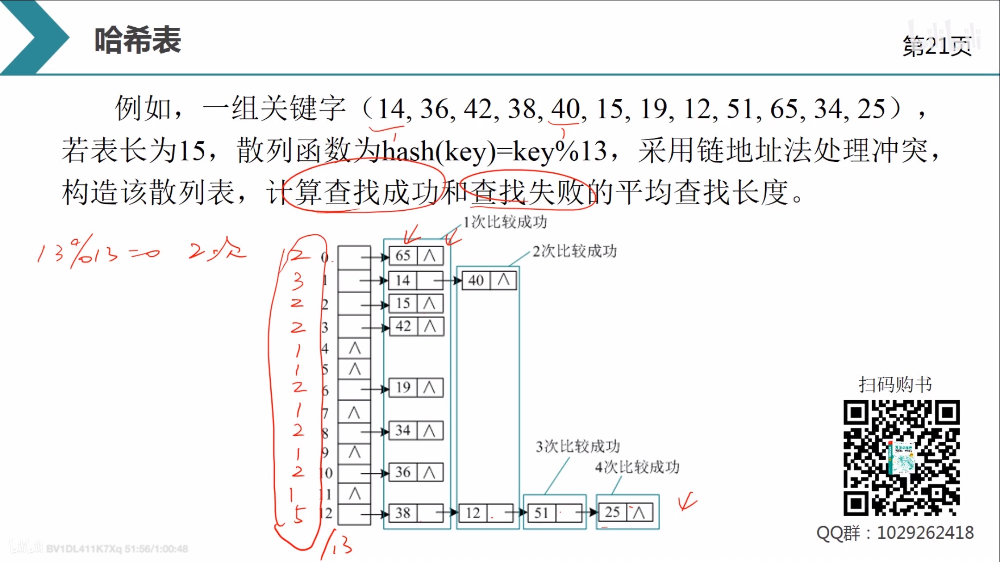

# 哈希表

### 哈希表查找关键字的方法——引入哈希表

线性表和树表的查找都是通过比较关键字的方法, 查找效率取决于关键字的比较次数. 而哈希表(散列表)可以不进行关键字笔记哦, 直接找到目标.

哈希表是根据关键字直接进行访问的数据结构. 散列表通过散列函数将关键字映射到存储地址, 建立了关键字和存储地址之间的一种直接映射关系.

>   例如: 关键字key = (17, 48, 76, 12), 散列函数H(key) = key % 5(5表示哈希表表长), 散列函数将关键字的映射(key按照余数的大小)存储到地址下标, 将关键字存储到数组的对应下标位置. 这样, 在进行查找key的位置时, 只需使用散列函数进行取模运算, 即可直接找到该key所对应的位置
>
>   上述例子使用的是除留余数法

### 哈希表查找key的时间复杂度

 理想情况下, 散列表查找的时间复杂度为*O(1)*. 但是, 散列表函数可能会把两个或两个以上的关键字映射到同一地址, 发生**==“冲突”==**, 发生“冲突”的两个关键字被称为”**==同义词==**“

>   例如: 48和13通过散列函数$H(key) = key\%5$计算的映射地址都是3, 13和48为“同义词”. 因此, 设计散列函数时应尽量减少冲突, 如果冲突无法避免, 则需要设计处理冲突的方法

## 哈希函数的概念

散列函数, 又称哈希函数, 是将关键字映射到存储地址的函数, 记为hash(key) = Addr. 设计散列函数时需要遵循以下2个原则:

-   散列函数尽可能简单, 能够快速计算关键字的散列地址.
-   散列函数映射的地址应均匀分布整个地址空间, 避免聚集, 以减少冲突.

散列函数设计原则的四字箴言: **简单、 均匀**

### 常见的散列函数

#### 直接定址法

直接取关键字的某个线性函数作为散列函数

​							==$hash(key) = a*key+b$==

​				其中a、b为常数

**适用场景**: 事先知道关键字, 关键字集合不是很大且连续性较好. 关键字如果不连续, 则有大量空位, 造成空间浪费.

-   学生的成绩就可以用直接定址法来做

>   通过绘制直接定址法的散列函数的函数图像可以发现, 是一个单调增\减的一元一次函数, 若关键字集合的数据很大或者连续性不好, 则需要建立的散列表的长度也需要很长, 进而造成了空间上的浪费.

#### 除留余数法

除留余数法是一种最简单和常用的构造散列函数的方法, 并且不需要事先知道关键字的分布. 假定散列表的表长为m, 取一个不大于表长的最大素数p, 则设计散列函数为:

​							==$hash(key) = key\%p$.==

##### 为什么要选择p为最大素数

素数:只能被1和自身整除的数

因为素数会使**“冲突”**出现的概率减小. ==暂时未理解==

##### 为什么p要不大于表长

如果p大于表长, 那么经过散列函数进行映射后的关键字可能会存储到超出表长范围的地方, 导致散列表无法存储该关键字

### 冲突的处理方法

无论如何设计散列函数, 都无法避免冲突问题. 发生冲突时, 需要进行冲突处理. 冲突处理方法分为3种:

**==开放地址法、 链地址法、 建立公共溢出区==**

#### 开放地址法

开放地址法是在线性存储空间上的解决方案, 称为==闭散列==. 发生冲突时, 采用冲突处理方法在线性存储空间上探测其他位置. 			hash^‘^(key) = (hash(key)+d~i~)%m			其中, hash(key)为原散列函数, hash^’^(key)为探测函数, d~i~为增量序列, m为表长.

-   闭散列: 关键字在相应位置上已经有其他的关键字存储了, 那么就去找散列表剩下的其他空间存储该关键字, 而不是另外再开辟空间

根据增量序列d~i~的不同, 开放地址法又分为**线性探测、 二次探测、 随机探测、 再散列法**.

最常用的是线性探测

##### 线性探测

线性探测法是最简单的开放地址法, 线性探测的增量序列:	d~i~ = 1, 2, …, m-1.

>    

-   查找成功的平均比较次数

    -   假设每个关键字出现概率相等
    -   次数 = (关键字出现的概率 ✖️ 每个关键词的比较次数)之和

-   查找失败的平均比较次数

    -   什么时候会查找失败?

        -   上述例题: p的值为13, 也就是说会有 (0, 1, 2, …, 12) 13种查找失败的可能.

            >    假设查找关键字26在散列表中的位置, 26%13 = 0. 找0的位置(存放了65), 一直找, 直到找到散列表的空位置也没有找到的话就终止查找, 这样查找26失败, 次数为`8`.

        -   当查找到散列表的空位置, 仍没有找到, 那么查找失败

    -   将所有失败的查找次数都列出来, 相加 ➗ 13 (p的值) = 查找失败的平均比较次数

>   
>
>   ==不理解的地方: 为什么有13种失败的情况, 却考虑进去了地址下标为13、14的查找失败次数?==

**注意:** 线性探测法很简单, 只要有空间, 就一定能够探测到位置. 但是, 在处理冲突的过程中, 会出现非同义词之间对同一个散列地址争夺的现象, 称为**==”堆积“==**. 堆积大大地降低了查找效率

##### 二次探测法

二次探测法采用前后跳跃式探测的方法, 发生冲突时, 向后1位探测, 向前1位探测, 向后2^2^位探测, 向前2^2^位探测……跳跃式探测, 避免堆积.

二次探测的增量序列如下:	d~i~ = 1^2^, -1^2^, 2^2^, -2^2^, …, k^2^, -k^2^	(k<=m/2)

>    
>
>   hash(25) = 25%13 = 12, 12号空间已存储数据, 采用二次探测处理冲突hash‘(key): 12–>13–>11–>1–>8–>6–>3–>13–>11–>7–>2–>3–>6–>1–>8. 已探测到(m/2)^2^, 仍然没有找到位置, 探测结束, 存储失败, 此时仍有4个空间, 却探测失败.

>   二次探测过程中如果二次探测地址为负值, 加上表长即可
>
>   例如: 如果按照哈希函数: hash’(key) = (hash(key) + d~i~) % m计算时, hash(key) + d~i~为负数, 那么需要在得到hash‘(key)后, 再对hash’(key)加m

二次探测法时跳跃式探测, 效率较高,但是会出现明明有空间却探测不到的情况, 因而存储失败, 而线性探测只要有空间就一定能够探测成功

#### 链地址法

链地址法又称为拉链法. 如果不同关键字通过散列函数映射到同一地址, 这些关键字为同义词, 将所有的同义词存储在一个线性表中. 查找、插入、删除操作主要在这个链表中进行, 链地址法适用于经常插入、删除的情况.

>   

