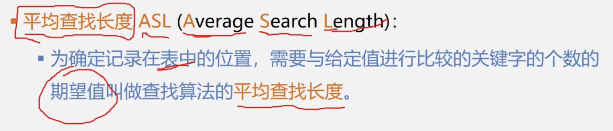
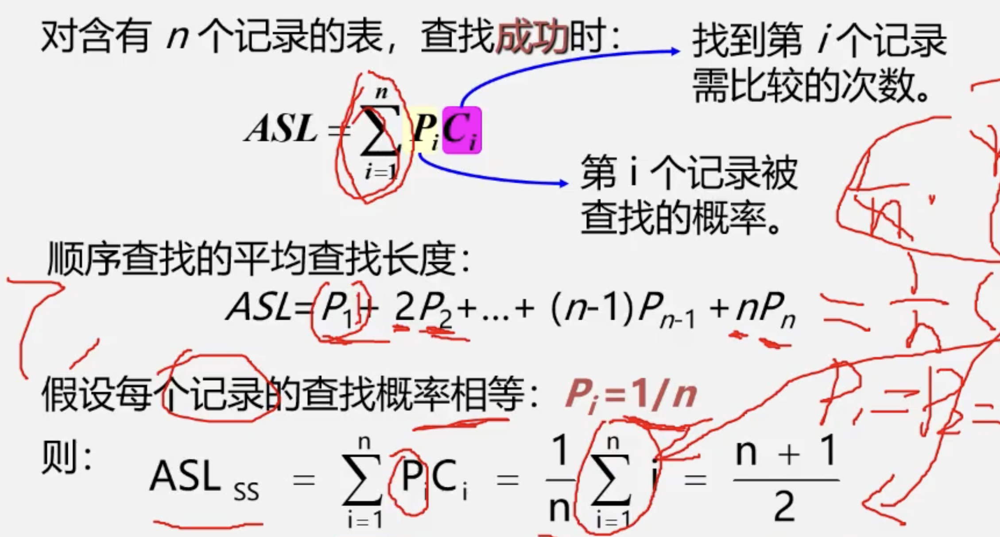

# 线性表

## 1.线性表的定义和特点

-   线性表是具有**相同特性**的数据元素的一个**有限序列**
    -   n = 0时为空表
-   同一线性表中的元素必定具有相同特性,数据元素间的关系时线性关系
    -   在非空的线性表，有且仅有一 个开始结点a~1~，它没有直接前趋，而仅有一个直接后继a;
    -   有且仅有一个终端结点a~n~，它没有直接后继，而仅有一个直接前趋a~n-1~
    -   其余的内部结点a~i~(2<=i<=n-1)都有且仅有一个直接前趋a~i-1~和一个直接后继a~i+1~。

## 2.案例引入

-   一元多项式运算
    -   下标表示指数,下标对应的数据元素存储对应指数的系数
-   稀疏多项式
    -   单个存储其系数与指数即可

## 3.线性表的类型定义

-   抽象数据类型线性表的定义:

```C
ADT List
{
    数据对象: D = {ai | ai属于Elemset,(i=1,2,...,n, n>=0)}
	数据关系: R= {<ai-1,ai> | ai-1,ai属于D,(i=2,3,...,n)}
    基本操作:
    	InitList(&L);
    	DestroyList(&L);
    	ListInsert(&L,i,e);
	    ListDelete(&L,i,&e);
    	....
}ADT List
```

### 基本操作

-   InitList(&L)
    -   操作结果;构造一个空的线性表L
-   DestroyList(&L)
    -   初始条件：线性表L已经存在
    -   操作结果：销毁线性表L
-   ClearList(&L)
    -   初始条件：线性表L已经存在
    -   操作结果：将线性表L重置为空表
-    ListEmpty(L)
    -   初始条件：线性表L已经存在
    -   操作结果：若线性表L为空表，则返回TURE;否则返回FALSE
-   ListLength(L)
    -   初始条件：线性表L已经存在
    -   操作结果：返回线性表L中的数据元素个数
-   GetElem(L,i,&e);
    -   初始条件：线性表L已经存在,1<=i<=ListLength(L)
    -   操作结果：用e返回线性表L中第i个数据元素的值
-   LocateElem(L,e,compare())
    -   初始条件：线性表L已经存在，compare()是数据元素判定函数
    -   操作结果：返回L中第1个与e满足compare()的数据元素的位序.若这样的数据元素不存在则返回值为0
-   PriorElem(L, cur_e, &pre_e)
    -   初始条件：线性表L已经存在
    -   操作结果：若cur_e是L的数据元素,且不是第一个则用pre_e返回已的前驱,否则操作失败;pre_e无意义
-   NextElem(L, cur_e, &next_e)
    -   初始条件:  线性表L已经存在
    -   操作结果:  若cur_e是L的数据元素，且不是第最后个,则用next_e返回它的后继，否则操作失败，next_e无意义
-     ListInsert(&L, i, e)
    -   初始条件：线性表L已经存在，1<=i<= ListLength(L)+1
    -   操作结果：在L的第i个位置之前插入新的数据元素e，L的长度加一
-   ListDelete(&L,i,&e)
    -   初始条件：线性表L己经存在，1<=i<=ListLength(L)
    -   操作结果：删除L的第i个数据元素,并用e返回其值，L的长度减一
-   ListTraverse(&L, visited())
    -   初始条件：线性表L已经存在
    -   操作结果：依次对线性表中每个元素调用visited()

### 4.线性表的顺序表示和实现

-   顺序存储结构

    依次存储,地址连续,中间没有空出存储单元.(占用一片连续的存储空间).

-   只要知道一个元素的存储位置就可以计算其他元素的存储位置

-   假设线性表每个元素需占`m`个存储单元,则第1个数据元素的存储位置和第i哥数据元素的存储位置之间满足关系

    ​							$LOC(a~i~) = LOC(a~1~) + (i-1)*m$

模糊定义为:

```C
#define LIST_INIT_SIZE 100	//线性表存储空间的初始分配量
typedef struct SqList
{
    ElemType elem[LIST_INIT_SIZE];
    int length;	//当前长度
}SL;
```


####  引用类型作形参

-   传递引用给函数与传递指针的效果是一样的,形参变化实参也发生变化
-   引用类型作形参,在内存中并没有产生实参的副本,它直接对实参操作;而一般变量作参数,形参与实参就占用不同的存储单元,所以形参变量的值是实参变量的副本.因此,当参数的数据量较大时,用引用比用一般变量传递参数的时间和空间效率都好
-   指针参数虽然也能达到与使用引用的效果，但在被调函数中需要重复使用“* 指针变量名〞的形式进行运算，这很容易产生错误且程序的阅读性较差；另一方面，在主调函数的调用点处，必须用变量的地址作为实参。



计算平均查找长度方法



>   P~i~为第i歌元素被查找的概率
>
>   C~i~为找到第i个记录需要比较的次数
>
>   $ASL = p1 + 2p2 + ... + nPn$
>
>   $Pi = 1/n$

### 顺序表实现线性表的优缺点

-   优点
    -   **存储密度大**(结点本身所占存储量/结点结构所占存储量)
    -   可以随机存取表中任意元素
-   缺点
    -   在插入、删除某一元素时,需要移动大量元素
    -   浪费存储空间
    -   属于静态存储形式,数据元素的个数不能自由扩充

### 链表

-   单链表、双链表、循环链表:
    -   结点只有一个指针域,为单链表
    -   两个指针域为双链表
    -   首尾相接为循环链表
-   头指针: 指向链表中第一个结点的指针
-   首结点: 链表中存储第一个数据元素a~1~的结点
-   头结点: 链表的首结点之前的附设的一个结点.整个链表的第一个结点.不存放有效数据

>   ***如何表示空表?***
>
>   -   无头结点时,**头指针为空**时表示空表
>   -   有头结点时,**头结点的指针域为空**表示空表
>
>   ***为什么在链表中设置头结点***
>
>   -   便于处理**首结点**
>       -   首结点的地址保存在头结点的指针域中,所以在链表的第一个位置上的操作与其他位置一致,无需进行特殊处理
>   -   便于**空表和非空表**的统一处理
>       -   无论链表是否为空,头指针都是指向头结点的非空指针,因此空表和非空表的处理也就统一了
>
>   ***头结点的数据域内装的是什么***
>
>   -   头结点的数据域可以为空,也可以存放线性表的长度等附加信息,但此结点不能计入链表的长度值
>
>   ***链表(链式存储结构)的特点***
>
>   -   结点在存储器中的位置是任意的,即逻辑上相邻的数据元素在物理上不一定相邻.
>   -   访问时只能通过头指针进入链表,并通过每个结点的指针域依次向后顺序扫描其余结点,所以寻找第一个结点和最后一个结点所花费的时间不等

**顺序表——————>随机存取**					**链表——————>顺序存取**

#### 循环链表

-   是一种头尾相接的链表		即:表中最后一个结点的指针指向头结点,整个链表形成一个环
    -   优点:可以从表中任意一个结点出发找到表中其他结点

-   循环链表中没有NULL指针,因此涉及遍历操作时,它的终止条件就不再像非循环链表一样判断`NULL == p`或者`NULL == p->pNext`而是判断他们是否等于头指针    `p == L` 或者`p->pNext = L`

| 头指针表示单循环链表 | 尾指针表示单循环链表 |
| -------------------- | -------------------- |
| 找首结点很方便a~1~O(1)   找尾结点不方便a~n~O(n)                     |   找首结点和尾结点都很方便O(1)             a~1~:(尾指针)R->pNext->pNext      |
- 带尾指针循环单链表的合并
    - p存放Ta(循环单链表)的头结点
    - Tb的首结点连接到Ta的尾结点
    - 释放Tb头结点
    - 修改指针,使Tb->pNext指向Ta的头结点
#### 双向链表
- 由于单向链表**无指针域指向前驱结点**，因此很难对其中一个结点的前驱结点进行查找。只能从表的头结点出发进行遍历。
- 双向链表：在指针域内**增加一个指向前驱结点的指针域**`prior`，这样链表中就形成了两个不同方向的链


```C
 typedef struct DulNode
 {
    Elemtype data;
    struct DulNode *prior, *pnext;
}DNODE, * PDNODE;
```

- 双向链表具有**对称性**
  p->prior->pnext = p = p->pnext->prior
- 双向链表的一些操作只涉及一个方向的指针，因此它们的算法与单向链表相同。但在插入、删除时，则需要同时修改两个方向上的指针。
- 双向链表的插入
```C
s->prior = p->prior;
p->prior->pnext = s;
s->pnext = p;
p->prior = s;
```
- 双向链表的删除
```C
void ListDelete_Dul(PDNODE L, int i, Elemtype *e)
{
    //删除带头结点的双向循环链表L的第i个元素，并用e返回
    if( !(p=GetElemP_Dul(L,i)) )
        //判断i的位置是否合理
        return ERROR;
    e = p->data;
    p->prior->pnext = p->pnext;
    p->pnext->prior = p->prior;
    free(p);
    return OK;
}
```

##### 双向循环链表
- 头结点的前驱指针指向链表的最后一个结点
- 最后一个结点的后继指针指向头结点
- 空表条件：头结点后继指针指向自己，前驱指针也指向自己。


| |查找头结点|查找尾结点|查找结点*P的前驱结点|
|-|-|-|-|
|单向链表L|L->pnext时间复杂度为O(1)|L-pnext依次遍历是时间复杂度为:O(n)|无法通过p->pnext找到前驱结点|
|仅设**头指针L的循环**单向链表|L->pnext时间复杂度为O(1)|L->pnext依次遍历时间复杂度为O(n)|通过p->pnext可以找到其前驱结点时间复杂度为O(n)|
|仅设**尾指针R的循环**单向链表|R->next时间复杂度为O(1)|R时间复杂度为O(1)|通过p->pnext可以找到其前驱结点时间复杂度为O(n)|
|双向循环链表L|L->pnext时间复杂度为O(1)|L->prior时间复杂度为O(1)|p->prior时间复杂度为O(1)|

#### 存储密度
- 存储密度是指结点数据本身所占的存储量和整个结点结构中所占的存储量之比
存储密度 = 结点数据元素本身的空间 / 结点占用的总空间

#### 顺序表和链表的比较
##### 链表
- 优点
    - 结点空间可以**动态申请和释放**
    - 数据元素的逻辑次序靠结点的指针来表示，**插入和删除时不需要移动数据元素**
- 缺点
    - 存储密度小，每个结点的**指针域需要额外占用存储空间**，每个结点的数据域所占字节不多时，指针域所占存储空间的比重显得很大。
    - 链式存储结构是**非随机存取**结构，对任一结点的操作都要从头指针以指针链查找到该结点，这增加了算法的复杂度
- 适用于
    - 长度变化比较大
    - 频繁进行插入或删除操作
##### 顺序表
- 优点
    - 不用为表示结点之间的逻辑关系而增加额外的存储开销，存储密度为1
    - 随机存取，按位置访问元素的时间复杂度为O(1)
- 缺点
    - 预先分配，会导致空间闲置或溢出
    - 平均移动约表中一半元素，时间复杂度为O(n)
- 适用于
    - 表长度变化不大，且能事先确定变化范围
    - 很少进行插入和删除操作，经常按照元素位置序号访问数据元素
### 线性表应用
- 线性表合并
    - 问题描述
        - 假设利用两个线性表La和Lb分别表示两个集合A和B，现要求一个新的集合A = AUB
        La = (7,5,3,11) Lb = (2,6,3) ===>   La = (7,5,3,11,2,6)
    - 算法步骤
        - 依次取出Lb中每个元素，执行以下操作
            - 在La中查找该元素
            - 如果找不到，则将其插入到La的最后
    - 实现
    ```C
    void union(PLIST La, PLIST Lb)
    {
        int La_len = ListLength(La);
        int Lb_len = ListLength(Lb);
        for(int i=1; i<Lb_len; i++)
        {
            GetElem(Lb,i,e);
            if( !LocateElem(La,e) )
                ListInsert(&La, ++La_len, e)
        }
    }
    //时间复杂度为O(ListLength(La)*ListLength(Lb))
    ```
- 有序表合并
    - 问题描述
        - 已知线性表La和Lb中的数据元素按值**非递减有序**排列，现要求将La和Lb归并为一个新的线性表Lc，且Lc中的数据元素仍按值非递减有序排列
        La = (1,7,8) Lb = (2,4,6,8,10,11) ====>  Lb = (1,2,4,6,7,8,8,10,11)
    - 算法步骤
        - 创建一个空表Lc
        - 依次从La或Lb中"摘取"元素值较小的结点插入到Lc表的最后，直至其中一个表变空为止
        - 继续将La或Lb其中一个表的剩余结点插入在Lc表的最后
    - 顺序表实现
    ```C
    void MergeList_Sq(SqLIST LA, SqList LB, SqList LC)
    {
        Elemtype *pa = LA.elem; //将pa指向LA的第一个元素
        Elemtype *pb = LB.elem;
        LC.length = LA.length + LB.length;
        LC.elem = (Elemtype *)malloc(sizeof(Eleltype)*LC.length);
        pc = LC.elem;
        Elemtype pa_last = LA.elem + LA.length - 1;
        Elemtype pb_last = LB.elem + LB.length - 1; //将pb_last指向LB的最后一个元素
        while(pa<=pa_last && pb<=pb_last)   //两个表都非空
        {
            if(*pa<=*pb)
                *pc++ = *pa++;  //等价于*pc = *pa;     pc++;      pa++;
            else
                *pc++ = *pb++;
        }
        while(pa<=pa_last)      //LB表已达到表尾，将LA中剩余的元素加入LC中
            *pc++ = *pa++;
        while(pb<=pb_last)      //LA表已达到表尾，将LB中剩余的元素加入LC中
            *pc++ = *pb++;
    }
    ```
    - 链表实现
    ```C
    void MergeList_L(LinkList &La, LinkList &Lb, LinkList &Lc)
    {
        pa = La->pnext;
        pb = Lb->pnext;
        pc = Lc = La;       //将La的头结点作为Lc的头结点
        while( pa&&pb )     //判断pa和pb是否为空
        {
            if(pa->data<=pb->data)
            {
                pc->pnext = pa;
                pc = pa;
                pa = pa->pnext;
            }
            else
            {
                pc->pnext = pb;
                pc = pb;
                pb = pb->pnext;
            }
        }
        pc->pnext = pa?pa:pb;
        /*
        三木运算符
        等价于：
        if(pa)
            pc->pnext = pa;
        else
            pc->pnext = pb;
        */
        free(Lb);
    }
    ```
    <!--  -->
