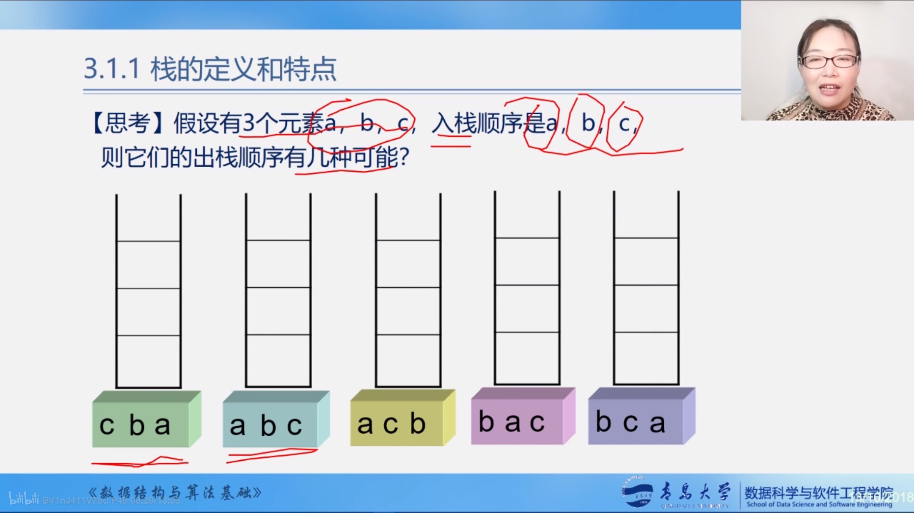
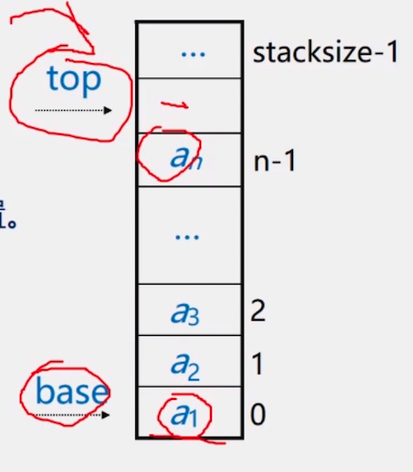
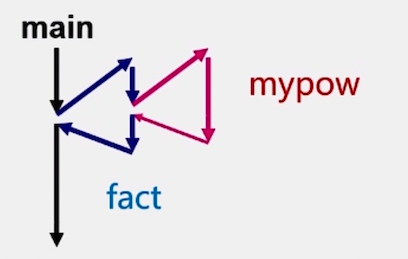
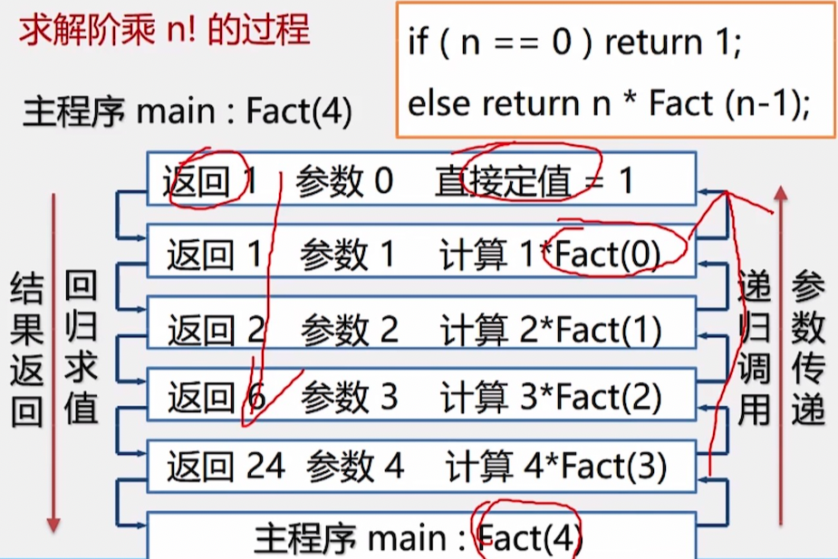
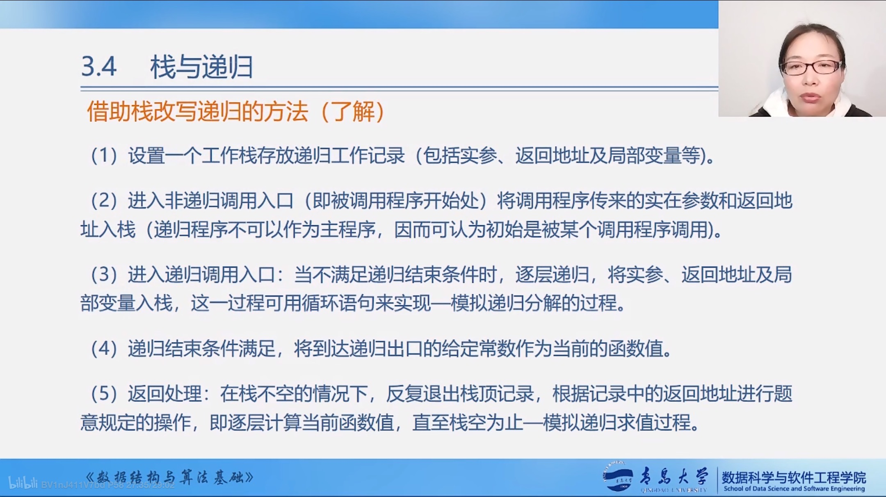
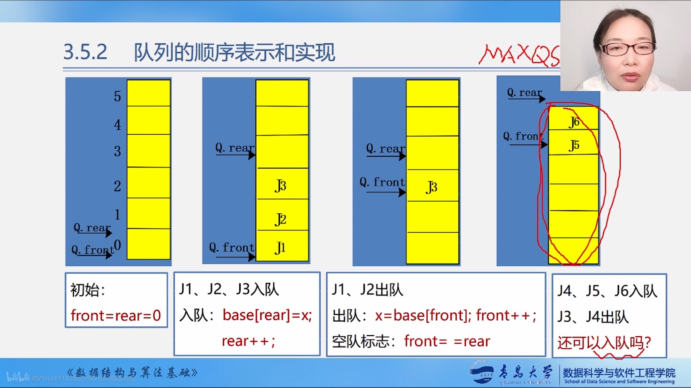
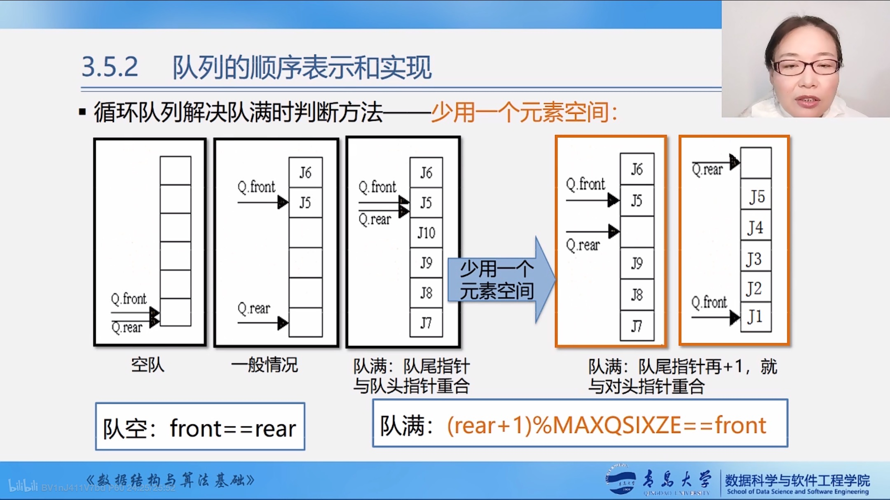

#  栈和队列

- 栈和队列是两种常用的、重要的数据结构
- 栈和队列是限定插入和删除只能在表的端点进行的**线性表**
## 栈的应用
- 由于栈的操作具有**先进后出**的特性，使得栈成为程序设计中的有用功具。
    - 数制转换
    - 表达式求值
    - 括号匹配的检验
    - 八皇后问题
    - 行编辑程序
    - 函数调用
    - 迷宫求解
    - 递归调用的实现
## 队列的应用

- 由于队列具有**先进先出**的特性，使得队列成为程序设计中解决类似排队问题的有用工具。
    - 脱机打印输出：按申请的先后顺序依次输出。
    - 多用户系统中，多个用户排成队，分时地循环使用CPU和主存
    - 按用户的优先级排成多个队，每个优先级一个队列
    - 实时控制系统中，信号按接收的先后顺序依次处理
    - 网络电文传输，按到达的时间先后顺序依次进行

## 栈的定义和特点

-   栈是一个特殊的线性表,是限定仅在一端(通常是表尾)进行插入和删除操作的线性表
-   又称为**先进后出**的线性表,简称LIFO结构
-   栈的相关概念
    -   表尾a~n~端称为栈顶TOP
    -   表头a~1~称为栈底Base
    -   插入元素到栈顶的操作,**入栈**
    -   从栈顶删除最后一个元素的操作,**出栈**
    -   “入” = 压入 = PUSH    “出” = 弹出 = POP

-   逻辑结构   与线性表相同,仍为一对一关系
-   存储结构   用顺序栈或链栈存储均可,但以顺序栈更常见
-   运算规则   只能在栈顶运算,且访问结点时依照后进先出的原则
-   实现方式   关键是编写入栈和出栈函数,具体实现依顺序栈或链栈的不同而不同
-   栈与一般线性表的不同
    -   仅在于运算规则不同
        -   一般线性表:随机存取
        -   栈:先进后出




## 队列的定义和特点

-   队列是先进先出的线性表,在表一端插入(表尾),另一端(表头)删除
-   逻辑结构:与同线性表相同,仍为一对一关系
-   存储结构:顺序队或链队,以循环顺序队列更常见
-   运算规则:只能在队首和队尾运算,且访问结点时依照先进先出原则
-   实现方式:关键是掌握入队和出队操作,具体实现依顺序队或链队的不同而不同

## 栈的抽象数据类型的类型定义

```C
ADT Stack
{
    数据对象:
    	D = { ai | ai 属于 ElemSet, i=1,2,...,n, n>=0 }
    数据关系:
    	R1 = { <ai-1, ai> | ai-1,ai属于D, i = 2,....,n }
    基本操作:
    	初始化、进栈、出栈、取栈顶元素等
}ADT Stack
```

## 顺序栈的表示和实现

-   存储方式:同一班线性表的顺序存储结构完全相同
    -   利用一组地址连续的存储单元依次存放自栈底
-   从栈顶的数据元素.栈底一般在低地址端
    -   附设top指针,指示栈顶元素在顺序栈中的位置
        -   但是为了方便操作,通常top指示真正的**栈顶元素之上**的下标地址
    -   另设base指针,指示栈底元素在顺序栈中的位置
    -   另外,用stacksize表示栈可使用的最大容量
-   栈的示意图



-   空栈:   base == top
-   满栈:   top-base == stacksize
    -   **指针相减得出的结果是两个指针之间相差的元素的个数**
    -   满栈时的处理方法
        -   报错,返回操作系统
        -   分配更大的空间,作为栈的存储空间,将原栈的内容移入新栈
-   使用数组作为顺序栈存储方式的特点
    -   简单、方便、但易产生溢出(数组大小固定)
-   上溢:  栈已满,又要压入元素
    -   上溢是一种错误,使问题的处理无法进行
-   下溢:  栈已空,还要弹出元素
    -   下溢一般认为是一种结束条件,即问题处理结束

顺序栈的表示

```C
#define MAXSIZE 100
typedef struct SqStack
{
    SElemtype *base;	//栈底指针
    SElemtype *top;		 //栈顶指针
    int stacksize;			 //栈可用最大容量
}SQSTACK;
```


## 栈与递归

-   递归的定义

    -   若一个对象**部分地包括它自己**,或用它**自己给自己**定义,则称这个对象是递归的
    -   若一个过程直接地或**间接的调用自己**,则称这个过程是递归过程

    -   例如:递归求n的阶乘

        ```C
        long Fact(long n)
        {
            if(0 == n)
                return 1;
            else
                return n*Fact(n-1);
        }
        ```

-   #### 栈与递归的实例

-   递归定义的数学函数

    -   阶乘函数

        >   Fact(n) = 1    				  若n=0
        >
        >   Fact(n) = n*Fact(n-1)    若n>0

    -   2阶Fibonaci数列

        >   Fib(n) = 1								 若n=1或2
        >
        >   Fib(n) = Fib(n-1) + Fib(n-2)   其他

-   具有递归特性的数据结构
    -   二叉树
    -   广义表
-   可递归求解的问题
    -   迷宫问题
    -   Hanoi塔问题

-   #### 递归问题——用分治法求解

    -   >   分治法: 对于一个较为复杂的问题,能够分解成几个相对简单的且解法相同或类似的子问题来求解

        必备的三个条件

        -   能够将一个问题转变成一个新问题,而新问题与原问题的解法相同或类同,不同的仅是**处理的对象**,且这些处理对象是变化有规律的
        -   可以通过上述转化而使问题简化
        -   必须有一个明确的递归出口,或称递归的边界

    -   分治法求解递归问题算法的一般形式:

        ```c
        void p(参数表)
        {
        	if (递归结束条件)
                	可直接求解步骤;    //----基本项
            else
                p(较小的参数);			//----归纳项
        }
        ```

        -   例如:

            ```C
            long Fact(long n)
            {
                if(0 == n)
                    return 1;						//基本项
                else
                    return n*Fact(n-1);		//归纳项
            }
            ```

-   函数调用过程

    -   调用前,系统完成:

        -   将**实参,返回地址**等传递给被调用函数
        -   为被调用函数的**局部变量**分配存储区
        -   将控制转移到被调用函数的入口

    -   调用后,系统完成:

        -   保存被调用函数的**计算结果**
        -   释放被调用函数的**数据区**
        -   依照被调用函数保存的**返回地址**将控制转移到调用函数

    -   当多个函数构成嵌套调用时

        ```C
        double fact(int n)
        {
            .......
                z = mypow(3.5, 2);
            .......
        }
        double mypow(double x, int n)
        {
            ......
        }
        int main(void)
        {
            ......
                y = fact(3);
        }
        ```

        

        遵循栈的后调用先返回

        

    -   递归函数调用的实现

        | 层次 | 主函数     | 0层  |
        | ---- | ---------- | ---- |
        |      | 第一次调用 | 1层  |
        |      | …….        |      |
        |      | 第i次调用  | i层  |

        >   “递归工作栈”——递归程序运行期间使用的数据存储区
        >
        >   “工作记录”————实在参数,局部变量,返回地址

    -   递归的优缺点

        -   优点:结构清晰,程序易读
        -   缺点
            -   每次调用要生成工作记录,保存状态信息,入栈;
            -   返回时要出栈,恢复状态信息.时间开销大.

    -   递归——>非递归

        -   方法一:尾递归、单向递归———>循环结构

            -   尾递归——>循环结构

                ```C
                long Fact(long n)
                {
                    if(0 == n)
                        return 1;
                    else
                        return n*Fact(n-1);
                }
                ```

                转化为

                ```C
                long Fact(int n)
                {
                	t = 1;
                    for(int i=1; i<=n; i++)
                        t = t*i;
                    return t;
                }
                ```

            -   单向递归——>循环结构

                -   虽然有一处以上的递归调用语句,但各次递归调用语句的参数**只和主调函数**有关,与相互之间参数无关,并且这些**递归调用语句处于算法的最后**

                ```C
                long Fib(long n)
                {
                    if(1 == n || 2 == n)
                        return 1;
                    else
                        return Fib(n-1) + Fib(n-2);
                }
                ```

                转换为

                ```C
                long Fib(long n)
                {
                    if(1 == n || 2 == n)
                        return 1;
                    else
                    {
                        t1 = 1;
                        t2 = 1;
                        for(int i=3; i<=n; i++)
                        {
                            t3 = t1 + t2;
                            t1 = t2;
                            t2 = t3;
                        }
                        return t3;
                    }
                }
                ```


        -   方法二:自用栈模拟系统的运行时栈

            -   借助栈改写递归的方法
                -   递归程序在执行时需要系统提供栈来实现
                -   仿照递归算法执行过程中递归工作栈的状态变化可写出相应的非递归程序
                -   改写后的非递归算法与原来的递归算法相比，结构不够清晰，可读性较差，有的还需要经过一系列优化
                -   

## 队列的表示和操作的实现

-   相关术语
    -   队列是仅在**表尾**进行插入操作,在**表头**进行删除操作的线性表
    -   表尾即a~n~端,称为**队尾**;表头即a~1~端,称为**队头**
    -   它是一种先进先出的线性表
    -   插入元素称为入队;删除元素称为出队
    -   队列的存储结构为链队或顺序队(常用循环顺序队)

```C
ADT Queue
{
    数据对象: D = {ai | ai属于ElemSet, i = 1,2,...,n, n>=0}
    数据关系: R = {<a(i-1), ai} | a(i-1),ai属于D, i=2,...,n}	约定a1端为队列头   an端为队列尾
    基本操作：
        InitQueue(&0)
        操作结果：构造空队列Q
        DestroyQueue(&Q） 条件：队列Q已存在；操作结果：队列Q被销毁
        ClearQueue(&0)
        条件：队列Q已存在;操作结果：将Q清空
        QueueLength(Q)
        条件：队列Q已存在 操作结果：返回Q的元素个数，即队长
        GetHead(O, &e)
        条件：Q为非空队列
        操作结果：用e返回Q的队头元素
        EnQueue(&Q, e)
        条件：队列Q已存在
        操作结果：插入元素e为Q的队尾元素
        DeQueue(&Q, &e） 条件：Q为非空队列 操作结果：州除Q的队头元素，用e返回值
        .......还有将队列置空、遍历队列等操作......
}ADT Queue
```

-   队列的物理存储可以用顺序存储结构, 也可以用链式存储结构,相应的,队列的存储方式也分为两种,即:顺序队列和链式队列.
-   ### 队列的顺序表示——用一维数组base[MAXQSIZE]

```C
#define MAXQSIZE 100
typedef struct SqQueue
{
    QElemType *base;
    int front;					//头指针
    int rear;					//尾指针
};
```



-   #### 队列溢出

-   rear = MAXQSIZE时,发生溢出

    -   假溢出
        -   front != 0
        -    rear = MAXQISZE
    -   真溢出
        -   Front = 0
        -   rear = MAXSIZE

-   解决假溢出的方法

    -   队头元素出队后,将队中元素依次向队头方向移动

        -   缺点:浪费时间.每移动一次,队中元素都要移动

    -   引入循环队列

        -   将队空间设想成一个循环的表,即分配给队列的m个存储单元可以循环使用,当rear为MAXQSIZE时,若向量的开始端空着,又可以从头使用空着的空间.当front为MAXQSIZE时,也是一样

        -   base[0]接在base[MAXQSIZE-1]之后,若rear+1 == M,则令rear = 0;

        -   实现方法: 并非是真正使用循环队列,而是利用**模(mod, C语言中: %)运算**

        -   插入元素:

            ```C
            Q.base[Q.rear] = x;
            Q.rear = (Q.rear + 1) % MAXQSIZE;
            ```

        -   删除元素

            ```C
            x = Q.base[s.front];
            Q.front  = (Q.front + 1) % MAXQSIZE;
            ```

        -   循环队列: 循环使用为队列分配的存储空间

-   #### 队满和队空的条件

-   队满和队空的条件都为`front == rear`,无法进行判断

-   解决方案

    -   另外设置一个标志,以区别队空、队满
        -   例如:队空时front指向的值为-1
    -   另外设置一个 变量,记录元素个数
        -   例如:入队时,有``cnt++;`
    -   少用一个元素空间
        -   

-   ### 队列用链表表示


