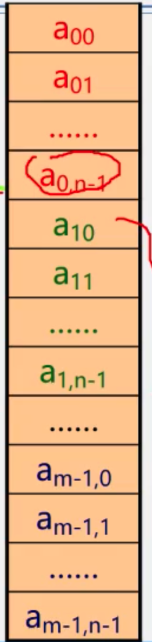
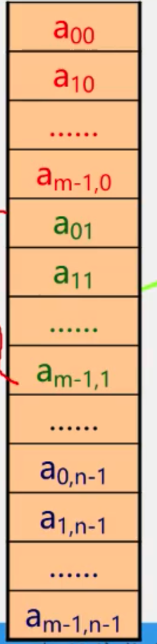
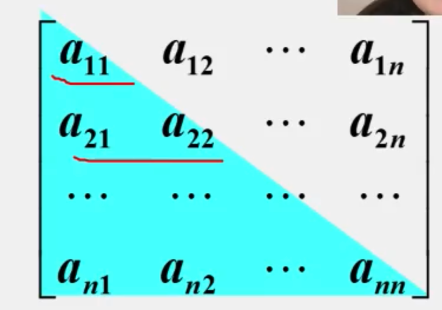
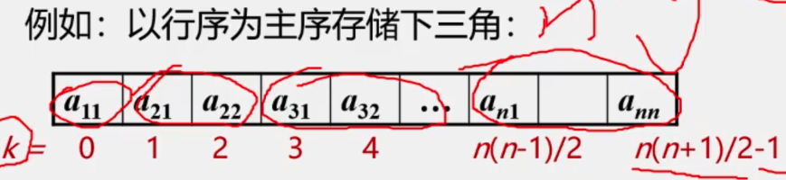
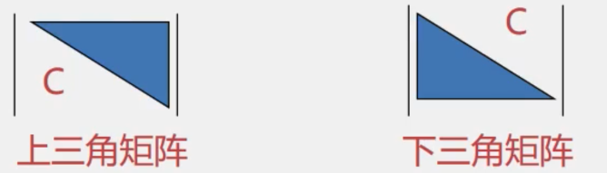

# 串

## 串的定义
-  串： 零个或多个任意字符组成的有限序列
    -  S = "a~1~a~2~a~3~.....a~n~"
    -  S为串名
    -  " "内部为串值
    -  n为串长
    -  n=0时为空串
    -  空串用空集符号表示
- 子串： 一个串中任意个连续字符组成的子序列（包含空串）
    - 例如："abcde"的子串有：
        - ""
        - "a"
        - "ab"
        - "abc"
        - "abcd"
        - "abcde"
- 真子串： 不包含自身的所有子串
- 主串： 包含子串的串
- 字符位置： 字符**在序列中的序号**为该字符在串中的位置
- 子串位置： **子串第一个字符**在主串中的位置
- 空格串： 由一个或多个空格组成的串，**与空串不同**
> 字符串a、b、c、d
> a = "BEI"
> b = "JING"
> c = "BEIJING"
> d = "BEI JING"
> - 长度：a=3, b=4, c=7, d=8
- 串相等： 当且仅当两个串的长度相等并且各个对应位置上的字符都相同时，这两个串相等
> 如：
> "abcd" != "abc"
> "abcd" != "ab cd"
- 所有空串都是相等的
## 串案例引入
    串的应用非常广泛，计算机上的非数值处理对象大部分时字符串数据。
> 例如：文字编辑、符号处理、各种信息处理系统等
- 检测某种病毒的DNA是否在人类的DNA序列中出现过（病毒的DNA是环状的， 人的DNA是线性的）
## 串的类型定义、存储结构及运算
```C
ADT String
{
    数据对象： D = {ai | ai 属于 CharacterSet, i = 1, 2, 3, ..., n, n>=0}
    数据关系： R1 = {<a(i-1), ai> | a(i-1), ai 属于D. i = 1, 2, ...., n}
    基本操作：
        StrAssign(&T, chars)    //串的赋值
        StrCompare(S, T)        //串的比较
        StrLength(S)            //求串长
        Concat(&T, S1, S2)      //串连结
        SubString(&Sub,S,pos,len） //求子串
        StrCopy(&T,S)           //串拷贝
        StrEmpty(S)             //串判空
        ClearString (&S)        //清空串
        Index(S,T,pos)          //子串的位置
        Replace(&S, T,V)        //串替换
        Strinsert(&S,pos,T)     //子串插入
        StrDelete(&S,pos,len)   //子串删除
        DestroyString(&S)       //串销毁
}ADT String
```
- 串的顺序存储结构
```C
#define MAXLEN 265
typedef struct String
{
    char ch[MAXLEN+1];  //+1为了多储存一位结束符
    int length;
};
```
- 串的链式存储结构
    - 优点：操作方便
    - 缺点：存储密度低
        - 可以将多个字符存放在一个结点中，以尽量减小此缺点
```C
#define CHUNKSIZE 80
typedef struct Chunk
{
    char ch[CHUNKSIZE];
    struct Chunk *next;
}Chunk;
typedef struct String
{
    Chuck *head, *tail;     //串的头指针和尾指针
    int curlen;             //串当前的长度
}LString;
```

### 串的匹配模式算法

-   算法目的
    -   确定**主串**中所包含**子串(模式串)**第一次出现的位置(定位)
-   算法应用
    -   搜索引擎
    -   拼写检查
    -   语言翻译
    -   数据压缩
-   算法种类
    -   BF算法(Brute- Force, 又称古典的、经典的、朴素的、穷举的)
    -   KMP算法(特点:速度快)

#### 串的模式匹配算法————BF算法

-   Brute-Force简称为BF算法,亦称简单匹配算法.采用穷举法的思路

>   S : a  	a 	 a 	 a 	 b 	 c 	 d					主串:正文串
>
>   T:						  a	  b	  c							 子串:模式串

算法的思路:从S的每一个字符开始依次与T的字符进行匹配

>   例如:设目标串S = “aaaaab“, 模式串T = ”aaab“
>
>   ​		 S的长度为n(n=6), T的长度为m(m=4)
>
>   BF算法的匹配过程如下
>
>   i = 1,j = 1;
>
>   S:  a  	a  	a  	a  	a  	b
>
>   T:  a  	a  	a  	b
>
>   匹配失败:
>
>   ​	i = i-j+2 = 2(回溯)	//	i-j+2可以看为:`(i-j+1)+1`	`i-j+1`是将i放到开始的位置, 再`+1`后变成从开始位置的后一个位置开始
>
>   ​	j = 1(从头开始)
>
>   i = 3,j = 1;
>
>   S:  a  	a  	a  	a  	a  	b
>
>   T:  				a  	a  	a  	b
>
>   匹配成功:
>
>   ​	i = 7, j = 5	返回 i - T.length = 3	// 	`i-T.length`	其中`i`表示匹配结束后`i`所在的位置,`i-T.length`代表T串的第一个字符在主串中的位置

##### BF算法设计思想

`Index(S, T, pos)`

-   将主串的第pos个字符和模式串的第一个字符比较
    -   若相等, 继续逐个比较后续字符
    -   若不相等, 从主串的下一个字符起,重新与模式串的第一个字符比较
-   直到主串的一个连续子串字符序列与模式串相等. 返回值为S中与T匹配的子序列第一个字符的序号,即匹配成功
-   否则, 匹配失败, 返回值`0`

```C
int Index_BF(SString S, SString T, int pos)
{
    int i = pos, j = 1;
    while( i<=S.length && j<=T.length )		//两个条件必须同时成立.  S与T都有一个变量length来记录此时字符串的长度
    {
        if( S.ch[i] == T.ch[j] )
        {
            ++i;
            ++j;
        }
        else
        {
            i = i-j+2;
            j = 1;
        }
    }
    if ( j>=T.length )
        return i-T.length;
    else
        return 0;
}
```

##### BF算法的时间复杂度

-   若n为主串的长度, m为子串的长度
    -   最坏的情况是
        -   在主串前面n - m个位置都部分匹配到子串的最后一位,即这n-m位各比较了m次
        -   最后n-m位也各比较了1次
    -   总次数为: (n-m) * m + m = (n-m+1)*m
    -   若m<<n, 则算法时间复杂度为O(n*m)

#### KMP算法

-   KMP算法比较BF算法有较大改进, 从而使算法效率有了某种程度的提高
-   利用已经**部分匹配**的结果而加快模式串的滑动速度,且主串S的指针**i不必回溯**,可提速到O(n+m)
-   为此,定义`next[j]`函数, 表明当模式中第j个字符与主串中相应字符“失配”时, 在模式中需重新和主串中该字符进行比较的字符的位置.
-   next[j]
    -   当j = 1时
        -   next[j] = 0
    -   当此集合非空时
        -   max{ k | 1<k<j, 且 “P~1~…P~k-1~” = “P~j-k+1~….P~j-1~” }
            -   其中“P~1~…P~k-1~”表示从头开始的k-1个元素, 即k的前缀字符串(不能取到P~k~)
            -   其中“P~j-k+1~….P~j-1~” 表示j前面的k-1个元素元素, 即k的后缀字符串(不能取到P~1~)

##### KMP算法实现

```C
int Index_BF(SString S, SString T, int pos)
{
    int i = pos, j = 1;
    while( i<=S.length && j<=T.length )		//两个条件必须同时成立.  S与T都有一个变量length来记录此时字符串的长度
    {
        if(  0==j || S.ch[i] == T.ch[j] )
        {
            ++i;
            ++j;ddfgtyy
        }
        else
        {
           j = next[j];			//i不变,j后退
        }
    }
    if ( j>=T.length )
        return i-T.length;
    else
        return 0;
}
```

# 数组

-   数组: 按一定格式排列起来的,具有**相同类型**的数据元素的集合

-   一维数组: 若线性表中的元素为非结构的简单元素

    -   逻辑结构:线性结构.定长的线性表
    -   声明格式:  数据类型    变量名称[长度]
        -   例如: `int num[5] = {1,2,3,4,5};`

-   二维数组: 若一维数组中的数据元素又是一维数组结构,则称为二维数组

    -   二维数组的逻辑结构
        -   非线性结构: 每一个数据元素既在一个行表中, 又在一个列表中
        -   线性结构: 该线性表的每个数据元素也是一个定长的线性表
    -   声明格式:   数据类型    变量名称\[行数][列数];
        -   例如:`int num[5][8];`
    -   在C语言中,一个二维数组类型也可以定义为一维数组类型

    ```C
    typedef elemtype array2[m][n];
    等价于;
    typedef elemtype array1[n];
    typedef array1 array2[m];
    ```

-   三位数组: 若二维数组中的元素又是一个一维数组, 则称作三位数组.
-   …….
-   n维数组: 若n-1维数组中的元素又是一个一维数组, 则称作n维数组

>   结论:
>
>   ​	线性表结构是数组结构的一个特例,
>
>   ​	而数组结构又是线性表结构的拓展

-   数组特点: **结构固定**——定义后, 维数和维界不再改变
-   数组基本操作: 除了结构的初始化和销毁之外, 只有取元素和修改元素值的操作

### 数组的抽象数据类型定义

**n维数组**的抽象数据类型

>   ADT Array
>   {
>       数据对象:  j~i~ = 0, ….., b~i~-1, i = 1,2,…,n
>
>   ​					  D = {a~j1j2…jn~ | a~j1j2…jn~ 属于 ElemSet }
>
>   ​	数据关系:
>
>   ​					R1 = { <a~j1…ji…jn~, a~j1…ji+1…jn~> | 0<=j~k~<=b~k~-1, 1<=k<=n, 且k!=i, 0<=j~i~<=b~k~-2, a~j1…ji…jn~, a~j1…ji+1…jn~属于 D, i = 2,…,n }
>
>   }

例如

>   -   **二维数组**的抽象数据类型的数据对象和数据关系的定义
>       -   n=2（维数为2，二维数组）
>       -   b~1~：第1维长度（行数）
>       -   b~2~：第2维长度（列数）
>       -   a~j1j2~：第1维下标为j~1~，第2维下标为j~2~

### 数组的顺序存储

-   因为

    -   数组特点: 结构固定———维数和维界不变
    -   数组基本操作:初始化、 销毁、 取元素、 修改元素值. 一般不做插入和删除操作.

-   所以

    -   一般都是采用**顺序存储结构**来表示数组

-   注意

    -   数组中可以是多维的, 但存储数据元素的内容单元地址是一维的, 因此, 在存储数组结构之前, 需要解决将多维关系映射到一维关系的问题.

-   #### 一维数组————求数组中某个元素的地址

-   有数组定义：int a[5]; 每个元素占用4宇节，假设a[0]存储在2000单元，a[3]地址是多少？

    -   LOC(0) = a  2000
    -   L = 4
    -   LOC(3) = ?
    -   LOC(i) = ?
    -   a + i * L
    -   LOC(i) = ?
        -   i = 0
            -   LOC(0) = a
        -   i > 0
            -   LOC(i-1) + L = a + i*L

-   #### 二维数组

-   两种顺序存储方式

    -   以行序为主序(低下标优先)	BASIC、 COBOL 和 PASCAL
    -   以列序为主序(高下标优先)    FORTRNAN

-   存储单元是一维结构, 而数组是个多维结构,则用一组连续存储单元存放数组的数据元素就有个次序约定问题

-   以行序为主序

    -   
    -   设数组开始存储位置LOC(0,0),存储每个元素需要L个存储单元, 数组元素a\[i][j]的存储位置是:$LOC(i, j) = LOC(0, 0) + (n*i+j)*L$
        -   $i$为行数, $j$为列数

    >   设有一个二维数组A\[m][n]**按行优先**顺序存储,假设A\[0][0]存放位置在644~(10)~, A\[2][2]存放在位置676~(10)~, 每个元素占一个空间, 问A\[3][3]~(10)~存放在什么位置?((10)表示用十进制表示)

    -   设数组元素A\[i][j]存放在起始地址为LOC(i, j)的存储单元中

    -   >   Loc (2,2) = Loc (0,0 ) + 2 * n + 2 = 644 + 2 * n + 2 = 676.
        >   n= (676 - 2 - 644) /2 = 15
        >   Loc ( 3.3) = Loc (0,0) + 3* 15 + 3 = 644 + 45 + 3 = 692

-   以列序为主序

    -   

### 特殊矩阵的压缩存储

-   矩阵: 一个由m*n个元素排成的m行n列的表

-   矩阵的常规存储

    -   将矩阵描述为一个二维数组

-   矩阵的常规存储特点

    -   可以对其元素进行随机存取; 矩阵运算非常简单; 存储密度为1

-   不适宜常规存储的矩阵

    -   值相同的元素很多且呈现某种规律分布; 零元素多

-   矩阵的压缩存储: 为多个相同的非零元素只分配一个存储空间; 对零元素不分配空间

-   什么是压缩存储

    -   若多个数据元素的值都相同, 则只分配一个元素值的存储空间, 且零元素不占存储空间

-   什么样的矩阵能够压缩

    -   一些特殊矩阵, 如: 对称矩阵, 对角矩阵, 三角矩阵, 稀疏矩阵等

-   什么叫稀疏矩阵

    -   矩阵中非零元素的个数较少(一般小于5%)

-   #### 对称矩阵

    -   特点:在$n*n$的矩阵a中, 满足如下性质

        -   a~ij~ = a~ji~ (1<=i, j<=n)

    -   存储方法:只存储下(或者上)三角(包括主对角线)的数据元素.共占用$n(n+1)/2$个元素空间

    -   对称矩阵的存储结构

        -   对称矩阵上下三角中的元素数均为$n(n+1)/2$

        -   可以**以行序为主序**将元素存放在一个一维数组sa[n(n+1)/2]中

            

            

-   #### 三角矩阵

    -   特点: 对角线以下(或者以上)的数据元素(不包括对角线)全部为常数c

    -   重复元素c共享一个元素存储空间, 共占用n(n+1)/2 + 1个元素空间:sa[1..n(n+1)/2+1]

    -   >   n(n+1)/2+1   多+1是因为要存储常数c我爱你我的家 我弟家我弟中国 哈哈就看见我爱你我是丁永涛的爸爸 啦啦啦啦  陈小黑嘿呦嘿啊啦啦啦我是你爹真伟大 养你这么大 而你不听话 一天到晚去玩耍 滚吧滚吧连滚带爬 我只要你妈妈啦!

    -   上三角矩阵

        -   i<=j
            -   k = (i-1)*(2n-i+2)/2+j-i+1
        -   i>j
            -   k = n(n+1)/2+1


