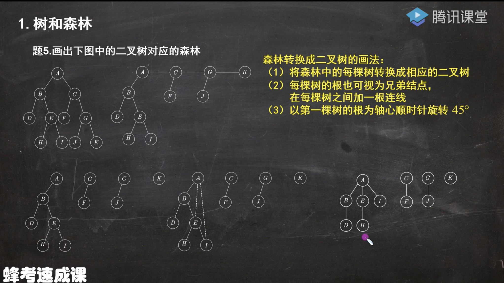
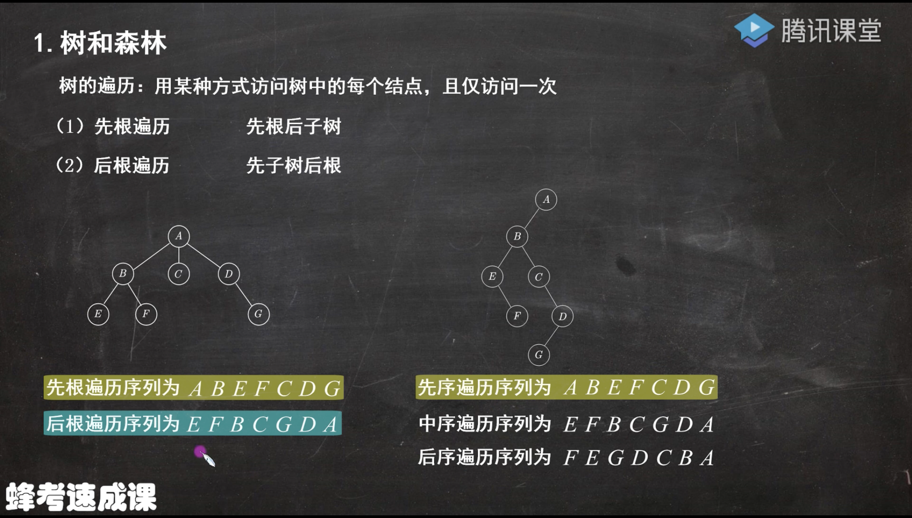
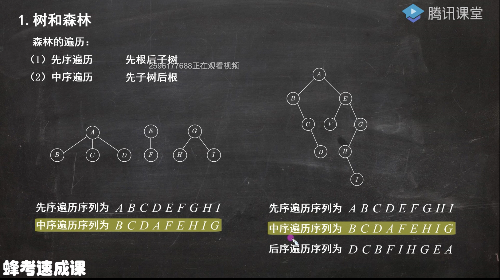
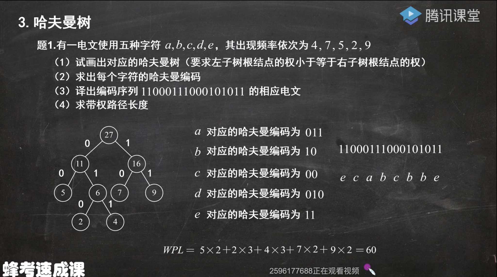

## 树

#### 树的基本概念

基本术语

-   祖先、双亲、孩子、兄弟
-   度
    -   结点的度: 该结点的孩子数
    -   树的度: 树中结点的最大度数
-   结点
    -   分枝结点(非终端结点): 结点的度大于0
    -   叶子结点(终端结点): 结点的度为0
-   深度、高度
    -   深度: 自根向下逐层累加
    -   高度: 自下向上逐层累加
-   有序树: 结点的各子树从左到右是有次序的,不能互换
-   无序树
-   路径、路径长度
    -   路径: 两个结点间所经过的结点序列
    -   路径长度: 两个结点间所经过的线段数

#### 树的性质

-   树中的结点数等于所有结点的度数加1
    -   所有结点的度数不包括根结点, 因此需要加1
-   度数为*m*的树中第*i*层上最多有m^i-1^个结点
    -   举例即可的
-   高度为h的m叉树至多有(m^h^ - 1)/(m - 1)个结点
    -   1  + m + m^2^ + … + m^h-1^   		等比数列求和
-   具有n个结点的m叉树的最小高度为[log~m~(n(m-1)+1)]
    -   根据树的第三个性质可得 (m^h^ - 1)/(m - 1) = n.	化简可得上式

## 二叉树

-   二叉树是n(n>=0)个结点的有限集合
    -   或者为空二叉树
    -   或者由一个根结点和两个互不相交的被称为根的左子树和右子树组成, 左右子树又分别是一棵二叉树

#### 特殊二叉树

#### 二叉树的性质

-   非空二叉树上的叶子结点数等于度数为2的结点数加1, 即n~0~=n~2~+1
    -   n = n~0~+n~1~+n~2~		n = 0\*n~0~ + 1\*n~1~ + 2*n~2~ + 1		两式联立的上式
-   非空二叉树上第k层上至多有2^k-1^个结点
-   高度为h的二叉树至多有2^h^ - 1个结点
-   具有n(n>0)个结点的完全二叉树的高度为[log~2~(n+1)]或者[log~2~n+1]
    -   高度为h-1的满二叉树, 其结点个数为:2^h-1^-1
    -   高度为h的满二叉树, 其结点个数为: 2^h^-1
        -   2^h-1^-1 < n <= 2^h^-1
        -   同时+1 再取对数
        -   h-1 < log~2~(n+1) <= h
            -   取右边不等式
    -   将高度为h-1的满二叉树所得的所有结点数+1,可得高度为h的最少结点的完全二叉树: 2^h-1^
        -   2^h-1^<=n<2^h^
        -   取对数
        -   h-1 <= log~2~n < h
            -   取左边不等式

#### 二叉树的存储结构

-   顺序存储结构
    -   指用一组地址连续的存储单元依次自上而下、自左至右存储完全二叉树的结点元素, 即将完全二叉树上编号为*i*的结点元素存储在一维数组下标为*i-1*的元素中
        -   如果一棵二叉树不是完全二叉树,将其构造成完全二叉树, 存储时将构造出来的结点标记为0即可.

-   链式存储结构

    -   用链表结点来存储二叉树中每个结点

    -   | 左孩子 | 数据域 | 右孩子 |
        | ------ | ------ | ------ |
        | lchild | data   | rchild |

    -   ```C
        typedef struct BiTNode
        {
            ElemType data;
            struct BiTNode *lchild, *rchild;
        }BITN, *PBITN;
        ```

    -   含有n个结点的二叉链表中, 含有n+1个空链域, 含有n-1个非空链域

#### 二叉树的遍历

-   按某条搜索路径访问树中每个结点, 使得每个结点均被访问一次, 而且仅被访问一次
-   按照先遍历左子树再遍历右子树的原则, 常见的遍历次序有
    -   先序遍历(NLR): 根 左 右
        -   用栈实现
    -   中序遍历(LNR): 左 根 右
    -   后序遍历(LRN): 左 右 根
        -   仅知道先序序列和后序序列是无法确定一棵唯一的二叉树的.
-   层次遍历

## 树和森林

-   #### 树的存储结构(与二叉树的存储结构方式不同)

    -   双亲表示法
        -   创建指向双亲的指针域

    -   孩子表示法
        -   创建指向孩子的指针域

    -   孩子兄弟表示法
        -   创建指向孩子和兄弟的指针域

-   #### 将树转换成二叉树

    -   在兄弟结点之间加一条线
    -   对每个结点, 只保留它与第一个孩子的连线, 抹去与其他孩子的连线
    -   以树根为轴心, 顺时针旋转45度

-   由树转换成二叉树, 二叉树的根结点的右子树总是空的

-   #### 将森林转换成二叉树

-   森林: 多棵树的集合

    -   将森林中的每棵树转换成相应的二叉树(但是先不以根为轴心顺时针旋转45度)
    -   每棵树的根也可视为兄弟结点, 在每棵树之间加一根连线
    -   以第一棵树的根为轴心顺时针旋转45度

-   森林转换成二叉树后, 除了第一棵树以外, 其余的树转换后均为二叉树的右子树.

-   #### 将二叉树转换为森林

>   

-   #### 树的遍历

-   用某种方式访问树中的每个结点, 且仅访问一次

-   先根遍历: 先根后子树(最好自左向右来看)

    -   其结果与将树转换成二叉树后, 得出的先序遍历结果相同

-   后根遍历: 先子树后根(最好自左向右来看)

    -   其结果与将树转换成二叉树后, 得出的中序遍历结果相同

>   

-   #### 森林的遍历

-   先序遍历: 先根后子树(最好自左向右来看)

    -   其结果与将森林转换成二叉树后, 得出的先序遍历结果相同

-   中序遍历: 先子树后根(最好自左向右来看)

    -   其结果与将森林转换成二叉树后, 得出的中序遍历结果相同

>   

-   #### 二叉排序树

-   二叉排序树(二叉查找树)或者是一棵空树, 或者是具有下列特性的二叉树

    -   若左子树非空, 则左子树上所有结点的值均小于根结点的值
    -   若右子树非空, 则右子树上所有结点的值均小于根结点的值
    -   左、右子树也分别是一棵二叉排序树

-   若对一棵二叉排序树构成的序列采用中序遍历, 可得到**升序**的结果

-   二叉排序树的插入

    -   若原二叉排序树为空, 则直接插入结点; 否则, 若关键字小于根结点值, 则插入到左子树, 若关键字大于根结点值, 则插入到右子树
    -   向二叉排序树插入一个新结点时, 新结点一定会成为二叉排序树的一个叶子结点
    -   二叉排序树的构造
        -   从一棵空树出发, 依次输入提供的元素, 将它们插入二叉排序树的合适位置

-   二叉排序树的删除

    -   若被删除的结点是叶子结点, 则直接删除
    -   若被删除的结点只有一棵左子树或者一棵右子树, 则让该结点的子树成为其双亲结点的子树
    -   若被删除的结点同时有左、右两棵子树, 则令该结点的直接后继(直接前驱)代替该结点, 然后从二叉排序树中删去这个直接后继(直接前驱), 这样就转换成了前两种情况
        -   直接前驱/直接后继: 通过对二叉排序树的中序遍历得到.

-   #### 哈夫曼树

-   权: 树中结点常被赋予一个代表某种意义的数值

-   结点带权路径长度: 从树的根到任意结点的路径长度与该结点上权值的乘积

-   树的带权路径长度: 树中所有叶结点的带权路径长度之和, 记为WPL

-   哈夫曼树: 树的带权路径长度最小的二叉树

-   ##### 构造哈夫曼树的步骤

    -   将所有结点分别作为仅含一个结点的二叉树
    -   构造一个新结点, 从中选取两棵根结点权值最小的树作为新结点的左、右子树, 并且将新结点的权值置为左、右子树上根结点的权值之和
    -   从中删除刚才选出的两棵树, 同时将新得到的树加入森林中
    -   重复步骤(2)和(3),直至剩下一棵树为止

-   ##### 哈夫曼编码

    -   左子树上的路径均为0
    -   右子树上的路径均为1

-   ##### 例题

>   


