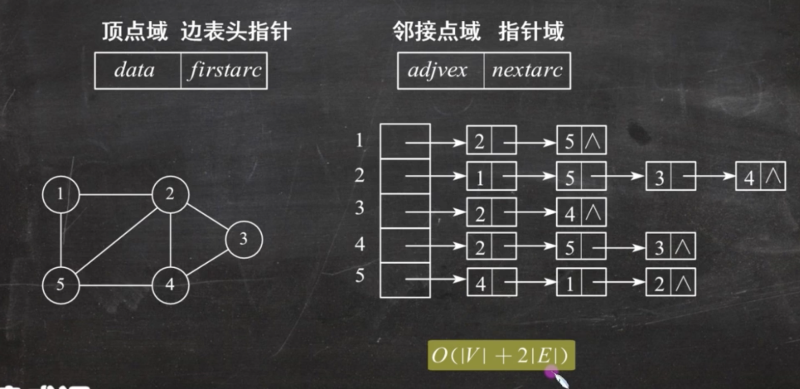
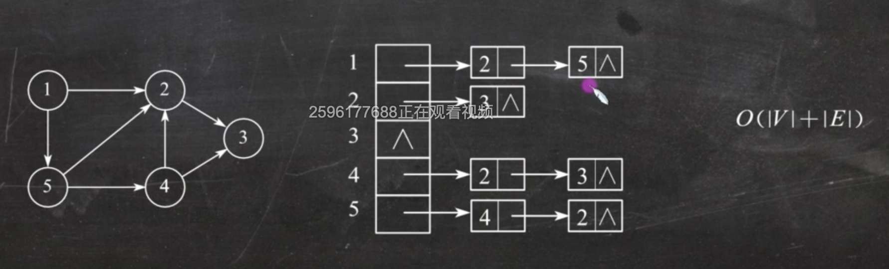
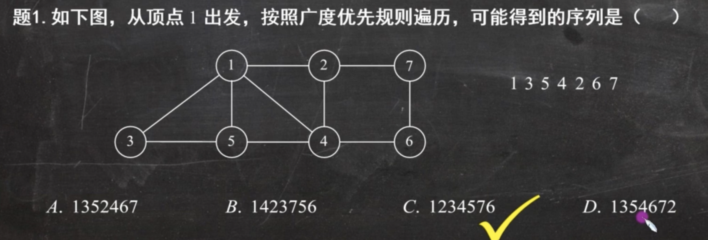
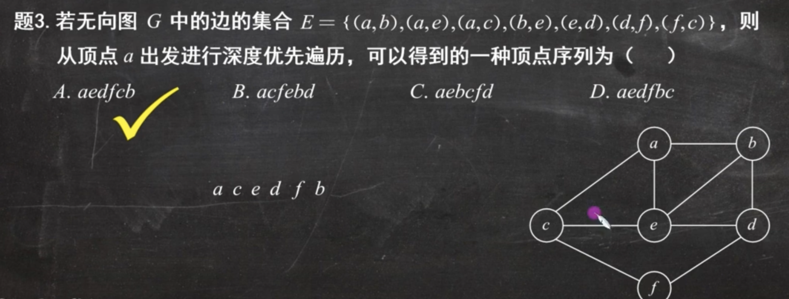
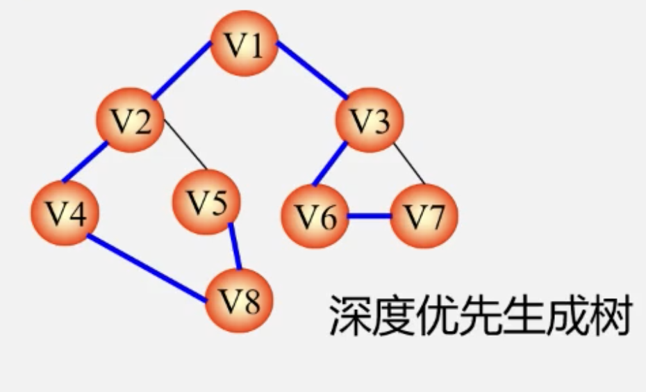
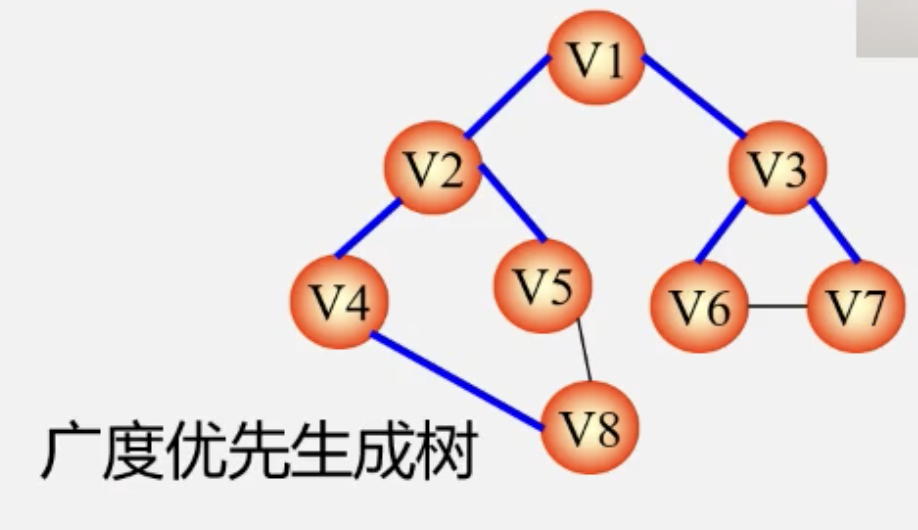
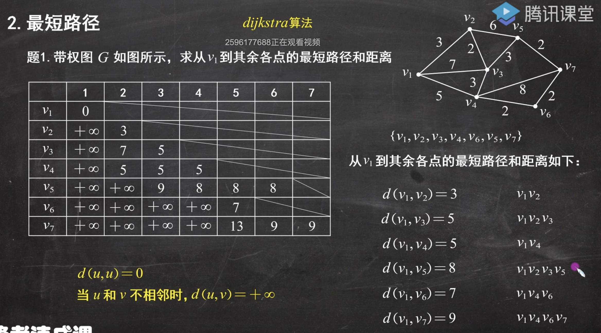
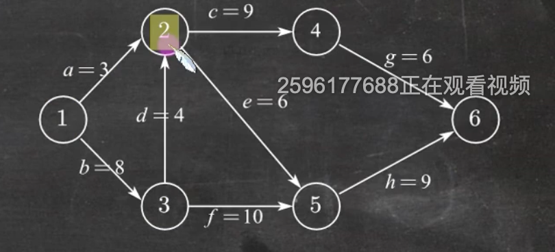
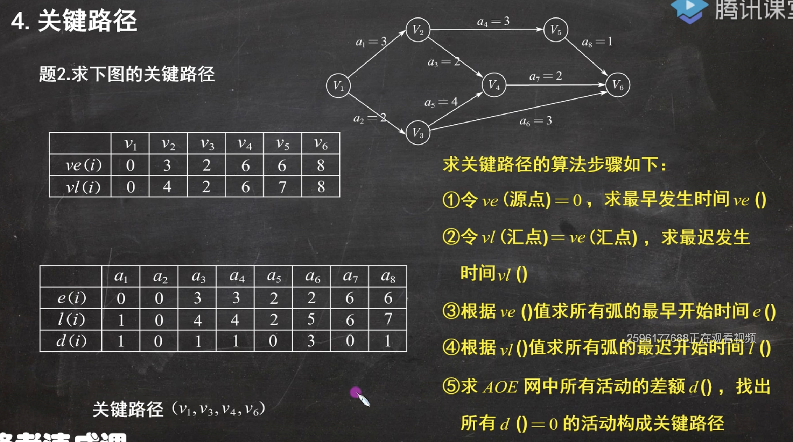

# 图

## 基本概念

-   有向图: <v,w>	两个顶点之间的线段是有方向的
-   无向图: (v,w) = (w,v)  两个顶点之间的线段无方向
-   简单图:
    -   不存在重复边, 即两个顶点之间仅有一条线段
    -   不存在顶点到自身的边
-   多重图: 与简单图的定义相反即可
-   完全图(简单完全图)
    -   对于无向图
        -   任意两个顶点之间都存在边
            -   边数 = $n*(n-1)/2$
                -   因为每条边都多乘了一次, 所以需要除以2
    -   对于有向图
        -   任意两个顶点之间都存在方向相反的两条弧
            -   边数 = $n*(n-1)$
-   子图、 生成子图
    -   顶点集与边集都被包含
    -   生成子图: 顶点集与原图相等, 边集被包含于原图
-   连通、连通图
    -   连通图: 图中任意两个顶点都是连通的,
    -   极小连通图: 既要保持图连通, 又要是边数最少的子图
-   生成树: 包含图中全部顶点的一个极小连通子图, **不存在回路**
-   顶点的度、入度和出度
    -   无向图的度: 顶点v与其他顶点连接的数量
        -   无向图的全部顶点的度的和等于边数的两倍
    -   有向图
        -   入度: 以顶点v为终点的有向边的数目
        -   出度: 以顶点v为起点的有向边的数目
        -   顶点的度: 等于入度与出度之和
        -   有向图的全部顶点的入度之和与出度之和相等, 并且入度之和与出度之和都等于边数
-   边的权, 网
    -   边上的数值表示每条边的权值
    -   网(带权图): 边上带有权值的**图**
-   路径、路径长度和回路(环)
    -   路径: 经过的顶点
    -   路径长度: 经过的边数
    -   回路(环): 起点的顶点与终点的顶点相同

## 存储结构

图的存储结构有四种: **邻接矩阵法、邻接表法**、十字链表法、邻接多重表法

-   #### 邻接矩阵法

    -   无向图

        -   A\[i][j]

            -   (v~i~,v~j~)存在
                -   A\[i][j] = 1
            -   (v~i~,v~j~)不存在
                -   A\[i][j] = 0

        -   >   

        -   无向图的邻接矩阵都是对称矩阵

    -   有向图

        -   A\[i][j]

            -   <v~i~,v~j~>存在
                -   A\[i][j] = 1
            -   <v~i~,v~j~>不存在
                -   A\[i][j] = 0

        -   >   

        -   不是对称矩阵

    -   带权图

        -   A\[i][j]

            -   <v~i~,v~j~>存在
                -   A\[i][j] = 权值
            -   <v~i~,v~j~>不存在
                -   A\[i][j] = 0或∞(但是只能取其中一个)

        -   >   

    -   对于三种矩阵, 它们的行列都是与图的顶点有关的, 与图中的边数无关

    -   n个顶点的无向连通图用邻接矩阵表示是, 该矩阵至少有$2*(n-1)$个非零元素

        -   至少: 设无向连通图为无向极小连通图
        -   n个顶点之间有(n-1)条边, 即n个顶点之间有(n-1)个关系, 由于无向图的邻接矩阵是对称矩阵, 所以乘以2

    -   带权有向图G用邻接矩阵A存储, 则顶点i的入度等于A中第i列非零非无穷元素之和

    -   用邻接矩阵存储一个图时, 在不考虑压缩存储的情况下, 所占用的存储空间大小只与图中顶点的个数有关, 而与图的边数无关

-   #### 邻接表法

-   顶点表结点: 头结点

-   边表结点: 表结点

    -   无向图

        -   >   

    -   有向图

        -   >   

-   特点

    -   若G为无向图, 则所需的存储空间为: O(|V| + 2|E|)
        若G为有向图, 则所需的存储空间为: O(|V| + |E|)
        -   V: 顶点数	E: 边数
    -   对于稀疏图, 采用邻接表表示能极大地节省存储空间
    -   图的邻接表表示不唯一
    -   在有向图的邻接表表示中, 求一个给定顶点的出度只需计算其邻接表中的结点个数

-   求某个顶点的出度(求从某个顶点出发的弧): 只需看对应结点的边表结点有几个即可

    -   只需找到对应的顶点表进行查找即可, 时间复杂度小

-   求某个顶点的入度: 只需看边表结点中有几个该结点即可

    -   需要对整个顶点表和边表进行遍历, 才能找到所有的顶点的入度, 时间复杂度较大

-   求顶点个数

    -   只需遍历顶点表, 时间复杂度小

## 图的遍历

从图中的某一顶点出发, 按照某种搜索方法沿着图中的所有顶点访问一次且仅访问一次

#### 遍历算法

广度优先搜索和深度优先搜索

-   ##### 广度优先搜索遍历

    -   类似于二叉树的层次遍历算法

    -   >   

-   ##### 深度优先搜索遍历

    -   类似于二叉树的先序遍历

    -   >   

-   如果从一个无向图的任意顶点出发进行一次深度(广度)优先搜索即可访问所有顶点, 则该图一定是连通图

## 图的应用

-   #### 最小生成树

-   生成树: 所有顶点均由边连接在一起, 但不存在回路

    -   一个图可以有许多棵不同的生成树
    -   生成树的顶点个数与图的顶点个数相同
    -   生成树是图的极小连通子图, 去掉一条边则是非连通图
    -   一个有n个顶点的连通图的生成树有n-1条边
    -   在生成树中再加一条边必然形成回路
        -   但是含有n个顶点n-1条边的图不一定是生成树
    -   生成树中任意两个顶点间的路径是唯一的

-   深度优先生成树: 利用深度优先生成的

-   >   

-   广度优先生成树: 利用广度优先生成的

-   >   

-   最小生成树: 给定一个无向网图, 在该网的所有生成树中, 使得各边**权值之和最小**的那棵生成树成为该网的**最小生成树**, 也叫**最小代价生成树**.

    -   最小生成树可能并不唯一

-   ##### 如何构造最小生成树

    -   构造最小生成树的算法有很多, 其中多数算法都利用了MST的性质

        -   MST性质: 设N = (V, E)是一个连通网, U是顶点集V的一个非空子集. 若(u, v)是一条具有最小权值的边, 其中u属于U, v属于V-U, 则必然存在一棵包含边(u, v)的最小生成树

            -   >

        -   MST性质解释:

            -   在生成树的构造过程中, 图中n个顶点(V)分属两个集合

                -   已经落在生成树上的顶点集: ***U***
                -   尚未落在生成树上的顶点集: ***V - U***

            -   接下来则应在所有连通U中顶点和V-U中顶点的边中选取**权值最小的边**

            -   >   

-   普里姆(Prim)算法

    -   设*N = (V, E)*是连通网, *TE*是*N*上最小生成树中的**边的集合**

    -   初始令 *U = {u~0~}, (u~0~属于V), TE = {}*

    -   在所有*u属于U, v属于V-U*的边(u, v)属于E中, 找一条代价最小的边(u~0~, v~0~)

    -   将(u~0~, v~0~)并入集合TE, 同时v~0~并入U.

    -   重复上述操作直至 U=V 为止, 则 T=(V, TE) 为 N 的最小生成树

    -   >

-   克鲁斯卡尔(Kruskal)算法

    -   设连通网 N = (V, E), 令最小生成树初始状态为**只有** n 个**顶点**而**无边**的非连通图 T = (V, {}), 每个顶点自成一个连通分量

    -   在 E 中选取代价最小的边, 若该边依附的顶点落在 T 中不同的连通分量上(即: **不能形成环**), 则将此边加入到 T 中; 否则, 舍去此边, 选取下一条代价最小的边.

    -   依此类推, 直至 T 中所有顶点都在同一连通分量上为止

    -   >

    #### 最短路径

-   dijkstra算法

    -   d(u, u) = 0		当u和v不相邻时, d(u, v) = +∞

    -   >   

    #### 拓扑排序

    #### 关键路径

-   ##### 概念

    -   AOE网: 以顶点表示事件, 以有向边表示活动, 以边上的权值表示完成该活动的开销
    -   关键路径: 从开始顶点到结束顶点的所有路径中, 具有最大路径长度的路径
    -   关键活动: 关键路径上的活动

-   ##### 事件(顶点)v~k~的最早发生时间ve(k)

    -   指从源点v~1~到顶点v~k~的最长路径长度

    -   Ve(1) = 0

    -   Ve(k) = Max{ve(j) + Weight(v~j~, v~k~)}

        -   v~k~是v~j~的任意后续, ve(j)是v~j~的最早发生时间

        -   Weight(v~j~, v~k~)是v~j~和v~k~之间的权值

        -   >   

        -   2的最早发生时间为12

-   ##### 事件v~k~的最迟发生时间vl(k)

    -   指在不推迟整个工程完成的前提下, 即保证它的后续事件v~j~在其最迟发生时间vl(j)能够发生时, 该事件最迟必须发生的时间
    -   vl(汇点) = ve(汇点)
        -   汇点指最后一个顶点
    -   vl(k) = Min{ vl(j) - Weight(v~k~, v~j~) }
        -   v~k~是v~j~的任意前驱

-   ##### 活动a~i~的最早开始时间e(i)

    -   指该活动弧的起点所表示的事件的最早发生时间
    -   <v~k~, v~j~>     对于v~k~与v~j~两个顶点之间, a~i~活动的最早开始时间为v~k~的最早发生时间
    -   e(i) = ve(k)

-   ##### 活动a~i~的最迟开始时间

    -   指该活动弧的终点所表示事件的最迟发生时间与该活动所需时间之差
    -   <v~k~, v~j~>     对于v~k~与v~j~两个顶点之间, a~i~活动的最迟开始时间为v~j~的最迟发生时间减去vk与vj间的权值
    -   l(i) = vl(j) - Weight(v~j~, v~k~)

-   ##### 一个活动a~i~的最迟开始时间l(i)和其最早开始时间e(i)的差额d(i) = l(i) - e(i)

    -   d(i) = 0的活动a~i~是**关键活动**

-   >   