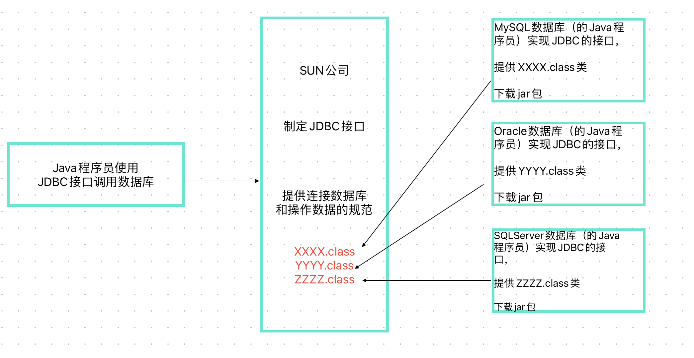
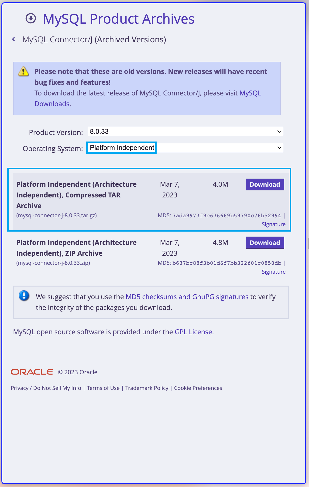
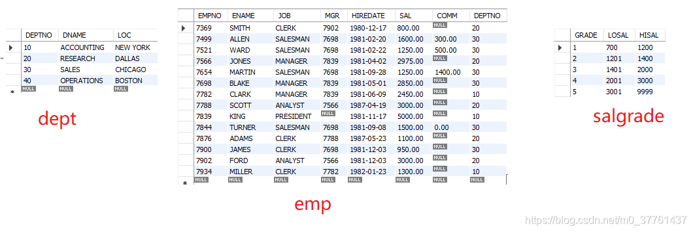

# JDBC

## 1、JDBC是什么？

**J**ava **D**ata**B**ase **C**onnectivity（Java语言连接数据库）

## 2、JDBC的本质

是sun公司提供的一个**接口**。在java.sql.*包下。




## 3、下载jar包

在[mysql官网](https://downloads.mysql.com/archives/c-j/)下载jar包



下载对应mysql版本的jar包即可。

> jar包就是别人已经写好的类，然后将这些类进行打包，我们可以将这些jar包引入自己的项目当中。使用这些类。


## 4、JDBC编程六步

| 步骤                        | 说明                                                         |
| :-------------------------- | :----------------------------------------------------------- |
| 1、注册驱动                 | 告诉Java程序，即将要连接的是哪个品牌的数据库                 |
| 2、获取数据库连接           | 表示JVM的进程和数据库进程之间的通道打开了，这属于进程之间的通信，使用完毕后一定要关闭通道。 |
| 3、获取数据库操作对象       | 专门执行sql语句的对象                                        |
| 4、执行SQL语句              | DQL DML...执行sql语句                                        |
| 5、处理查询结果集（非必要） | 只有执行的sql是select语句时，才会有这一步                    |
| 6、释放资源                 | 使用完资源之后一定要关闭资源。Java和数据库属于进程间的通信，开启之后一定要关闭 |

# JDBC编程

## 1、创建一个mysql数据库作为测试

```sql
create database test;
use test;
DROP TABLE IF EXISTS EMP;
DROP TABLE IF EXISTS DEPT;
DROP TABLE IF EXISTS SALGRADE;

CREATE TABLE DEPT
       (DEPTNO int(2) not null ,
	DNAME VARCHAR(14) ,
	LOC VARCHAR(13),
	primary key (DEPTNO)
	);
CREATE TABLE EMP
       (EMPNO int(4)  not null ,
	ENAME VARCHAR(10),
	JOB VARCHAR(9),
	MGR INT(4),
	HIREDATE DATE  DEFAULT NULL,
	SAL DOUBLE(7,2),
	COMM DOUBLE(7,2),
	primary key (EMPNO),
	DEPTNO INT(2) 
	)
	;

CREATE TABLE SALGRADE
      ( GRADE INT,
	LOSAL INT,
	HISAL INT );

INSERT INTO DEPT ( DEPTNO, DNAME, LOC ) VALUES ( 
10, 'ACCOUNTING', 'NEW YORK'); 
INSERT INTO DEPT ( DEPTNO, DNAME, LOC ) VALUES ( 
20, 'RESEARCH', 'DALLAS'); 
INSERT INTO DEPT ( DEPTNO, DNAME, LOC ) VALUES ( 
30, 'SALES', 'CHICAGO'); 
INSERT INTO DEPT ( DEPTNO, DNAME, LOC ) VALUES ( 
40, 'OPERATIONS', 'BOSTON'); 
commit;
 
INSERT INTO EMP ( EMPNO, ENAME, JOB, MGR, HIREDATE, SAL, COMM,
DEPTNO ) VALUES ( 
7369, 'SMITH', 'CLERK', 7902,  '1980-12-17'
, 800, NULL, 20); 
INSERT INTO EMP ( EMPNO, ENAME, JOB, MGR, HIREDATE, SAL, COMM,
DEPTNO ) VALUES ( 
7499, 'ALLEN', 'SALESMAN', 7698,  '1981-02-20'
, 1600, 300, 30); 
INSERT INTO EMP ( EMPNO, ENAME, JOB, MGR, HIREDATE, SAL, COMM,
DEPTNO ) VALUES ( 
7521, 'WARD', 'SALESMAN', 7698,  '1981-02-22'
, 1250, 500, 30); 
INSERT INTO EMP ( EMPNO, ENAME, JOB, MGR, HIREDATE, SAL, COMM,
DEPTNO ) VALUES ( 
7566, 'JONES', 'MANAGER', 7839,  '1981-04-02'
, 2975, NULL, 20); 
INSERT INTO EMP ( EMPNO, ENAME, JOB, MGR, HIREDATE, SAL, COMM,
DEPTNO ) VALUES ( 
7654, 'MARTIN', 'SALESMAN', 7698,  '1981-09-28'
, 1250, 1400, 30); 
INSERT INTO EMP ( EMPNO, ENAME, JOB, MGR, HIREDATE, SAL, COMM,
DEPTNO ) VALUES ( 
7698, 'BLAKE', 'MANAGER', 7839,  '1981-05-01'
, 2850, NULL, 30); 
INSERT INTO EMP ( EMPNO, ENAME, JOB, MGR, HIREDATE, SAL, COMM,
DEPTNO ) VALUES ( 
7782, 'CLARK', 'MANAGER', 7839,  '1981-06-09'
, 2450, NULL, 10); 
INSERT INTO EMP ( EMPNO, ENAME, JOB, MGR, HIREDATE, SAL, COMM,
DEPTNO ) VALUES ( 
7788, 'SCOTT', 'ANALYST', 7566,  '1987-04-19'
, 3000, NULL, 20); 
INSERT INTO EMP ( EMPNO, ENAME, JOB, MGR, HIREDATE, SAL, COMM,
DEPTNO ) VALUES ( 
7839, 'KING', 'PRESIDENT', NULL,  '1981-11-17'
, 5000, NULL, 10); 
INSERT INTO EMP ( EMPNO, ENAME, JOB, MGR, HIREDATE, SAL, COMM,
DEPTNO ) VALUES ( 
7844, 'TURNER', 'SALESMAN', 7698,  '1981-09-08'
, 1500, 0, 30); 
INSERT INTO EMP ( EMPNO, ENAME, JOB, MGR, HIREDATE, SAL, COMM,
DEPTNO ) VALUES ( 
7876, 'ADAMS', 'CLERK', 7788,  '1987-05-23'
, 1100, NULL, 20); 
INSERT INTO EMP ( EMPNO, ENAME, JOB, MGR, HIREDATE, SAL, COMM,
DEPTNO ) VALUES ( 
7900, 'JAMES', 'CLERK', 7698,  '1981-12-03'
, 950, NULL, 30); 
INSERT INTO EMP ( EMPNO, ENAME, JOB, MGR, HIREDATE, SAL, COMM,
DEPTNO ) VALUES ( 
7902, 'FORD', 'ANALYST', 7566,  '1981-12-03'
, 3000, NULL, 20); 
INSERT INTO EMP ( EMPNO, ENAME, JOB, MGR, HIREDATE, SAL, COMM,
DEPTNO ) VALUES ( 
7934, 'MILLER', 'CLERK', 7782,  '1982-01-23'
, 1300, NULL, 10); 
commit;
 
INSERT INTO SALGRADE ( GRADE, LOSAL, HISAL ) VALUES ( 
1, 700, 1200); 
INSERT INTO SALGRADE ( GRADE, LOSAL, HISAL ) VALUES ( 
2, 1201, 1400); 
INSERT INTO SALGRADE ( GRADE, LOSAL, HISAL ) VALUES ( 
3, 1401, 2000); 
INSERT INTO SALGRADE ( GRADE, LOSAL, HISAL ) VALUES ( 
4, 2001, 3000); 
INSERT INTO SALGRADE ( GRADE, LOSAL, HISAL ) VALUES ( 
5, 3001, 9999); 
commit;
```

包含3表：部门表、员工表、薪资等级表。



## 2、JDBC中重要的接口和类

#### **DriverManager类**（驱动管理类）里面全是静态方法，我们用它来注册驱动

`static void registerDriver(Driver driver);`		向 DriverManager 注册驱动程序

`static Connection getConnection(String url, String user, String password);` 		建立到给定数据库 URL 的连接

#### Statement接口（执行sql）用于执行静态 SQL 语句并返回它所生成结果的对象

`int executeUpdate(String sql)`		执行更新语句，该语句可能为 INSERT、UPDATE 或 DELETE 语句，返回值是“影响数据库中的记录条数”
`ResultSet executeQuery(String sql)`		执行 SQL查询语句，该语句返回单个 ResultSet 对象

#### ResultSet接口（查询结果集），sql查询语句后可以将结果封装到ResultSet中

`boolean next()`	将光标从当前位置向前移一行。ResultSet 光标最初位于第一行之前；第一次调用 next 方法使第一行成为当前行；第二次调用使第二行成为当前行，依此类推（用来查询结果）
`String getString(int columnIndex)`	不管数据库中的数据类型是什么，都以String的形式取出（columnIndex是指取列数，第一列，第二列…）
`String getString(String columnLabel)`	不管数据库中的数据类型是什么，都以String的形式取出（ columnLabel指查询语句中的列名）

## 示例1: 插入操作

```java
import java.sql.*;

public class JDBCTest01 {
    public static void main(String[] args) {

        Connection conn = null;
        Statement stmt = null;
        try {
            //1、注册驱动的第二种方法，告诉java我要连接mysql
            Driver driver = new com.mysql.jdbc.Driver();
            DriverManager.registerDriver(driver);
            //2、获取连接，告诉java我要连接哪台机器的mysql，并写入用户和密码
            //127.0.0.1和localhost都是本地ip地址
            String url = "jdbc:mysql://127.0.0.1:3306/test?useSSL=false";
            String user = "root";
            String password = "root";
            conn = DriverManager.getConnection(url,user,password);
            System.out.println(conn);

            //3、获取数据库操作对象（statement专门执行sql语句）
            stmt = conn.createStatement();

            //4、执行sql
            String sql = "insert into dept(deptno,dname,loc) values(50,'军部','长安');";
            //专门执行DML语句（insert、delete、update）
            //返回值是“影响数据库中的记录条数”
            int a = stmt.executeUpdate(sql);
            System.out.println(a);
            System.out.println(a == 1 ? "保存成功":"保存失败");

            //5、处理查询结果集
			//插入语句，暂时不需要查询

        } catch (SQLException e) {
            e.printStackTrace();
        } finally {
            //6、释放资源
            //为了保证资源一定释放，在finally语句块中关闭资源
            //分别要遵循从小到大依次关闭
            if (stmt != null) {
                try {
                    stmt.close();
                } catch (SQLException throwables) {
                    throwables.printStackTrace();
                }
            }
            if (conn != null) {
                try {
                    conn.close();
                } catch (SQLException throwables) {
                    throwables.printStackTrace();
                }
            }
        }
    }
}
```

## 示例2：处理查询结果集（遍历查询结果）

```java
import java.sql.*;

public class JDBCTest05 {
    public static void main(String[] args) {
        Connection conn = null;
        Statement stmt = null;
        ResultSet rs = null;
        try {
            //1、注册驱动
            Class.forName("com.mysql.jdbc.Driver");
            //2、获取连接
            conn = DriverManager.getConnection("jdbc:mysql://localhost:3306/test?useSSL=false","root","root");
            //3、获取数据库连接对象
            stmt = conn.createStatement();
            //执行sql
            String sql = "select empno,ename,sal from emp;";
            rs = stmt.executeQuery(sql);
            //5、处理查询结构集
            while (rs.next()) {
                //1、第一种方法
                //String empno = rs.getString(1); //第一列
                //String ename = rs.getString(2); //第二列
                //String sal = rs.getString(3);   //第三列
                //System.out.println(empno + "\t" + ename + "\t" + sal + "\t"); //jdbc中所有下标从1开始

                //2、第二种方法
                String empno = rs.getString("empno"); //第一列
                String ename = rs.getString("ename"); //第二列
                String sal = rs.getString("sal");   //第三列
                System.out.println(empno + "\t" + ename + "\t" + sal + "\t"); //jdbc中所有下标从1开始
            }
        } catch (Exception e) {
            e.printStackTrace();
        } finally {
            //6、释放资源
            if (rs != null) {
                try {
                    rs.close();
                } catch (SQLException throwables) {
                    throwables.printStackTrace();
                }
            }
            if (stmt != null) {
                try {
                    stmt.close();
                } catch (SQLException throwables) {
                    throwables.printStackTrace();
                }
            }
            if (conn != null) {
                try {
                    conn.close();
                } catch (SQLException throwables) {
                    throwables.printStackTrace();
                }
            }
        }
    }
}
```


