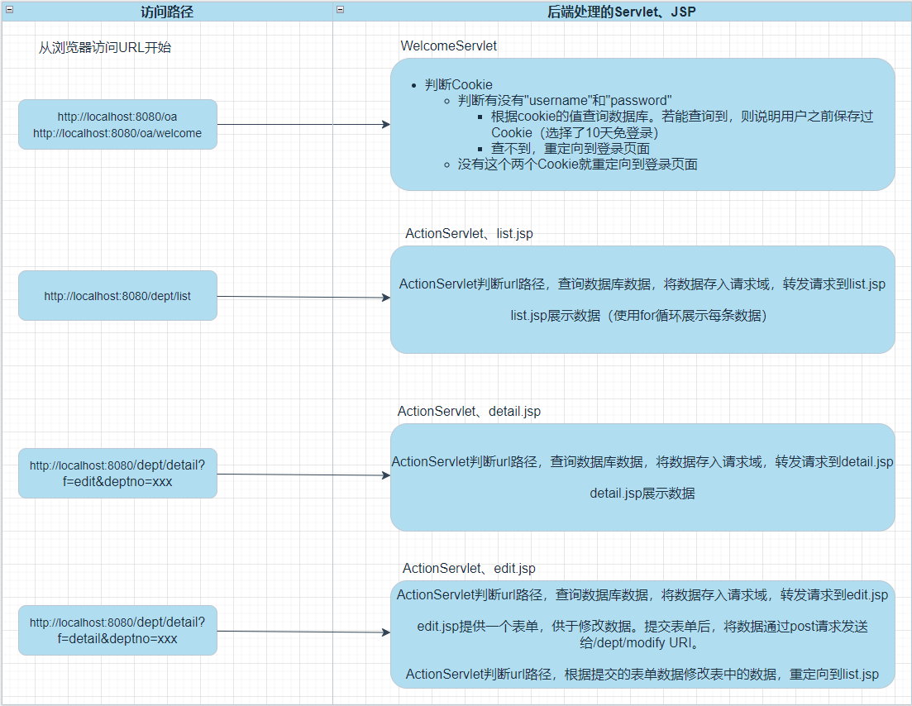

# JSTL标签库

## 什么是JSTL标签库？

Java Standard Tag Lib（Java标准的标签库）

JSTL标签库通常结合EL表达式一起使用。目的是让JSP中的java代码消失。

标签是写在JSP当中的，但实际上最终还是要执行对应的java程序。（java程序在jar包当中。）

## 使用JSTL标签库的步骤：

1. 第一步：引入JSTL标签库对应的jar包。

    - tomcat10之后引入的jar包是：

        - jakarta.servlet.jsp.jstl-2.0.0.jar

        - jakarta.servlet.jsp.jstl-api-2.0.0.jar

2. 第二步：在JSP中引入要使用标签库。（使用taglib指令引入标签库。）

    - JSTL提供了很多种标签，你要引入哪个标签？？？？重点掌握核心标签库。

    - ```jsp
        <%@taglib prefix="c" uri="http://java.sun.com/jsp/jstl/core" %>
        这个就是核心标签库。
        prefix="这里随便起一个名字就行了，核心标签库，大家默认的叫做c，你随意。"
        ```

3. 第三步：在需要使用标签的位置使用即可。表面使用的是标签，底层实际上还是java程序。

## JSTL标签的原理

```jsp
<%@taglib prefix="c" uri="http://java.sun.com/jsp/jstl/core" %>
以上uri后面的路径实际上指向了一个xxx.tld文件。
tld文件实际上是一个xml配置文件。
在tld文件中描述了“标签”和“java类”之间的关系。
以上核心标签库对应的tld文件是：c.tld文件。它在哪里。
在jakarta.servlet.jsp.jstl-2.0.0.jar里面META-INF目录下，有一个c.tld文件。
```

### 源码解析：配置文件tld解析

```xml
<tag>
    <description>对该标签的描述</description>
    <name>catch</name> 标签的名字
    <tag-class>org.apache.taglibs.standard.tag.common.core.CatchTag</tag-class> 标签对应的java类。
    <body-content>JSP</body-content> 标签体当中可以出现的内容，如果是JSP，就表示标签体中可以出现符合JSP所有语法的代码。例如EL表达式。
    <attribute>
        <description>
        	对这个属性的描述
        </description>
        <name>var</name> 属性名
        <required>false</required> false表示该属性不是必须的。true表示该属性是必须的。
        <rtexprvalue>false</rtexprvalue> 这个描述说明了该属性是否支持EL表达式。false表示不支持。true表示支持EL表达式。
    </attribute>
  </tag>

<c:catch var="">
	JSP....
</c:catch>
```

## jstl中的核心标签库core当中有哪些常用的标签呢？

- c:if

    - <c:if test="boolean类型，支持EL表达式"></c: if>

- c:forEach

    - `<c:forEach items="集合，支持EL表达式" var="集合中的元素" varStatus="元素状态对象"> ${元素状态对象.count} </c: forEach>`
    - `<c:forEach var="i" begin="1" end="10" step="2"> ${i} </c: forEach>`

- c:choose c:when c:otherwise

    - ```jsp
        <c:choose>
            <c:when test="${param.age < 18}">
                青少年
            </c:when>
            <c:when test="${param.age < 35}">
                青年
            </c:when>
            <c:when test="${param.age < 55}">
                中年
            </c:when>
            <c:otherwise>
                老年
            </c:otherwise>
        </c:choose>
        ```

## 使用以上知识改造OA



我们现在需要修改前端的jsp页面，尽量减少Java代码的出现，使用JSTL和EL表达式来代替他们