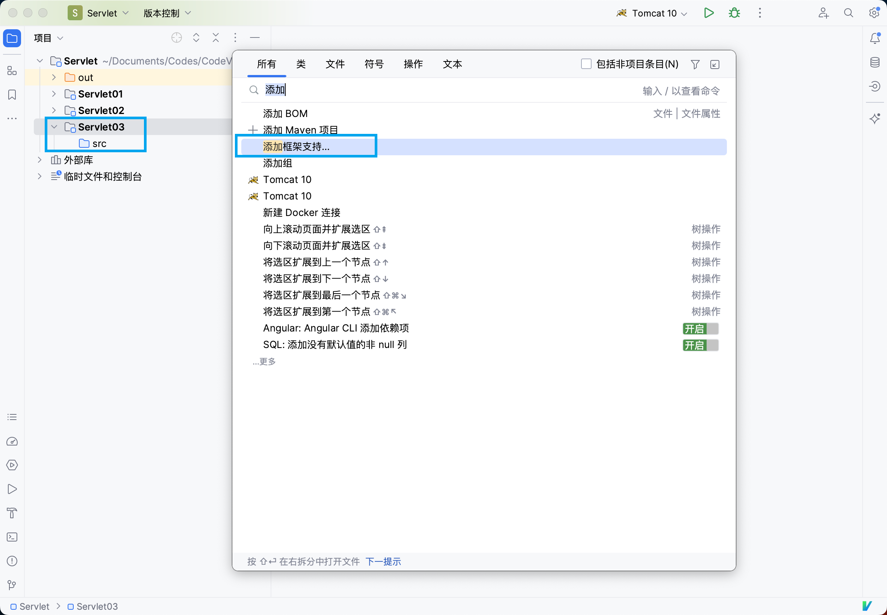
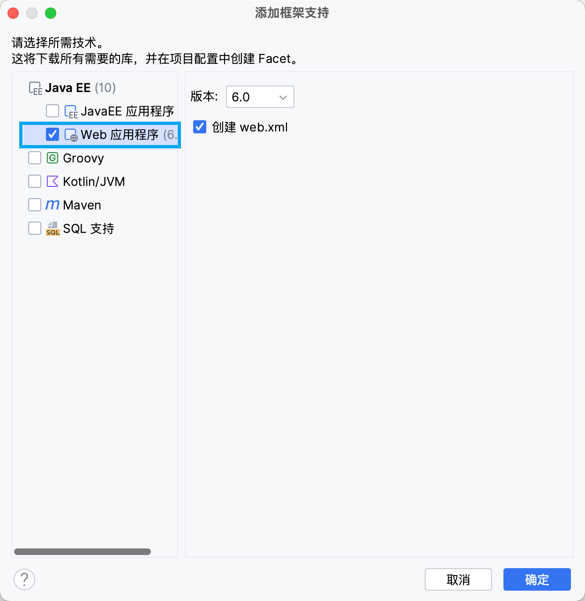
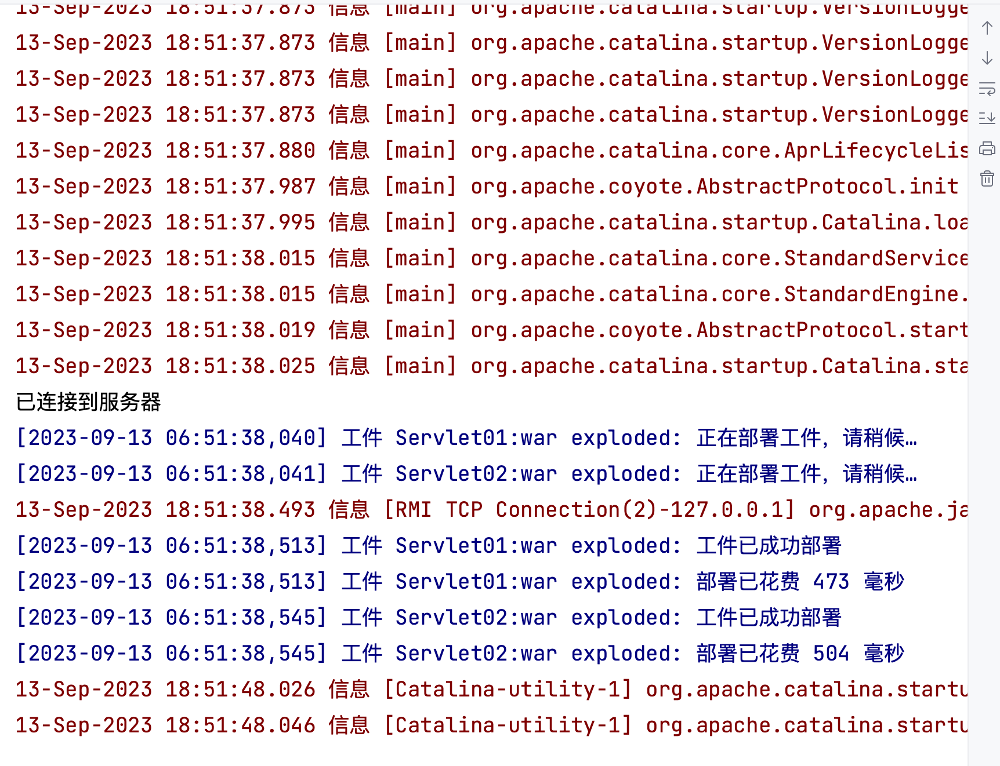
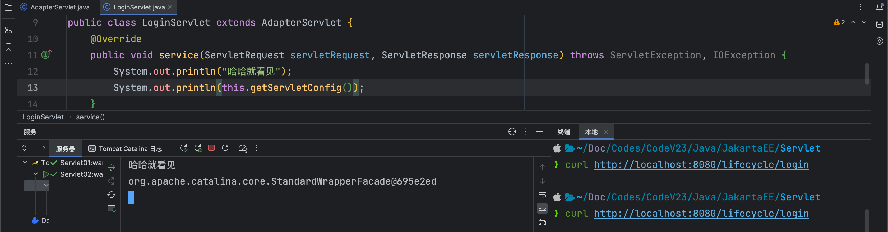
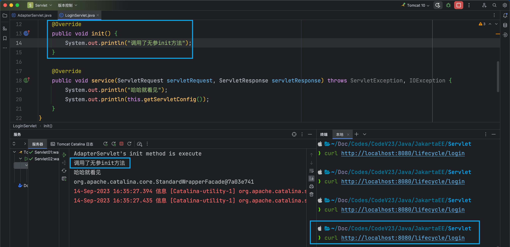
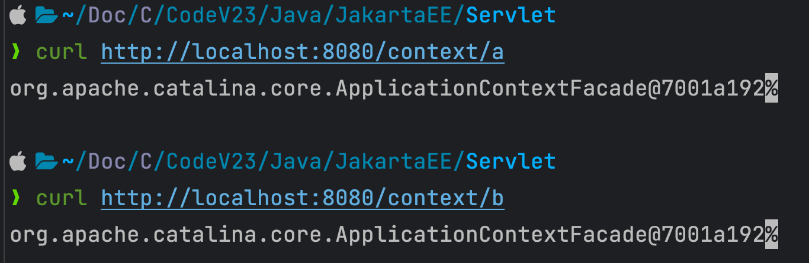
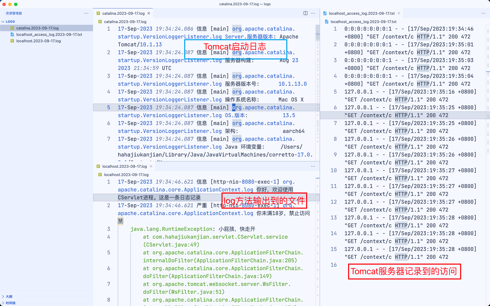
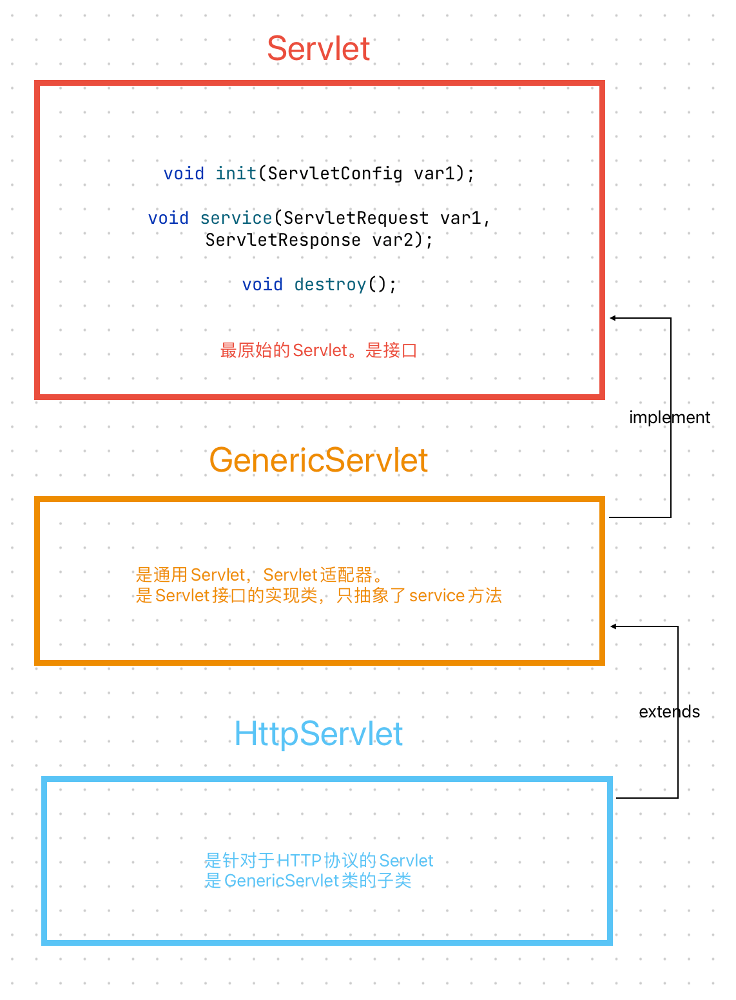
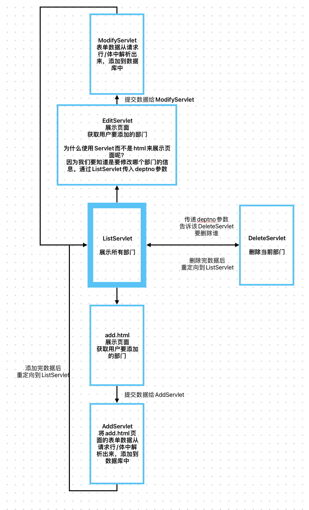
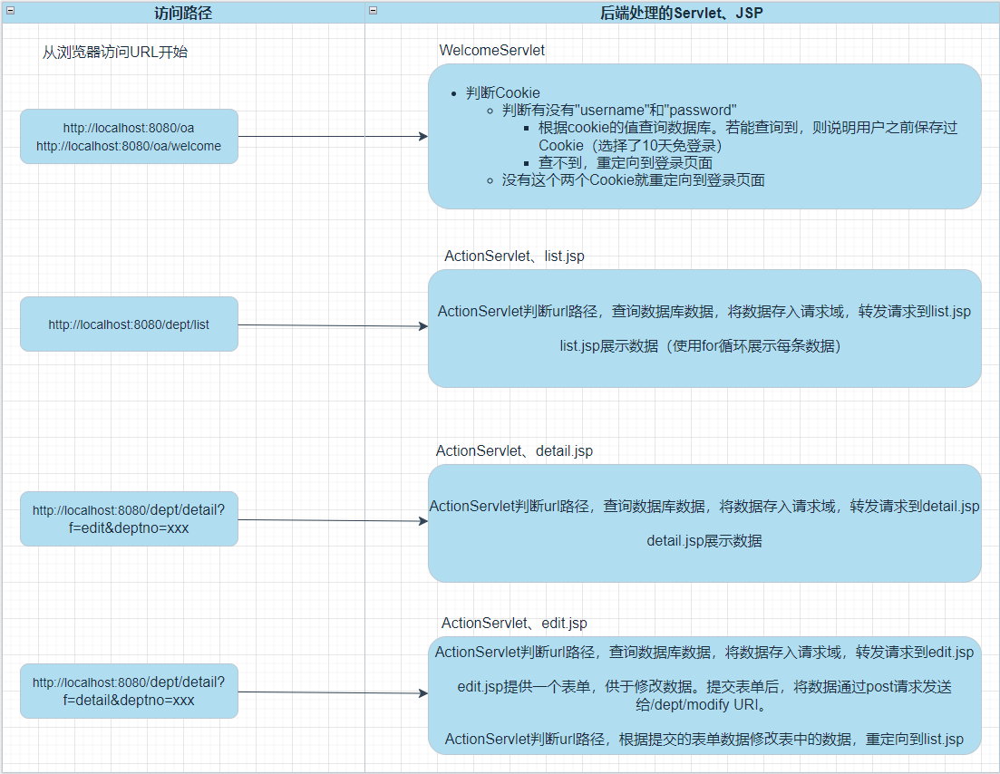

#  Servlet

## IDEA创建Servlet项目

### 1、创建一个JavaSE模块


不要创建JakartaEE模块等等，因为它们使用Maven，我们只创建单纯的Tomcat+Servlet+JSP项目。

### 2、添加web目录



由于创建出的模块没有web目录，我们需要双击Shift搜索“添加框架支持”，选择Web



### 3、完善Tomcat运行环境


## Servlet生命周期

### 自己new的Servlet对象不受Web容器的管理

Web容器（Tomcat服务器）在创建Servlet对象时，会先创建一个HashMap集合，将其创建的Servlet对象都存入到集合当中，统一进行管理。

但是我们自己new出来的Servlet对象，没有添加到集合当中，不受Web容器的管理。

因此自己创建的Servlet对象的生命周期与

### **服务器启动后，不会创建Servlet对象**

#### **证明：**

```java
public class AServlet implements Servlet {

	public AServlet() {
		System.out.println("AServlet无参数构造方法执行了");
	}

	@Override
    ....
}
```



服务器启动后，AServlet的构造方法并没有被调用。

#### **解释：**

在服务器刚刚启动的时候，加入我们写了1000个Servlet类，如果都创建了对象，会非常占用内存。

根据用户发送的请求，动态的创建Servlet

#### 配置Servlet类在服务器启动时，自动创建对象

如果在web.xml中配置``<load-on-startup>任意一个整数</load-on-startup>`，那么该servlet类会在服务器启动时启动创建。

整数越小，表示创建对象的优先级越高。不用在意负数。可以理解为数组下标

```xml
	<servlet>
		<servlet-name>aservlet</servlet-name>
		<servlet-class>com.hahajiukanjian.servlet.AServlet</servlet-class>
		<load-on-startup>0</load-on-startup>
	</servlet>
	<servlet-mapping>
		<servlet-name>aservlet</servlet-name>
		<url-pattern>/a</url-pattern>
	</servlet-mapping>
```

### 生命周期

```shell
AServlet无参数构造方法执行了
AServlet init method execute!
AServlet service method execute!
--------------访问了一次http://localhost:8080/lifecycle/a--------------
AServlet service method execute!
AServlet service method execute!
AServlet service method execute!
AServlet service method execute!
AServlet service method execute!
AServlet service method execute!
--------------访问了多次http://localhost:8080/lifecycle/a--------------

```

根据以上结果我们可以得知

- 用户在发送第一次请求的时候Servlet对象被实例化（AServlet的构造方法被执行了。并且执行的是无参数构造方法。）
- AServlet对象被创建出来之后，Tomcat服务器马上调用了AServlet对象的init方法。（init方法在执行的时候，AServlet对象已经存在了。已经被创建出来了。）
- 用户发送第一次请求的时候，init方法执行之后，Tomcat服务器马上调用AServlet对象的service方法。

- 根据以上输出结果得知，用户在发送第二次，或者第三次，或者第四次请求的时候，Servlet对象并没有新建，还是使用之前创建好的Servlet对象，直接调用该Servlet对象的service方法，这说明：

    1. Servlet对象是单例的（单实例的。但是要注意：Servlet对象是单实例的，但是Servlet类并不符合单例模式。我们称之为假单例。之所以单例是因为Servlet对象的创建我们javaweb程序员管不着，这个对象的创建只能是Tomcat来说了算，Tomcat只创建了一个，所以导致了单例，但是属于假单例。真单例模式，构造方法是私有化的。）

    2. 无参数构造方法、init方法只在第一次用户发送请求的时候执行。也就是说无参数构造方法只执行一次。init方法也只被Tomcat服务器调用一次。

    3. 只要用户发送一次请求：service方法必然会被Tomcat服务器调用一次。发送100次请求，service方法会被调用100次。

- 关闭服务器的时候，控制台输出了以下内容：

    ```
    AServlet's destroy method execute!
    ```

- 通过以上输出内容，可以得出以下结论：

    - Servlet的destroy方法只被Tomcat服务器调用一次。
    - destroy方法是在什么时候被调用的？
        - 在服务器关闭的时候。
        - 因为服务器关闭的时候要销毁AServlet对象的内存。
        - 服务器在销毁AServlet对象内存之前，Tomcat服务器会自动调用AServlet对象的destroy方法。

- 请问：destroy方法调用的时候，对象销毁了还是没有销毁呢？

    - destroy方法执行的时候AServlet对象还在，没有被销毁。destroy方法执行结束之后，AServlet对象的内存才会被Tomcat释放。

- Servlet对象更像一个人的一生：

    - Servlet的无参数构造方法执行：标志着你出生了。
    - Servlet对象的init方法的执行：标志着你正在接受教育。
    - Servlet对象的service方法的执行：标志着你已经开始工作了，已经开始为人类提供服务了。
    - Servlet对象的destroy方法的执行：标志着临终。有什么遗言，抓紧的。要不然，来不及了。

- 关于Servlet类中方法的调用次数？

    - 构造方法只执行一次。
    - init方法只执行一次。
    - service方法：用户发送一次请求则执行一次，发送N次请求则执行N次。
    - destroy方法只执行一次。

> **tips**
>
> **Q：**在Servlet中，init方法和构造方法都是只执行一次，并且它们执行的时间大致相同。为什么Sun公司在制定Servlet规范的时候，制定了init方法呢？直接使用构造方法不就行了吗？
>
> **A：**如果程序员使用构造方法初始化Servlet对象，很容易写出有参数的构造方法。而Tomcat服务器，通过反射机制创建Servlet对象时，只能调用无参构造方法。因此不如重新制定一个规范，使用init方法初始化Servlet对象。


## 适配器模式

> 我们的手机直接插在220V的电压上，手机可能会报废掉。因此我们需要手机的插头（充电适配器）

在AServlet实现Servlet接口的时候，需要实现很多的方法，而我们实际常用的只有init、service、destory方法。

因此我们可以写一个**AAdapter抽象类**，实现其他不常用的方法，抽象init、service、destory方法。

但是这样AServlet只能通过**继承（extends）**的方式，来实现Servlet类的方法，会占用继承位。

### 完善适配器

#### 1、接收可能会用到的ServletConfig对象

tomcat为代码大致写法

```java
public class Tomcat {
    public static void main(String[] args) {
        // 通过反射机制，读取web.xml文件中的数据
        Class clazz = Class.forName("com.hahajiukanjian.servlet.LoginServlet");
        Object obj = clazz.newInstance();
        // 向下转型
        Servlet servlet = (Servlet)obj;

        // 创建ServletConfig对象
        // Tomcat服务器负责将ServletConfig对象实例化出来。
        // 多态（Tomcat服务器完全实现了Servlet规范）
        ServletConfig servletConfig = new org.apache.catalina.core.StandardWrapperFacade();

        // 调用init方法
        servlet.init(servletConfig);

        // 等待调用service方法
    }
}
```

在创建Servlet对象的时候，会创建ServletConfig对象。将其作为形参传入servlet对象的init方法中。

我们创建的适配器，只抽象了service方法。`public abstract void service(ServletRequest servletRequest, ServletResponse servletResponse) throws ServletException, IOException;`

**这个方法无法接收到servletConfig形参的值。**我们需要对适配器进行完善。使我们在**继承适配器的时候能够得到servletConfig的值**

```java
public abstract class AdapterServlet implements Servlet {

	private ServletConfig servletConfig;

	@Override
	public ServletConfig getServletConfig() {
		return servletConfig;
	}

	@Override
	public void init(ServletConfig servletConfig) throws ServletException {
		System.out.println("AdapterServlet's init method is execute");
		this.servletConfig = servletConfig;
	}

    ....
}
```

我们在**AdapterServlet**（适配器Servlet类）中添加了私有的成员变量servletConfig。并创建了get方法。这样通过子类调用`this.getServletConfig()`，即可获得形参servletConfig的值。

**查看输出结果：**



#### 2、给父类的init方法加上final修饰

如果子类重写init方法，步骤1就会失效

```java
public class LoginServlet extends AdapterServlet {

	@Override
	public void init(ServletConfig servletConfig) throws ServletException {
	}

	@Override
	public void service(ServletRequest servletRequest, ServletResponse servletResponse) throws ServletException, IOException {
		System.out.println("哈哈就看见");
		System.out.println(this.getServletConfig());
	}
}
```

子类重写了init方法，父类（AdapterServlet）的init方法不会被执行。导致service中获取的servletConfig对象的值为null。

**Q：**如何解决这个问题呢？

**A：**将父类的init方法加上final修饰，使子类不能重写该方法。

```java
public class AdapterServlet implements Servlet {
    ...
	public final void init(ServletConfig servletConfig) throws ServletException {
		this.servletConfig = servletConfig;
	}
    ...
}
```

#### 3、提供一个无参的init方法供子类重写

父类当中有参数的init方法已经加上了**final**修饰，无法被子类重写。而子类在写业务的时候，可能需要重写init方法，来达到业务的需求。这时候应该怎么办呢？

让父类提供一个无参的init方法。

```java
public class AdapterServlet implements Servlet {
    ...
	public final void init(ServletConfig servletConfig) throws ServletException {
		this.servletConfig = servletConfig;
		init();  // <============
	}
    public void init() {} // <===============
    ...
}
```

并且在有参数的init方法（Tomcat服务器中调用的是有参数的init方法）中调用这个无参数的init方法。

这样，如果子类需要重写init方法时，只需要重写无参数的init方法就可以啦。



#### 官方提供的完善适配器

包路径：jakarta.servlet.GenericServlet;

```java
public abstract class GenericServlet implements Servlet, ServletConfig, Serializable {
    private transient ServletConfig config;		// <==========

 	// .......

    public void init(ServletConfig config) throws ServletException {
        this.config = config;
        this.init();		// <=========
    }

    public void init() throws ServletException {}		// <=========

    public abstract void service(ServletRequest var1, ServletResponse var2) throws ServletException, IOException;
	// ......
}

```

可以发现，官方的适配器部分实现思路与我们上面的思路类似（因为我们上面的思路就是跟着官方来的啦）。

## ServletConfig

> ServletConfig是Servlet中的一个规范（接口）
>
> 由Sun公司提供。Tomcat进行实现（org.apache.catalina.core.SdardWrapperFacade）

在上面，我们用了很巧妙的思路获取到了ServletConfig对象。它有什么作用呢？

他的作用就是：获取我们自己在web.xml文件中配置的内容信息。

```xml
	<servlet>
		<servlet-name>configservlet02</servlet-name>
		<servlet-class>com.hahajiukanjian.servlet.ConfigServlet02</servlet-class>
	</servlet>
	<servlet-mapping>
		<servlet-name>configservlet02</servlet-name>
		<url-pattern>/test02</url-pattern>
	</servlet-mapping>
```

- 一个Servlet对应一个ServletConfig对象。

- Servlet对象是Tomcat服务器创建，并且ServletConfig对象也是Tomcat服务器创建。并且默认情况下，他们都是在用户发送第一次请求的时候创建。

- Tomcat服务器调用Servlet对象的init方法的时候需要传一个ServletConfig对象的参数给init方法。

- ServletConfig接口的实现类是Tomcat服务器给实现的。（Tomcat服务器说的就是WEB服务器。）

- ServletConfig接口有哪些常用的方法？

- ```java
    public String getInitParameter(String name); // 通过初始化参数的name获取value
    public Enumeration<String> getInitParameterNames(); // 获取所有的初始化参数的name
    public ServletContext getServletContext(); // 获取ServletContext对象
    public String getServletName(); // 获取Servlet的name
    ```

- 以上方法在Servlet类当中，都可以使用this去调用。因为GenericServlet实现了ServletConfig接口。


## ServletContext

> ServletContext是Servlet中的规范（接口）
>
> 由Sun公司设计提供。Tomcat实现（org.apache.catalina.core.ApplicationContextFacade）

### 一个webapp中共享一个ServletContext

在ServletConfig中，我们已经了解了它大部分方法的作用。但是使用`getServletContext`方法获取到的ServletContext是用来干什么的，我们还不知道。现在我们来了解一下ServletContext

```java
public class AServlet extends GenericServlet {

	@Override
	public void service(ServletRequest request, ServletResponse response) throws ServletException, IOException {
		response.setContentType("text/html");
		PrintWriter out = response.getWriter();

		ServletContext application = this.getServletContext();
		out.print(application.toString());
	}
}
```

先获取到ServletContext并将其输出到页面上（同时还有一个BServlet）



我们可以发现，A/BServlet的ServletContext是同一个值。

ServletContext的作用是包含当前webapp中所有servlet对象的数据（包含一整个web.xml)

### ServletContext的常用方法

#### 获取web.xml文件中的内容

```java
public String getInitParameter(String name); // 通过初始化参数的name获取value
public Enumeration<String> getInitParameterNames(); // 获取所有的初始化参数的name
```

```xml
<!--以上两个方法是ServletContext对象的方法，这个方法获取的是什么信息？是以下的配置信息-->
<context-param>
    <param-name>pageSize</param-name>
    <param-value>10</param-value>
</context-param>
<context-param>
    <param-name>startIndex</param-name>
    <param-value>0</param-value>
</context-param>
<!--注意：以上的配置信息属于应用级的配置信息，一般一个项目中共享的配置信息会放到以上的标签当中。-->
<!--如果你的配置信息只是想给某一个servlet作为参考，那么你配置到servlet标签当中即可，使用ServletConfig对象来获取。-->
```

#### 获取当前webapp的根路径名称

```java
// 在java源码中当中有一些地方可能会需要应用的根路径，这个方法可以动态获取应用的根路径
// 在java源码当中，不要将应用的根路径写死，因为你永远都不知道这个应用在最终部署的时候，起一个什么名字。
public String getContextPath();
// String contextPath = application.getContextPath();
```

#### 获取当前文件的真实路径（在OS中的绝对路径）

```java
// 获取文件的绝对路径（真实路径）
public String getRealPath(String path);
application.getRealPath("/") // 获取根（webapp）在OS中的真实路径
```

```java
// 通过ServletContext对象也是可以记录日志的
public void log(String message);
public void log(String message, Throwable t);
// 这些日志信息记录到哪里了？
// localhost.2021-11-05.log

// Tomcat服务器的logs目录下都有哪些日志文件？
//catalina.2021-11-05.log 服务器端的java程序运行的控制台信息。
//localhost.2021-11-05.log ServletContext对象的log方法记录的日志信息存储到这个文件中。
//localhost_access_log.2021-11-05.txt 访问日志

application.log("你好，欢迎使用CServlet进程。这是一条日志记录");

int age = 17;
if (age <= 18) {
	application.log("你未满18岁，禁止访问🈲️", new RuntimeException("小屁孩，快走开"));
}
```



#### 添加、获取、删除 应用域中的数据

```java
// 存（怎么向ServletContext应用域中存数据）
public void setAttribute(String name, Object value); // map.put(k, v)
// 取（怎么从ServletContext应用域中取数据）
public Object getAttribute(String name); // Object v = map.get(k)
// 删（怎么删除ServletContext应用域中的数据）
public void removeAttribute(String name); // map.remove(k)
```


### 问题与回答

> ServletContext还有另外一个名字：应用域（后面还有其他域：请求域、会话域....）
>
> 如果所有用户共享一份数据、数据量较小、数据固定（不经常修改），那么这样的数据可以放到ServletContext中（也就是放到web.xml中的`context-param`标签中
>
> **Q：**为什么是所有用户共享的数据，才能放到应用域中
>
> **A：**不是共享的没有意义。因为ServletContext这个对象在一个webapp中只有一个。只有需要共享的数据放入其中才有意义
>
>
>
> **Q：**为什么要数据量小，才能放到应用域中
>
> **A：**这些数据在服务器运行时会放入堆内存中。如果数据量比较大，会占用太多的堆内存，拖慢服务器运行的速度。并且ServletContext对象的生命周期比较长，在服务器关闭的时候才会被销毁，会影响服务器的性能。占用内存较小的数据量可以考虑放进去。
>
>
>
> **Q：**为什么要这些数据很少被修改，才能放到应用域中
>
> **A：**所有用户共享的数据，如果涉及到需要修改的操作，必然会存在线程并发所导致的安全问题。所以放到ServletContext对象中的数据一般是只读的
>
>
>
> 数据量小、所有用户共享、又不修改，这样的数据放到ServletContext这个应用域当中，会大大提升效率。因为应用域相当于一个缓存，放到缓存中的数据，下次在用的时候，不需要从数据库中再次获取，大大提升执行效率。

### 常见的缓存机制

- 数据库连接池
    - 这里所说的连接池中的连接是java语言连接数据库的连接对象：java.sql.Connection对象。
    - JVM是一个进程。MySQL数据库是一个进程。进程和进程之间建立连接，打开通道是很费劲的。是很耗费资源的。怎么办？可以提前先创建好N个Connection连接对象，将连接对象放到一个集合当中，我们把这个放有Connection对象的集合称为连接池。每一次用户连接的时候不需要再新建连接对象，省去了新建的环节，直接从连接池中获取连接对象，大大提升访问效率。
    - 连接池
        - 最小连接数
        - 最大连接数
        - 连接池可以提高用户的访问效率。当然也可以保证数据库的安全性。
- 线程池
    - Tomcat服务器本身就是支持多线程的。
    - Tomcat服务器是在用户发送一次请求，就新建一个Thread线程对象吗？
        - 当然不是，实际上是在Tomcat服务器启动的时候，会先创建好N多个线程Thread对象，然后将线程对象放到集合当中，称为线程池。用户发送请求过来之后，需要有一个对应的线程来处理这个请求，这个时候线程对象就会直接从线程池中拿，效率比较高。
        - 所有的WEB服务器，或者应用服务器，都是支持多线程的，都有线程池机制。
- ServletContext应用域
- 堆内存当中的字符串常量池
    - "abc"现在字符串常量池中找，如果有，直接拿来用；如果没有，则新建，再放入字符串常量池
- 堆内存当中的整数常量池
    - [-128 ~ 127]一共256个Integer类型的引用，放在整数型常量池中。没有超出这个范围的话，直接从常量池中取。
- redis


## HTTP协议

### 什么是协议？

协议是某些人或者某些组织制定的**一套规范**。

我说话你能听懂，你说话我也能听懂，这说明我们之间的聊天遵循着一种规范，一套协议。这套协议就是：普通话协议。遵循这个协议的人可以进行沟通。

### 什么是HTTP协议？

HTTP协议：是W3C制定的一种超文本传输协议。（通信协议：发送消息的模版提前被制定好。）

HTTP协议游走在B和S之间。B向S发数据要遵循HTTP协议。S向B发数据同样需要遵循HTTP协议。这样B和S才能解耦合。

#### W3C是什么？

万维网联盟组织

负责制定标准的：HTTP HTML4.0 HTML5 XML DOM等规范都是W3C制定的。

万维网之父：蒂姆·伯纳斯·李

#### 超文本是什么？

超文本说的就是：不是普通文本，比如流媒体：声音、视频、图片等。

HTTP协议支持：不但可以传送普通字符串，同样支持传递声音、视频、图片等流媒体信息。

#### 解耦合是什么？

B不依赖S。

S不依赖B。

不管是哪个品牌的浏览器，都是一样的向WEB服务器发送数据，表现为S不依赖B

不管是哪个品牌的WEB服务器，都是一样的向浏览器发送数据，表现为B不依赖S

**具体例子：**

> B指浏览器。浏览器有许多种：FireFox、Safari、Chrome、IE、Edge等等。
>
> S指服务器。服务器也有多种：Tomcat、jboss等等。我们甚至能够自己写一个简单的服务器。

Firefox浏览器  可以向 Tomcat发送请求，也可以向Jetty服务器发送请求。浏览器不依赖具体的服务器品牌。

WEB服务器也不依赖具体的浏览器品牌。可以是Firefox浏览器，也可以是Chrome浏览器，可以是IE，都行。

**浏览器（B）**向 **服务器（S）**发送数据，叫做**请求（Request）**

**服务器（S）** 向**浏览器（B）**发送数据，叫做**响应（Response）**

### HTTP协议包括什么？

请求协议

​	**浏览器  向  WEB服务器**发送数据的时候，这条数据需要遵循一套标准。这套标准中制定了请求报文的具体格式

响应协议

​	**WEB服务器  向  浏览器**发送数据的时候，这条数据需要遵循一套标准。这套标准中制定了响应报文的具体格式

#### 请求协议（B --> S）

> 包括：
>
> 请求行
>
> 请求头
>
> 空白行
>
> 请求体

具体格式：

##### GET请求

```
GET /Servlet05/getServlet?username=hahajiukanjian&password=123 HTTP/1.1					请求行
Accept: text/html,application/xhtml+xml,application/xml;q=0.9,image/avif,image/webp,image/apng,*/*;q=0.8,application/signed-exchange;v=b3;q=0.7															请求头
Accept-Encoding: gzip, deflate, br
Accept-Language: zh-CN,zh;q=0.9,en;q=0.8
Connection: keep-alive
Cookie: Webstorm-3ce9868e=f802af0d-6ba1-4574-856e-b9dfad3068fc; Idea-1bc37047=a7ac6816-7a91-41e9-a690-0fa926945504
Host: localhost:8080
Referer: http://localhost:8080/Servlet05/index.html
Sec-Fetch-Dest: document
Sec-Fetch-Mode: navigate
Sec-Fetch-Site: same-origin
Sec-Fetch-User: ?1
Upgrade-Insecure-Requests: 1
User-Agent: Mozilla/5.0 (Macintosh; Intel Mac OS X 10_15_7) AppleWebKit/537.36 (KHTML, like Gecko) Chrome/116.0.0.0 Safari/537.36
sec-ch-ua: "Chromium";v="116", "Not)A;Brand";v="24", "Google Chrome";v="116"
sec-ch-ua-mobile: ?0
sec-ch-ua-platform: "macOS"
																						空白行
																						请求体
```

##### POST请求

```
POST /Servlet05/postServlet HTTP/1.1													请求行
Accept: text/html,application/xhtml+xml,application/xml;q=0.9,image/avif,image/webp,image/apng,*/*;q=0.8,application/signed-exchange;v=b3;q=0.7															请求头
Accept-Encoding: gzip, deflate, br
Accept-Language: zh-CN,zh;q=0.9,en;q=0.8
Cache-Control: max-age=0
Connection: keep-alive
Content-Length: 36
Content-Type: application/x-www-form-urlencoded
Cookie: Webstorm-3ce9868e=f802af0d-6ba1-4574-856e-b9dfad3068fc; Idea-1bc37047=a7ac6816-7a91-41e9-a690-0fa926945504
Host: localhost:8080
Origin: http://localhost:8080
Referer: http://localhost:8080/Servlet05/index.html
Sec-Fetch-Dest: document
Sec-Fetch-Mode: navigate
Sec-Fetch-Site: same-origin
Sec-Fetch-User: ?1
Upgrade-Insecure-Requests: 1
User-Agent: Mozilla/5.0 (Macintosh; Intel Mac OS X 10_15_7) AppleWebKit/537.36 (KHTML, like Gecko) Chrome/116.0.0.0 Safari/537.36
sec-ch-ua: "Chromium";v="116", "Not)A;Brand";v="24", "Google Chrome";v="116"
sec-ch-ua-mobile: ?0
sec-ch-ua-platform: "macOS"
																						空白行
username=hahajiukanjian&password=123													请求体
```

##### 分析

- 请求行`GET /Servlet05/getServlet?username=hahajiukanjian&password=123 `
    - 包括三部分
        - 第一部分：请求的方式（共7七种）
            - get（常用的）
            - post（常用的）
            - delete
            - put
            - head
            - options
            - trace
        - 第二部分：URI
            - 什么是URI？
                - 统一资源标识符。代表网络中某个资源的名字。但是通过URI是无法定位到该资源的
            - 什么是URL？
                - 统一资源定位符。代表网络中某个资源，同时，通过URL是可以定位到该资源的。
            - URL 和 URI有什么关系，什么区别？
                - URL 包括 URI
                - http://localhost:8080/Servlet05/getServlet  这是URL
                - /Servlet05/getServlet  这是URI
        - 第三部分：HTTP协议版本号
- 请求头
    - 请求的服务器IP
    - 访问服务器的端口
    - 浏览器信息
    - 客户端的主机信息
    - Cookie信息
    - ...
- 空白行
    - 用于分割 **请求头** 和 **请求体**
- 请求体
    - 向服务器发送的具体数据。

#### 响应协议（S --> B）

> 包括：
>
> 状态行
>
> 响应头
>
> 空白行
>
> 响应体

具体格式：

```
HTTP/1.1 200 ok											状态行
Content-Type: text/html;charset=UTF-8					响应头
Content-Length: 115
Date: Mon, 18 Sep 2023 08:39:06 GMT
Keep-Alive: timeout=20
Connection: keep-alive
														空白行
<!DOCTYPE html>											响应体
<html>
<head>
	<title>Get页面</title>
</head>
<body>
	<h1>Get Page Response</h1>
</body>
</html>
```

##### 分析

- 状态行
    - 三部分组成
        - 第一部分：协议版本号（HTTP/1.1）
        - 第二部分：状态码（HTTP协议中规定的响应状态号。不同的响应结果对应不同的号码。）
            - 200 表示请求响应成功，正常结束。
            - 404表示访问的资源不存在，通常是因为要么是你路径写错了，要么是路径写对了，但是服务器中对应的资源并没有启动成功。总之404错误是前端错误。
            - 405表示前端发送的请求方式与后端请求的处理方式不一致时发生：
                - 比如：前端是POST请求，后端的处理方式按照get方式进行处理时，发生405
                - 比如：前端是GET请求，后端的处理方式按照post方式进行处理时，发生405
            - 500表示服务器端的程序出现了异常。一般会认为是服务器端的错误导致的。
            - 以4开始的，一般是浏览器端的错误导致的。
            - 以5开始的，一般是服务器端的错误导致的。
        - 第三部分：状态的描述信息
            - ok 表示正常成功结束。
            - not found 表示资源找不到。
- 响应头：

    - 响应的内容类型
    - 响应的内容长度
    - 响应的时间
    - ......
- 空白行：

    - 用来分隔“响应头”和“响应体”的。
- 响应体：

    - 响应体就是响应的正文，这些内容是一个长的字符串，这个字符串被浏览器渲染，解释并执行，最终展示出效果。

### 怎么向服务器发送GET请求，怎么向服务器发送POST请求？

#### POST

到目前为止，**只有一种情况可以发送POST请求**：使用form表单，并且form标签中的method属性值为：**method="post"**。

#### GET

其他所有情况一律都是**get请求**：

​	在浏览器地址栏上直接输入URL，敲回车，届于get请求。

​	在浏览器上直接点击超链接，属于get请求。

​	使用form表单提交数据时，form标签中没有写method属性，默认就是get

​	或者使用form的时候，form标签中method属性值为：method="'get”

​	...

### GET请求和POST请求有什么区别？

#### GET

1. get请求发送数据的时候，**数据会挂在URI的后面，并且在URI后面添加一个“?”**，"?"后面是数据。这样会导致发送的数据回显在浏览器的地址栏上。（get请求在“请求行”上发送数据）
    - http://localhost:8080/servlet05/getServlet?username=zhangsan&userpwd=1111
2. get请求只能发送普通的字符串。并且发送的字符串长度有限制，不同的浏览器限制不同。这个没有明确的规范。
    - get请求无法发送大数据量。
    - get请求在W3C中是这样说的：get请求比较适合从服务器端获取数据。
3. **get请求是安全的。**get请求是绝对安全的。为什么？**因为get请求只是为了从服务器上获取数据。不会对服务器造成威胁。**（get本身是安全的，你不要用错了。用错了之后又冤枉人家get不安全，你这样不好（太坏了），那是你自己的问题，不是get请求的问题。）
4. get请求支持缓存。
    1. https://n.sinaimg.cn/finance/590/w240h350/20211101/b40c-b425eb67cabc342ff5b9dc018b4b00cc.jpg首次访问这个链接，浏览器会将这个资源缓存起来，这样下次使用get请求访问这个链接的时候，就会直接从浏览器的缓存当中取出，而不是通过服务器的响应取出。（在有些时候，即便是我们断网了，在使用get请求访问一些已经访问过的资源的时候，仍然能够访问到，因为有缓存嘛）
    2. 任何一个get请求最终的“响应结果”都会被浏览器缓存起来。在浏览器缓存当中：
        - 一个get请求的路径a  对应  一个资源。
        - 一个get请求的路径b  对应  一个资源。
        - 一个get请求的路径c  对应  一个资源。
        - ....
    3. 实际上，你只要发送get请求，浏览器做的第一件事都是先从本地浏览器缓存中找，找不到的时候才会去服务器上获取。这种缓存机制目的是为了提高用户的体验。
    4. 有没有这样一个需求：我们不希望get请求走缓存，怎么办？怎么避免走缓存？我希望每一次这个get请求都去服务器上找资源，我不想从本地浏览器的缓存中取。
        - 只要每一次get请求的请求路径不同即可。
        - https://n.sinaimg.cn/finance/590/w240h350/20211101/7cabc342ff5b9dc018b4b00cc.jpg?t=789789787897898
        - https://n.sinaimg.cn/finance/590/w240h350/20211101/7cabc342ff5b9dc018b4b00cc.jpg?t=789789787897899
        - https://n.sinaimg.cn/finance/590/w240h350/20211101/7cabc342ff5b9dc018b4b00cc.jpg?t=系统毫秒数
        - 怎么解决？可以在路径的后面添加一个每时每刻都在变化的“时间戳”，这样，每一次的请求路径都不一样，浏览器就不走缓存了。

#### POST

1. post请求发送数据的时候，在**请求体**当中发送。不会回显到浏览器的地址栏上。也就是说post发送的数据，在浏览器地址栏上看不到。（post在“请求体”当中发送数据）
2. post请求可以发送任何类型的数据，包括普通字符串，流媒体等信息：视频、声音、图片。
    - post请求可以发送大数据量，理论上没有长度限制。
    - post请求在W3C中是这样说的：post请求比较适合向服务器端传送数据。
3. **post请求是危险的。**为什么？**因为post请求是向服务器提交数据，如果这些数据通过后门的方式进入到服务器当中，服务器是很危险的。**另外post是为了提交数据，所以一般情况下拦截请求的时候，大部分会选择拦截（监听）post请求。
4. post请求不支持缓存。（POST是用来修改服务器端的资源的。）
    - post请求之后，服务器“响应的结果”不会被浏览器缓存起来。因为这个缓存没有意义。

### GET请求和POST请求如何选择？

> 怎么选择GET请求和POST请求呢？衡量标准是什么呢？你这个请求是想获取服务器端的数据，还是想向服务器发送数据。如果你是想从服务器上获取资源，建议使用GET请求，如果你这个请求是为了向服务器提交数据，建议使用POST请求。

1. 大部分的form表单提交，都是post方式，因为form表单中要填写大量的数据，这些数据是收集用户的信息，一般是需要传给服务器，服务器将这些数据保存/修改等。
2. 如果表单中有敏感信息，还是建议适用post请求，因为get请求会回显敏感信息到浏览器地址栏上。（例如：密码信息）
3. 做文件上传，一定是post请求。要传的数据不是普通文本。
4. 其他情况都可以使用get请求。

不管你是get请求还是post请求，**发送的请求数据格式是==完全相同==的**，只不过位置不同，格式都是统一的：

- name=value&name=value&name=value&name=value
- name是什么？
    - 以form表单为例：form表单中input标签的name。
- value是什么？
    - 以form表单为例：form表单中input标签的value。


## 模板方法设计模式

- 什么是设计模式？
    - 某个问题的固定的解决方案。(可以被重复使用。)
- 你知道哪些设计模式？
    - GoF设计模式：
        - 通常我们所说的23种设计模式。（Gang of Four：4人组提出的设计模式）
        - 单例模式
        - 工厂模式
        - 代理模式
        - 门面模式
        - 责任链设计模式
        - 观察者模式
        - 模板方法设计模式
        - .....
    - JavaEE设计模式：
        - DAO
        - DTO
        - VO
        - PO
        - pojo
        - ....
    - ....
- 什么是模板方法设计模式？
    - 在模板类的模板方法当中定义核心算法骨架，具体的实现步骤可以延迟到子类当中完成。
- 模板类通常是一个抽象类，模板类当中的模板方法定义核心算法，这个方法通常是final的（但也可以不是final的）
- 模板类当中的抽象方法就是不确定实现的方法，这个不确定怎么实现的事儿交给子类去做。


## HttpServlet

> HttpServlet类是专门为HTTP协议准备的。比GenericServlet更加适合HTTP协议下的开发。
>
> jakarta.servlet.http.HttpServlet
>
> > 到目前为止我们接触了servlet规范中哪些接口？
> >
> > - jakarta.servlet.Servlet  核心接口（接口）
> > - jakarta.servlet.ServletConfig Servlet配置信息接口（接口）
> > - jakarta.servlet.ServletContext Servlet上下文接口（接口）
> > - jakarta.servlet.ServletRequest Servlet请求接口（接口）
> > - jakarta.servlet.ServletResponse Servlet响应接口（接口）
> > - jakarta.servlet.ServletException Servlet异常（类）
> > - jakarta.servlet.GenericServlet 标准通用的Servlet类（抽象类）
>
> > http包下都有哪些类和接口呢？jakarta.servlet.http.*;
> >
> > - HttpServlet（HTTP协议专用的Servlet类，接口）
> > - HttpServletRequest（HTTP协议专用的请求对象，接口）
> > - HttpServletResponse （HTTP协议专用的响应对象，接口）



HttpServlet源码分析：

```java
// =======================创建一个Servlet类=========================
public class HelloServlet extends HttpServlet {
	// 用户第一次请求，创建HelloServlet对象的时候，会执行这个无参数构造方法。
	public HelloServlet() {
    }

    //override 重写 doGet方法
    //override 重写 doPost方法
}

// =======================调用的init方法源码=========================
public abstract class GenericServlet implements Servlet, ServletConfig,
        java.io.Serializable {

	// 用户第一次请求的时候，HelloServlet对象第一次被创建之后，这个init方法会执行。
    public void init(ServletConfig config) throws ServletException {
        this.config = config;
        this.init();
    }
	// 用户第一次请求的时候，带有参数的init(ServletConfig config)执行之后，会执行这个没有参数的init()
	public void init() throws ServletException {
        // NOOP by default
    }
}

// =======================调用的serivce方法源码=======================
// HttpServlet模板类。
public abstract class HttpServlet extends GenericServlet {
    // 用户发送第一次请求的时候这个service会执行
    // 用户发送第N次请求的时候，这个service方法还是会执行。
    // 用户只要发送一次请求，这个service方法就会执行一次。
    @Override
    public void service(ServletRequest req, ServletResponse res)
        throws ServletException, IOException {

        HttpServletRequest  request;
        HttpServletResponse response;

        try {
            // 将ServletRequest和ServletResponse向下转型为带有Http的HttpServletRequest和HttpServletResponse
            request = (HttpServletRequest) req;
            response = (HttpServletResponse) res;
        } catch (ClassCastException e) {
            throw new ServletException(lStrings.getString("http.non_http"));
        }
        // 调用重载的service方法。
        service(request, response);
    }

    // 这个service方法的两个参数都是带有Http的。
    // 这个service是一个模板方法。
    // 在该方法中定义核心算法骨架，具体的实现步骤延迟到子类中去完成。
    protected void service(HttpServletRequest req, HttpServletResponse resp)
        throws ServletException, IOException {
        // 获取请求方式
        // 这个请求方式最终可能是：""
        // 注意：request.getMethod()方法获取的是请求方式，可能是七种之一：
        // GET POST PUT DELETE HEAD OPTIONS TRACE
        String method = req.getMethod();

        // 如果请求方式是GET请求，则执行doGet方法。
        if (method.equals(METHOD_GET)) {
            long lastModified = getLastModified(req);
            if (lastModified == -1) {
                // servlet doesn't support if-modified-since, no reason
                // to go through further expensive logic
                doGet(req, resp);
            } else {
                long ifModifiedSince;
                try {
                    ifModifiedSince = req.getDateHeader(HEADER_IFMODSINCE);
                } catch (IllegalArgumentException iae) {
                    // Invalid date header - proceed as if none was set
                    ifModifiedSince = -1;
                }
                if (ifModifiedSince < (lastModified / 1000 * 1000)) {
                    // If the servlet mod time is later, call doGet()
                    // Round down to the nearest second for a proper compare
                    // A ifModifiedSince of -1 will always be less
                    maybeSetLastModified(resp, lastModified);
                    doGet(req, resp);
                } else {
                    resp.setStatus(HttpServletResponse.SC_NOT_MODIFIED);
                }
            }

        } else if (method.equals(METHOD_HEAD)) {
            long lastModified = getLastModified(req);
            maybeSetLastModified(resp, lastModified);
            doHead(req, resp);

        } else if (method.equals(METHOD_POST)) {
            // 如果请求方式是POST请求，则执行doPost方法。
            doPost(req, resp);

        } else if (method.equals(METHOD_PUT)) {
            doPut(req, resp);

        } else if (method.equals(METHOD_DELETE)) {
            doDelete(req, resp);

        } else if (method.equals(METHOD_OPTIONS)) {
            doOptions(req,resp);

        } else if (method.equals(METHOD_TRACE)) {
            doTrace(req,resp);

        } else {
            //
            // Note that this means NO servlet supports whatever
            // method was requested, anywhere on this server.
            //

            String errMsg = lStrings.getString("http.method_not_implemented");
            Object[] errArgs = new Object[1];
            errArgs[0] = method;
            errMsg = MessageFormat.format(errMsg, errArgs);

            resp.sendError(HttpServletResponse.SC_NOT_IMPLEMENTED, errMsg);
        }
    }


    protected void doGet(HttpServletRequest req, HttpServletResponse resp)
        throws ServletException, IOException{
        // 报405错误
        String msg = lStrings.getString("http.method_get_not_supported");
        sendMethodNotAllowed(req, resp, msg);
    }

    protected void doPost(HttpServletRequest req, HttpServletResponse resp)
        throws ServletException, IOException {
        // 报405错误
        String msg = lStrings.getString("http.method_post_not_supported");
        sendMethodNotAllowed(req, resp, msg);
    }

}
/*
通过以上源代码分析：
	假设前端发送的请求是get请求，后端程序员重写的方法是doPost
	假设前端发送的请求是post请求，后端程序员重写的方法是doGet
	会发生什么呢？
		发生405这样的一个错误。
		405表示前端的错误，发送的请求方式不对。和服务器不一致。不是服务器需要的请求方式。

	通过以上源代码可以知道：只要HttpServlet类中的doGet方法或doPost方法执行了，必然405.

怎么避免405的错误呢？
	后端重写了doGet方法，前端一定要发get请求。
	后端重写了doPost方法，前端一定要发post请求。
	这样可以避免405错误。

	这种前端到底需要发什么样的请求，其实应该后端说了算。后端让发什么方式，前端就得发什么方式。

有的人，你会看到为了避免405错误，在Servlet类当中，将doGet和doPost方法都进行了重写。
这样，确实可以避免405的发生，但是不建议，405错误还是有用的。该报错的时候就应该让他报错。
如果你要是同时重写了doGet和doPost，那还不如你直接重写service方法好了。这样代码还能
少写一点。
*/
```

### 最终我们敲定Servlet的开发步骤：

1. 第一步：编写一个Servlet类，直接继承HttpServlet
2. 第二步：重写doGet方法或者重写doPost方法，到底重写谁，javaweb程序员说了算。
3. 第三步：将Servlet类配置到web.xml文件当中。
4. 第四步：准备前端的页面（form表单），form表单中指定请求路径即可。

## HttpServletRequest

HttpServletRequest，简称request对象。**封装了请求协议的全部内容。**

Tomcat服务器（WEB服务器）将**“请求协议”**中的数据全部**解析**出来，然后将这些数据全部**封装**到request对象当中了。

也就是说，我们只要面向HttpServletRequest，就可以获取请求协议中的数据。

HttpServletRequest接口的父接口：ServletRequest

```java
public interface HttpServletRequest extends ServletRequest {...}
```

### 实现类

通过测试：`org.apache.catalina.connector.RequestFacade` 实现了 HttpServletRequest接口

```java
public class RequestFacade implements HttpServletRequest {}
```

### request对象中都有什么信息？

封装了HTTP的请求协议。

实际上是用户发送请求的时候，遵循了HTTP协议，发送的是HTTP的请求协议，Tomcat服务器将HTTP协议中的信息以及数据全部解析出来，然后Tomcat服务器把这些信息封装到HttpServletRequest对象当中，传给了我们javaweb程序员。

### request和response对象的生命周期？

request对象和response对象，一个是请求对象，一个是响应对象。这两个对象只在当前请求中有效。

一次请求对应一个request。两次请求则对应两个request。

### 常用的方法

#### 获取前端浏览器用户提交的数据

```java
Map<String,String[]> getParameterMap() 这个是获取Map
Enumeration<String> getParameterNames() 这个是获取Map集合中所有的key
String[] getParameterValues(String name) 根据key获取Map集合的value
String getParameter(String name)  获取value这个一维数组当中的第一个元素。这个方法最常用。
// 以上的4个方法，和获取用户提交的数据有关系。
```

> - 思考：如果是你，前端的form表单提交了数据之后，你准备怎么存储这些数据，你准备采用什么样的数据结构去存储这些数据呢？
>
>     - 前端提交的数据格式：username=abc&userpwd=111&aihao=s&aihao=d&aihao=tt
>
>     - 我会采用Map集合来存储：
>
> ```java
> Map<String,String>
>     key存储String
>     value存储String
>     这种想法对吗？不对。
>     如果采用以上的数据结构存储会发现key重复的时候value覆盖。
>     key         value
>     ---------------------
>     username    abc
>     userpwd     111
>     aihao       s
>     aihao       d
>     aihao       tt
>     这样是不行的，因为map的key不能重复。
> Map<String, String[]>
>     key存储String
>     value存储String[]
>     key				value
>     -------------------------------
>     username		{"abc"}
>     userpwd			{"111"}
>     aihao			{"s","d","tt"}
> ```
>
> 注意：前端表单提交数据的时候，假设提交了120这样的“数字”，其实是以字符串"120"的方式提交的，所以服务器端获取到的一定是一个字符串的"120"，而不是一个数字。（前端永远提交的是字符串，后端获取的也永远是字符串。）

#### 转发（一次请求）

```java
/*
假设AServlet中的请求想要传递给BServlet。正常情况下，应该是这样写的。
BServlet bs = new BServlet();
bs.doGet(request, response);
而我们自己这样写的BServlet不受Tomcat（WEB容器）的管控，也不会被运行。
 */

// 第一步和第二步代码可以联合在一起。
request.getRequestDispatcher("/b").forward(request,response);
```

> **两个Servlet怎么共享数据？**
>
> 1. 将数据放到ServletContext应用域当中，当然是可以的，但是应用域范围太大，占用资源太多。不建议使用。
> 2. 可以将数据放到request域当中，然后AServlet转发到BServlet，保证AServlet和BServlet在同一次请求当中，这样就可以做到两个Servlet，或者多个Servlet共享同一份数据。

#### 获取请求域中的数据

```java
Object obj = request.getAttribute("name");
```

#### 其他常用方法

```java
// 获取客户端的IP地址
String remoteAddr = request.getRemoteAddr();

// get请求在请求行上提交数据。
// post请求在请求体中提交数据。
// 设置请求体的字符集。（显然这个方法是处理POST请求的乱码问题。这种方式并不能解决get请求的乱码问题。）
// Tomcat10之后，request请求体当中的字符集默认就是UTF-8，不需要设置字符集，不会出现乱码问题。
// Tomcat9前（包括9在内），如果前端请求体提交的是中文，后端获取之后出现乱码，怎么解决这个乱码？执行以下代码。
request.setCharacterEncoding("UTF-8");

// 在Tomcat9之前（包括9），响应中文也是有乱码的，怎么解决这个响应的乱码？
response.setContentType("text/html;charset=UTF-8");
// 在Tomcat10之后，包括10在内，响应中文的时候就不在出现乱码问题了。以上代码就不需要设置UTF-8了。

// 注意一个细节
// 在Tomcat10包括10在内之后的版本，中文将不再出现乱码。（这也体现了中文地位的提升。）

// get请求乱码问题怎么解决？
// get请求发送的时候，数据是在请求行上提交的，不是在请求体当中提交的。
// get请求乱码怎么解决
// 方案：修改CATALINA_HOME/conf/server.xml配置文件
<Connector URIEncoding="UTF-8" />
// 注意：从Tomcat8之后，URIEncoding的默认值就是UTF-8，所以GET请求也没有乱码问题了。

// 获取应用的根路径
String contextPath = request.getContextPath();

// 获取请求方式
String method = request.getMethod();

// 获取请求的URI
String uri = request.getRequestURI();  // /aaa/testRequest

// 获取servlet path
String servletPath = request.getServletPath(); //   /testRequest

```


## HttpServletResponse

HttpServletResponse对象是专门用来响应HTTP协议到浏览器的。


## 关于WEB-INF目录

在WEB-INF目录下新建了一个文件：welcome.html

打开浏览器访问：http://localhost:8080/servlet07/WEB-INF/welcome.html 出现了404错误。

**注意：放在WEB-INF目录下的资源是受保护的。在浏览器上不能够通过路径直接访问。所以像HTML、CSS、JS、image等静态资源一定要放到WEB-INF目录之外。**


## 关于一个web站点的欢迎页面

- 什么是一个web站点的欢迎页面？

    - 对于一个webapp来说，我们是可以设置它的欢迎页面的。
    - 设置了欢迎页面之后，当你访问这个webapp的时候，或者访问这个web站点的时候，没有指定任何“资源路径”，这个时候会默认访问你的欢迎页面。
    - 我们一般的访问方式是：
        - http://localhost:8080/servlet06/login.html 这种方式是指定了要访问的就是login.html资源。
    - 如果我们访问的方式是：
        - http://localhost:8080/servlet06 如果我们访问的就是这个站点，没有指定具体的资源路径。它默认会访问谁呢？
        - 默认会访问你设置的欢迎页面。

- 怎么设置欢迎页面呢？

    - 第一步：我在IDEA工具的web目录下新建了一个文件login.html

    - 第二步：在web.xml文件中进行了以下的配置

        - ```xml
            	<welcome-file-list>
                    <welcome-file>login.html</welcome-file>
                </welcome-file-list>
            ```

        - 注意：设置欢迎页面的时候，这个路径不需要以“/”开始。并且这个路径默认是从webapp的根下开始查找。

    - 第三步：启动服务器，浏览器地址栏输入地址

        - http://localhost:8080/servlet07

- 如果在webapp的根下新建一个目录，目录中再给一个文件，那么这个欢迎页该如何设置呢？

    - 在webapp根下新建page1

    - 在page1下新建page2目录

    - 在page2目录下新建page.html页面

    - 在web.xml文件中应该这样配置

        - ```
            <welcome-file-list>
                <welcome-file>page1/page2/page.html</welcome-file>
            </welcome-file-list>
            ```

        - 注意：路径不需要以“/”开始，并且路径默认从webapp的根下开始找。

- 一个webapp是可以设置多个欢迎页面的

    - ```xml
        <welcome-file-list>
            <welcome-file>page1/page2/page.html</welcome-file>
            <welcome-file>login.html</welcome-file>
        </welcome-file-list>
        ```

    - 注意：越靠上的优先级越高。找不到的继续向下找。

- 你有没有注意一件事：当我的文件名设置为index.html的时候，不需要在web.xml文件中进行配置欢迎页面。这是为什么？

    - 这是因为小猫咪Tomcat服务器已经提前配置好了。

    - 实际上配置欢迎页面有两个地方可以配置：

        - 一个是在webapp内部的web.xml文件中。（在这个地方配置的属于局部配置）

        - 一个是在CATALINA_HOME/conf/web.xml文件中进行配置。（在这个地方配置的属于全局配置）

            - ```xml
                <welcome-file-list>
                    <welcome-file>index.html</welcome-file>
                    <welcome-file>index.htm</welcome-file>
                    <welcome-file>index.jsp</welcome-file>
                </welcome-file-list>
                ```

            - Tomcat服务器的全局欢迎页面是：index.html index.htm index.jsp。如果你一个web站点没有设置局部的欢迎页面，Tomcat服务器就会以index.html index.htm index.jsp作为一个web站点的欢迎页面。

        - 注意原则：局部优先原则。（就近原则）

- 欢迎页可以是一个Servlet吗？

    - 当然可以。

    - 你不要多想，欢迎页就是一个资源，既然是一个资源，那么可以是静态资源，也可以是动态资源。

    - 静态资源：index.html welcome.html .....

    - 动态资源：Servlet类。

    - 步骤：

        - 第一步：写一个Servlet

            - ```java
                public class WelcomeServlet extends HttpServlet {
                    @Override
                    protected void doGet(HttpServletRequest request, HttpServletResponse response) throws ServletException, IOException {
                        response.setContentType("text/html");
                        PrintWriter out = response.getWriter();
                        out.print("<h1>welcome to bjpowernode!</h1>");
                    }
                }
                ```


        - 第二步：在web.xml文件中配置servlet

            - ```xml
                    <servlet>
                        <servlet-name>welcomeServlet</servlet-name>
                        <servlet-class>com.bjpowernode.javaweb.servlet.WelcomeServlet</servlet-class>
                    </servlet>
                    <servlet-mapping>
                        <servlet-name>welcomeServlet</servlet-name>
                        <url-pattern>/fdsa/fds/a/fds/af/ds/af/dsafdsafdsa</url-pattern>
                    </servlet-mapping>
                ```

        - 第三步：在web.xml文件中配置欢迎页

            - ```xml
                    <welcome-file-list>
                        <welcome-file>fdsa/fds/a/fds/af/ds/af/dsafdsafdsa</welcome-file>
                    </welcome-file-list>
                ```


## 使用Servlet制作CURD系统

增删改查

### 1. 创建数据库表

```sql
drop table if exists dept;
create table dept(
    deptno		int primary key,
    deptname	varchar(255),
    loc			varchar(255)
);
insert into dept(deptno,deptname,loc) values(10, '销售部', '北京');
insert into dept(deptno,deptname,loc) values(20, '技术部', '上海');
insert into dept(deptno,deptname,loc) values(10, '研发部', '广州');
insert into dept(deptno,deptname,loc) values(10, '媒体部', '深圳');
insert into dept(deptno,deptname,loc) values(10, '运营部', '青岛');
```

### 2. 创建html静态页面

欢迎页面index

部门展示页面list

添加部门页面add

修改部门页面alter

展示部门详情页面




## 转发和重定向

在一个web应用中通过两种方式，可以完成资源的跳转：**转发**和**重定向**

### 转发

```java
request.getRequestDispatcher("/dept/list").forward(request, response);
// 转发的时候是一次请求，不管你转发了多少次。都是一次请求。
// AServlet转发到BServlet，再转发到CServlet，再转发到DServlet，不管转发了多少次，都在同一个request当中。
// 这是因为调用forward方法的时候，会将当前的request和response对象传递给下一个Servlet。
```

1. 转发（一次请求）
    - 在浏览器地址栏上发送的请求是：http://localhost:8080/servlet10/a ，最终请求结束之后，无论我们跳转到了哪个页面，浏览器地址栏上的地址还是这个。
2. 本质区别：是由WEB服务器来控制的。A资源跳转到B资源，这个跳转动作是Tomcat服务器内部完成的。

### 重定向

```java
// 注意：路径上要加一个项目名。为什么？
// 浏览器发送请求，请求路径上是需要添加项目名的。
// 以下这一行代码会将请求路径“/oa/dept/list”发送给浏览器
// 浏览器会自发的向服务器发送一次全新的请求：/oa/dept/list
response.sendRedirect("/oa/dept/list");
```

1. 重定向（两次请求）
    - 在浏览器地址栏上发送的请求是：http://localhost:8080/servlet10/a ，最终在浏览器地址栏上显示的地址是：http://localhost:8080/servlet10/b
2. 本质区别：是浏览器完成的。具体跳转到哪个资源，是浏览器说了算。

### 转发和重定向应该如何选择？什么时候使用转发，什么时候使用重定向？

- 如果在上一个Servlet当中向request域当中绑定了数据，希望从下一个Servlet当中把request域里面的数据取出来，使用转发机制。

- 剩下所有的请求均使用重定向。（重定向使用较多。）

### **==转发会存在浏览器的刷新问题==**。

如果我们此刻的操作是**向数据库添加数据**，当我们使用转发请求到达另一个页面时，浏览器的地址栏仍然保持着向数据库添加数据这个操作的 URL。如果此时我们刷新页面，还是会向数据库添加数据。


## Servlet注解，简化配置

> 分析oa项目中的web.xml文件
>
> 现在只是一个单标的CRUD，没有复杂的业务逻辑，很简单的一丢丢功能。web.xml文件中就有如此多的配置信息。如果采用这种方式，对于一个大的项目来说，这样的话web.xml文件会非常庞大，有可能最终会达到几十兆。
>
> 在web.xml文件中进行servlet信息的配置，显然开发效率比较低，每一个都需要配置一下。
>
> 而且在web.xml文件中的配置是很少被修改的，所以这种配置信息能不能直接写到java类当中呢？可以的。
>
> Servlet3.0版本之后，推出了各种Servlet基于注解式开发。

优点是什么？

- 开发效率高，不需要编写大量的配置信息。直接在java类上使用注解进行标注。
- web.xml文件体积变小了。

并不是说注解有了之后，web.xml文件就不需要了？

- 有一些需要变化的信息，还是要配置到web.xml文件中。一般都是 注解+配置文件 的开发模式。
- 一些不会经常变化修改的配置建议使用注解。一些可能会被修改的建议写到配置文件中。

我们的第一个注解：

```java
jakarta.servlet.annotation.WebServlet
```

在Servlet类上使用：@WebServlet

### WebServlet注解中有哪些属性呢？

- name 属性：用来指定Servlet的名字。等同于：<servlet-name>
- value/urlPattern 属性：用来指定Servlet的映射路径。可以指定多个字符串。<url-pattern>。value属性名是可以省略的。
- loadOnStartUp属性：用来指定在服务器启动阶段是否加载该Servlet。等同于：<load-on-startup>
- 注意：属性是一个数组，如果数组中只有一个元素，使用该注解的时候，属性值的大括号可以省略。
- 注意：不是必须将所有属性都写上，只需要提供需要的。（需要什么用什么。）

注解对象的使用格式：

- @注解名称(属性名=属性值, 属性名=属性值, 属性名=属性值....)

## 使用模板方法设计模式优化oa项目

- 上面的注解解决了配置文件的问题。但是现在的oa项目仍然存在一个比较臃肿的问题。
    - 一个单标的CRUD，就写了6个Servlet。如果一个复杂的业务系统，这种开发方式，显然会导致类爆炸。（类的数量太大。）
    - 怎么解决这个类爆炸问题？可以使用模板方法设计模式。
- 怎么解决类爆炸问题？
    - 以前的设计是一个请求一个Servlet类。1000个请求对应1000个Servlet类。导致类爆炸。
    - 可以这样做：一个请求对应一个方法。一个业务对应一个Servlet类。
    - 处理部门相关业务的对应一个DeptServlet。处理用户相关业务的对应一个UserServlet。处理银行卡卡片业务对应一个CardServlet。

```java
@WebServlet({"/dept/list", "/dept/add", "/dept/edit", "/dept/modify", "/dept/delete", "/dept/details"})
public class ActionServlet extends HttpServlet {
	@Override
	protected void service(HttpServletRequest request, HttpServletResponse response) throws ServletException,
			IOException {
		// 按照模版设计模式重新对oa项目进行设计，减少Servlet类的使用（只使用一个Servlet类处理oa的请求）
		// 获取到前端的请求路径
		String servletPath = request.getServletPath();

		if (servletPath.equals("/dept/list")) {
			doList(request, response);
		} else if (servletPath.equals("/dept/add")) {
			doAdd(request, response);
		} else if (servletPath.equals("/dept/edit")) {
			doEdit(request, response);
		} else if (servletPath.equals("/dept/modify")) {
			doModify(request, response);
		} else if (servletPath.equals("/dept/delete")) {
			doDel(request, response);
		} else if (servletPath.equals("/dept/details")) {
			doDetails(request, response);
		}
	}
```

按照 Httpservlet 中 service 方法的设计模式模板，我们可以改造为 doPath 的形式

## Session技术

> **HTTP是一个无状态的协议。**
>
> 1. 什么是状态？
>     - 状态通常指的是关于客户端或服务器的信息，用于跟踪它们之间的交互。
> 2. 什么是无状态协议？
>     - 每个HTTP请求都是相互独立的，服务器不会保留关于客户端的任何信息或状态。每次HTTP请求都是独立的交互，服务器不会知道这个请求是与之前的请求相关联的。
> 3. 为什么HTTP是无状态的
>     - **简化协议**：HTTP的主要目标之一是保持协议的简洁性。无状态性质使协议更加简单，因为每个HTTP请求都是相互独立的，服务器无需保留关于客户端的状态信息。这使得协议的设计更加清晰，易于理解和实现。
>     - **可伸缩性**：由于HTTP是无状态的，服务器不需要存储关于每个客户端连接的信息，这使得服务器更容易扩展以处理大量客户端请求。如果HTTP是有状态的，服务器需要在每个连接上维护客户端状态信息，这可能会导致服务器资源的快速耗尽。
>     - **容错性**：无状态性质使得HTTP协议更加容错。即使在客户端或服务器端发生故障的情况下，可以重新建立连接并继续通信，因为先前的请求和响应不依赖于后续请求。
>     - **灵活性**：无状态性质使得客户端和服务器之间的通信更加灵活。客户端可以随时向服务器发出请求，而服务器可以独立地处理每个请求，而不需要考虑之前的请求。
>
> 尽管这样能够减轻服务器的压力，但是我们在实际使用B/S结构的系统中，还是希望能够在多个HTTP请求之间保存某种信息（例如用户的身份认证状态、购物车内容等）。
>
> 虽然我们可以借助转发请求来实现，但是通过转发机制，不仅麻烦，还会造成很多的弊端（如刷新问题等）。
>
> **因此我们需要引入Session技术来实现在多个HTTP请求之间保存信息**

### 什么是Session

- 全包路径：**jakarta.servlet.http.HttpSession**
- 翻译成中文是会话的意思
- 用户打开浏览器，进行一系列操作，然后最终将浏览器关闭，这个整个过程叫做：**一次会话**。会话在服务器端也有一个对应的java对象，这个java对象叫做：session。一个会话当中包含多次请求。（一次会话对应N次请求。）
- session机制属于B/S结构的一部分。如果使用php语言开发WEB项目，同样也是有session这种机制的。session机制实际上是一个规范。然后不同的语言对这种会话机制都有实现。
- session对象最主要的作用是：**保存会话状态。**（用户登录成功了，这是一种登录成功的状态，你怎么把登录成功的状态一直保存下来呢？使用session对象可以保留会话状态。）

1. **session对象是存储在服务器端的**

2. 一个session对象对应一个会话。

3. 一次会话中包含多次请求。

4. session怎么获取？

    1. HttpSession session = request.getSession();
    2. 从服务器中获取session对象。如果没有获取到session对象，则新建一个session
    3. HttpSession session = request.getSession(false);
    4. 如果获取不到session对象，**也不会新建session**

5. 为什么关闭浏览器，会话结束？

    1. 如果没有设置cookie的过期时间，浏览器默认将sessionid保存在浏览器缓存当中。当浏览器关闭后，浏览器缓存自然也被清除。再次打开浏览器访问该页面时，无法获取到上次的session ID，也就意味着会话结束了。
    2. 实际上，服务器端的session对象并没有因为关闭浏览器而被销毁。会话结束，只是因为无法对应上sessionID了。

6. session对象什么时候被销毁？

    1. **超时销毁**

        1. 浏览器关闭的时候，服务器是不知道的，服务器无法监测到浏览器关闭了，所以session的销毁要依靠session超时机制。

        2. ```java
            session.setMaxInactiveInterval();
            // 使用该方法设置session的超时时间
            ```

    2. **手动销毁**

        1. 系統提供了“安全退出”，用户可以点击这个按钮，这样服务器就知道你退出了，然后服务器会自动销毁session对象。

        2. ```java
            session.invalidate();
            // 使用该方法手动销毁session对象
            ```

### session对象的实现原理。

> HttpSession session = request.getSession();
>
> 这行代码很神奇。张三访问的时候获取的session对象就是张三的。李四访问的时候获取的session对象就是李四的。

- JSESSIONID=xxxxxx  这个是以Cookie的形式保存在浏览器的内存中的。浏览器只要关闭。这个cookie就没有了。

1. 在web服务器中，有一个管理session的表，类似于map集合。
    1. 这个表的key存储为：sessionid
    2. value存储为：session对象
2. 当用户第一次发送请求时，服务器会创建一个新的session对象，并为这个对象创建一个sessionid。通过响应将sessionid发送给客户端（浏览器）。浏览器将其存储在cookie当中
3. 当用户第二次向服务器发送请求时，浏览器会将sessionid附加到请求头当中，发送给服务器。服务器获取到sessionid后，根据id找到对应的session对象

## Cookie

> 在session的实现原理中，每一个session对象都会关联一个sessionID
>
> JSESSIONID=41C481F0224664BDB28E95081D23D5B8
>
> 以上这个键值对数据其实就是一个cookie对象

### cookie是怎么生成的？

```java
Cookie cookie = new Cookie("Key", "Value");
```

通过服务器端创建cookie

```java
response.addCookie(cookie);
```

服务器通过响应，将cookie添加到浏览器中

### 被保存在什么地方？

- 保存在浏览器的运行内存中（只要浏览器关闭，cookie就消失了）
- 保存在本机的硬盘当中（永久保存）

### 有什么作用？

1. cookie与session机制一样，都是为了保存会话状态
2. cookie将会话的状态保存到浏览器客户端上（cookie数据存储在浏览器上/硬盘上）
3. session是将会话状态保存到服务器上（session数据存储在服务器上）

### 使用案例

1. **早期京东商城，不登录就能添加物品到购物车**

**Q：**京东商城，在未登录的情况下，向购物车中放几件商品。然后关闭商城，再次打开浏览器，访问京东商城的时候，购物车中的商品还在，这是怎么做的？我没有登录，为什么购物车中还有商品呢？

**A：**将购物车中的商品编号放到cookie当中，cookie保存在硬盘文件当中。这样即使关闭浏览器。硬盘上的cookie还在。下一次再打开京东商城的时候，查看购物车的时候，会自动读取本地硬盘中存储的cookie，拿到商品编号，动态展示购物车中的商品。

京东存储购物车中商品的cookie可能是这样的：productIds=xxxxx,yyyy,zzz,kkkk

注意：cookie如果清除掉，购物车中的商品就消失了。

为什么早期京东会允许不登录就能添加商品到购物车呢？为了抢占用户

2. **126邮箱中有一个功能：十天内免登录**

这个功能也是需要cookie来实现的。

怎么让cookie失效？

- 十天后自动失效
- 改密码
- 浏览器手动清除cookie

**cookie机制和session机制其实都不属于java中的机制，实际上cookie机制和session机制都是HTTP协议的一部分。php开发中也有cookie和session机制，只要是你是做web开发，不管是什么编程语言，cookie和session机制都是需要的。**

**HTTP协议中规定：任何一个cookie都是由name和value组成的。name和value都是字符串类型的。**

### 常用方法

#### setMaxAge

```java
cookie.setMaxAge(time);
// 设置cookie的存活时间/过期时间
```

```java
// 设置cookie过期时间为一小时
cookie1.setMaxAge(60 * 60);

// 设置cookie过期时间为0。表示立即过期，常用于删除浏览器中的同名cookie
cookie1.setMaxAge(0);

// 设置cookie过期时间为负数，该cookie不会被存储，说的是不会被存储到硬盘中，会存储到浏览器缓存中
cookie1.setMaxAge(-1);
```

#### setPath

```java
cookie.setPath("Path");
// 设置cookie的访问路径。设置了什么路径，就会以该路径为根路径，用户在提交请求时，会将cookie添加到请求头当中。
```

```java
cookie.setPath(request.getContextPath());
// 设置cookie的请求根路径为项目的根路径。
// 这样无论在访问本项目的任意链接时都会携带该cookie
```

### 浏览器什么时候会发送cookie？

如果没有设置cookie的path（setPath方法），那么浏览器发送cookie时，会根据创建它（这个cookie）的Servlet的路径来发送。

- 假设现在发送的请求路径是“http://localhost:8080/servlet13/cookie/generate”生成的cookie，如果cookie没有设置path，默认的path是什么？
    - 默认的path是：http://localhost:8080/servlet13/cookie 以及它的子路径。
    - 也就是说，以后只要浏览器的请求路径是http://localhost:8080/servlet13/cookie 这个路径以及这个路径下的子路径，cookie都会被发送到服务器。

浏览器发送cookie给服务器了，服务器中的java程序怎么接收？

```java
Cookie[] cookies = request.getCookies();
```

# JSP

> ##  分析使用纯粹Servlet开发web应用的缺陷
>
> 在Servlet当中编写HTML/CSS/JavaScript等前端代码。存在什么问题？
>
> - java程序中编写前端代码，编写难度大。麻烦。
> - java程序中编写前端代码，显然程序的耦合度非常高。
> - java程序中编写前端代码，代码非常不美观。
> - java程序中编写前端代码，维护成本太高。（非常难于维护）
>     - 修改小小的一个前端代码，只要有改动，就需要重新编译java代码，生成新的class文件，打一个新的war包，重新发布。
>
> Servlet（Java程序）能不能不写了，让机器自动生成。我们程序员只需要写这个Servlet程序中的“前端的那段代码”，然后让机器将我们写的“前端代码”自动翻译生成“Servlet这种java程序”。然后机器再自动将“java”程序编译生成"class"文件。然后再使用JVM调用这个class中的方法。

## JSP是什么？

JSP是：JavaServer Pages的缩写。（基于Java语言实现的服务器端的页面。）

Servlet是JavaEE的13个子规范之一，那么JSP也是JavaEE的13个子规范之一。

JSP是一套规范。所有的web容器/web服务器都是遵循这套规范的，都是按照这套规范进行的“翻译”

每一个web容器/web服务器都会内置一个JSP翻译引擎。

对JSP进行错误调试的时候，还是要直接打开JSP文件对应的java文件，检查java代码。

### JSP实际上就是一个Servlet。

- 当我们访问 index.jsp 时，**实际上底层执行的是：index_jsp.class 这个java程序。**

- **这个index.jsp会被tomcat翻译生成index_jsp.java文件，然后tomcat服务器又会将index_jsp.java编译生成index_jsp.class文件**

- index_jsp 类继承 HttpJspBase，而HttpJspBase类继承的是HttpServlet。所以index_jsp类就是一个Servlet类。
- jsp的生命周期和Servlet的生命周期完全相同。完全就是一个东西。没有任何区别。
- jsp和servlet一样，都是单例的。（假单例。）

### 为什么jsp文件第一次访问时比较慢？

- 为什么大部分的运维人员在给客户演示项目的时候，为什么提前先把所有的jsp文件先访问一遍。
    - 要把jsp文件翻译生成java源文件
    - java源文件要编译生成class字节码文件
    - 然后通过class去创建servlet对象
    - 然后调用servlet对象的init方法
    - 最后调用servlet对象的service方法。
- 第二次就比较快了，为什么？
    - 因为第二次直接调用单例servlet对象的service方法即可。

### JSP既然本质上是一个Servlet，那么JSP和Servlet到底有什么区别呢？

职责不同：

- Servlet的职责是什么：收集数据。（Servlet的强项是逻辑处理，业务处理，然后链接数据库，获取/收集数据。）
- JSP的职责是什么：展示数据。（JSP的强项是做数据的展示）

## JSP的基础语法

### 在jsp文件中直接编写文字，都会自动被翻译到哪里？

翻译到servlet类的service方法的out.write("翻译到这里")，直接翻译到双引号里，被java程序当做普通字符串打印输出到浏览器。

### <% java语句; %>

- 在这个符号当中编写的被视为java程序，被翻译到Servlet类的service方法内部。
- 这里你要细心点，你要思考，在<% %>这个符号里面写java代码的时候，你要时时刻刻的记住你正在“方法体”当中写代码，方法体中可以写什么，不可以写什么，你心里是否明白呢？
- 在service方法当中编写的代码是有顺序的，方法体当中的代码要遵循自上而下的顺序依次逐行执行。
- service方法当中不能写静态代码块，不能写方法，不能定义成员变量。。。。。。
- 在同一个JSP当中 <%%> 这个符号可以出现多个。

### <%! %>

- 在这个符号当中编写的java程序会自动翻译到service方法之外。
- 这个语法很少用，为什么？不建议使用，因为在service方法外面写静态变量和实例变量，都会存在线程安全问题，因为JSP就是servlet，servlet是单例的，多线程并发的环境下，这个静态变量和实例变量一旦有修改操作，必然会存在线程安全问题。

### <%= %>

- 怎么向浏览器上输出一个java变量。
- <% String name = “jack”;  out.write("name = " + name); %>
- 注意：以上代码中的out是JSP的九大内置对象之一。可以直接拿来用。当然，必须只能在service方法内部使用。
- 如果向浏览器上输出的内容中没有“java代码”，例如输出的字符串是一个固定的字符串，可以直接在jsp中编写，不需要写到<%%> 这里。
- 如果输出的内容中含有“java代码”，这个时候可以使用以下语法格式：
    - <%= %> 注意：在=的后面编写要输出的内容。
    - <%= %> 这个符号会被翻译到哪里？最终翻译成什么？
        - 翻译成了这个java代码：   out.print();
        - 翻译到service方法当中了。
    - 什么时候使用<%=%> 输出呢？输出的内容中含有java的变量，输出的内容是一个动态的内容，不是一个死的字符串。如果输出的是一个固定的字符串，直接在JSP文件中编写即可。

### <%--  --%>

在JSP中如何编写JSP的专业注释

- <%--JSP的专业注释，不会被翻译到java源代码当中。--%>
- <!--这种注释属于HTML的注释，这个注释信息仍然会被翻译到java源代码当中，不建议。-->

### <%@page %>指令

<%@page  contentType="text/html;charset=UTF-8"%>

- page指令，通过contentType属性用来设置响应的内容类型。

## JSP基础语法---指令讲解

### 指令的作用

指导JSP的翻译引擎如何工作（指导当前的JSP翻译引擎如何翻译JSP文件。）

### 指令都有哪些

- inclue指令：包含指令，在JSP中完成静态包含，很少用（不学）
- taglib指令：引入标签库的指令。在JSTL标签库的时候再学习
- page  指令：重点学习

**<%@指令名  属性名=属性值  属性名=属性值  属性名=属性值....%>**

#### page指令

##### session

```jsp
<%@page session="true|false" %>
true表示启用JSP的内置对象session，表示一定启动session对象。没有session对象会创建。
如果没有设置，默认值就是session="true"
session="false" 表示不启动内置对象session。当前JSP页面中无法使用内置对象session。
```

##### contentType

```jsp
<%@page contentType="text/json" %>
contentType属性用来设置响应的内容类型
但同时也可以设置字符集。
<%@page contentType="text/json;charset=UTF-8" %>
```

##### pageEncoding

```jsp
<%@page pageEncoding="UTF-8" %>
pageEncoding="UTF-8" 表示设置响应时采用的字符集。
```

##### import

```jsp
<%@page import="java.util.List, java.util.Date, java.util.ArrayList" %>
<%@page import="java.util.*" %>
import语句，导包。
```

##### errorPage

```jsp
<%@page errorPage="/error.jsp" %>
当前页面出现异常之后，跳转到error.jsp页面。
errorPage属性用来指定出错之后的跳转位置。
```

##### isErrorPage

```jsp
<%@page isErrorPage="true" %>
表示启用JSP九大内置对象之一：exception
默认值是false。
```

## 九大内置对象

jakarta.servlet.jsp.PageContext pageContext

jakarta.servlet.http.HttpServletRequest request

jakarta.servlet.http.HttpSession session

jakarta.servlet.ServletContext application

jakarta.servlet.jsp.JspWriter out

jakarta.servlet.http.HttpServletResponse response

java.lang.Throwable exception

jakarta.servlet.ServletConfig config

java.lang.Object page

### 四级作用域

```java
jakarta.servlet.jsp.PageContext				pageContext
jakarta.servlet.http.HttpServletRequest		request
jakarta.servlet.http.HttpSession 			session
jakarta.servlet.ServletContext 				application
```

作用域的大小排序为

pageContext `<` request `<` session `<` application

页面域 `<` 请求域 `<` 会话域 `<` 应用域

它们都有`setAttribute` `getAttribute` `removeAttribute`方法

### 其余的内置对象

`out | response`

`exception`

`page ===> this`

`config`

# EL表达式

## EL表达式是干什么的？

- Expression Language（表达式语言）

- EL表达式可以代替JSP中的java代码，让JSP文件中的程序看起来更加整洁，美观。
- JSP中夹杂着各种java代码，例如<% java代码 %>、<%=%>等，导致JSP文件很混乱，不好看，不好维护。所以才有了后期的EL表达式。
- **EL表达式可以算是JSP语法的一部分。EL表达式归属于JSP。**

## EL表达式出现在JSP中主要是

- 从某个作用域中取数据，然后将其转换成字符串，然后将其输出到浏览器。这就是EL表达式的功效。三大功效：
    1. 第一功效：从某个域中取数据。
        - 四个域：
            - pageContext
            - request
            - session
            - application
            -
	2. 第二功效：将取出的数据转成字符串。
	    - 如果是一个java对象，也会自动调用java对象的toString方法将其转换成字符串。
	3. 第三功效：将字符串输出到浏览器。
	    - 和这个一样：<%= %>，将其输出到浏览器。

## 使用

语法格式：${表达式}

```jsp
<%
	// 创建User对象
	User user = new User();
	user.setUsername("jackson");
	user.setPassword("1234");
	user.setAge(50);

	// 将User对象存储到某个域当中。一定要存，因为EL表达式只能从某个范围中取数据。
	// 数据是必须存储到四大范围之一的。
	request.setAttribute("userObj", user);
%>

<%--使用EL表达式取--%>
${这个位置写什么？？？？这里写的一定是存储到域对象当中时的name}
要这样写：
${userObj}
等同于java代码：<%=request.getAttribute("userObj")%>
你不要这样写：${"userObj"}

面试题：
	${abc} 和 ${"abc"}的区别是什么？
		${abc}表示从某个域中取出数据，并且被取的这个数据的name是"abc"，之前一定有这样的代码: 域.setAttribute("abc", 对象);
		${"abc"} 表示直接将"abc"当做普通字符串输出到浏览器。不会从某个域中取数据了。

${userObj} 底层是怎么做的？从域中取数据，取出user对象，然后调用user对象的toString方法，转换成字符串，输出到浏览器。

<%--如果想输出对象的属性值，怎么办？--%>
${userObj.username} 使用这个语法的前提是：User对象有getUsername()方法。
${userObj.password} 使用这个语法的前提是：User对象有getPassword()方法。
${userObj.age} 使用这个语法的前提是：User对象有getAge()方法。
${userObj.email} 使用这个语法的前提是：User对象有getEmail()方法。
EL表达式中的. 这个语法，实际上调用了底层的getXxx()方法。
注意：如果没有对应的get方法，则出现异常。报500错误。

${userObj.addr222.zipcode}
以上EL表达式对应的java代码：
user.getAddr222().getZipcode()
```

综上所述EL表达式是从四级作用域中获取他们的属性

- pageContext > request > session > application
- 通过`getAttribute`获取

- 如果存入作用域中的属性是一个Javabean的话，可以直接通过`.`来输出类中的属性
    - User.xxx   这个xxx是User类中的getXxx方法

- `${User.address.email}`
- `<%= ((User)request.getAttribute("User")).getAddress().getEmail()`

## pageContext

**需要注意！**

在EL表达式中，只有pageContext对象

- EL表达式中有四个隐含的隐式的范围：

    - pageScope 对应的是 pageContext范围。

    - requestScope 对应的是 request范围。

    - sessionScope 对应的是 session范围。

    - applicationScope 对应的是 application范围。

- EL表达式对null进行了预处理。如果是null，则向浏览器输出一个空字符串。

- EL表达式取数据的时候有两种形式：

    - 第一种：.  （大部分使用这种方式）

    - 第二种：[ ] （如果存储到域的时候，这个name中含有特殊字符，可以使用 [ ]）

        - ```java
            request.setAttribute("abc.def", "zhangsan");
            ${requestScope.abc.def} 这样是无法取值的。
            应该这样：${requestScope["abc.def"]}
            ```

- EL表达式输出数组、JavaBean数组、LIst集合、Set集合的方式

    - ```jsp
        <h3>数组的输出方式</h3><br>
        n1[0]：${names1[0]}<br>

        <h3>JavaBean的数组的输出方式</h3><br>
        u[0]：${users[0].name}<br>

        <h3>List集合的输出方式</h3><br>
        n2[0]：${names2[0]}<br>

        <h3>Set集合的输出方式</h3><br>
        names3：${names3}<br>
        ```

    - 其中Set集合没有索引。无法通过`[索引]`的方式获取内容

- page指令当中，有一个属性，可以忽略EL表达式

    - ```java
        <%@page contentType="text/html;charset=UTF-8" isELIgnored="true" %>
        isELIgnored="true" 表示忽略EL表达式
        isELIgnored="false" 表示不忽略EL表达式。（这是默认值）

        isELIgnored="true" 这个是全局的控制。

        可以使用反斜杠进行局部控制：\${username} 这样也可以忽略EL表达式。
        ```

- 通过EL表达式获取应用的根：

    - `${pageContext.request.contextPath}`

## EL表达式中其他的隐式对象：

- pageContext

- param

- paramValues

- initParam

- ```jsp
    如果URL为http://localhost:8080/JSP/5.jsp?name="张三"<br>
    jsp:<%=request.getParameter("name")%><br>
    EL :${param.name}<br>

    <hr>
    如果URL为http://localhost:8080/JSP/5.jsp?aihao="骑马"&aihao="剑术"<br>
    jsp:<%=request.getParameterValues("aihao")%><br>
    EL: ${paramValues.aihao}<br>
    EL: ${paramValues.aihao[0]}<br>
    EL: ${paramValues.aihao[1]}<br>

    <hr>
    获取web.xml的内容<br>
    jsp:<%=application.getInitParameter("pageSize")%><br>
    jsp:<%=application.getInitParameter("pageNum")%><br>
    EL: ${initParam.pageSize}<br>
    EL: ${initParam.pageNum}<br>

    ```

## EL表达式的运算符

- 算术运算符
    - +、-、*、/、%
- 关系运算符
    - [ ] == eq != > >= < <=
- 逻辑运算符
    - [ ] !  && ||  not and or
- 条件运算符
    - [ ] ? :
- 取值运算符
    - [ ]和.
- empty运算符
    - [ ] empty运算符的结果是boolean类型
    - [ ] ${empty param.username}
    - [ ] ${not empty param.username}
    - [ ] ${!empty param.password}


# JSTL标签库

## 什么是JSTL标签库？

Java Standard Tag Lib（Java标准的标签库）

JSTL标签库通常结合EL表达式一起使用。目的是让JSP中的java代码消失。

标签是写在JSP当中的，但实际上最终还是要执行对应的java程序。（java程序在jar包当中。）

## 使用JSTL标签库的步骤：

1. 第一步：引入JSTL标签库对应的jar包。

    - tomcat10之后引入的jar包是：

        - jakarta.servlet.jsp.jstl-2.0.0.jar

        - jakarta.servlet.jsp.jstl-api-2.0.0.jar

2. 第二步：在JSP中引入要使用标签库。（使用taglib指令引入标签库。）

    - JSTL提供了很多种标签，你要引入哪个标签？？？？重点掌握核心标签库。

    - ```jsp
        <%@taglib prefix="c" uri="http://java.sun.com/jsp/jstl/core" %>
        这个就是核心标签库。
        prefix="这里随便起一个名字就行了，核心标签库，大家默认的叫做c，你随意。"
        ```

3. 第三步：在需要使用标签的位置使用即可。表面使用的是标签，底层实际上还是java程序。

## JSTL标签的原理

```jsp
<%@taglib prefix="c" uri="http://java.sun.com/jsp/jstl/core" %>
以上uri后面的路径实际上指向了一个xxx.tld文件。
tld文件实际上是一个xml配置文件。
在tld文件中描述了“标签”和“java类”之间的关系。
以上核心标签库对应的tld文件是：c.tld文件。它在哪里。
在jakarta.servlet.jsp.jstl-2.0.0.jar里面META-INF目录下，有一个c.tld文件。
```

### 源码解析：配置文件tld解析

```xml
<tag>
    <description>对该标签的描述</description>
    <name>catch</name> 标签的名字
    <tag-class>org.apache.taglibs.standard.tag.common.core.CatchTag</tag-class> 标签对应的java类。
    <body-content>JSP</body-content> 标签体当中可以出现的内容，如果是JSP，就表示标签体中可以出现符合JSP所有语法的代码。例如EL表达式。
    <attribute>
        <description>
        	对这个属性的描述
        </description>
        <name>var</name> 属性名
        <required>false</required> false表示该属性不是必须的。true表示该属性是必须的。
        <rtexprvalue>false</rtexprvalue> 这个描述说明了该属性是否支持EL表达式。false表示不支持。true表示支持EL表达式。
    </attribute>
  </tag>

<c:catch var="">
	JSP....
</c:catch>
```

## jstl中的核心标签库core当中有哪些常用的标签呢？

- c:if

    - <c:if test="boolean类型，支持EL表达式"></c: if>

- c:forEach

    - `<c:forEach items="集合，支持EL表达式" var="集合中的元素" varStatus="元素状态对象"> ${元素状态对象.count} </c: forEach>`
    - `<c:forEach var="i" begin="1" end="10" step="2"> ${i} </c: forEach>`

- c:choose c:when c:otherwise

    - ```jsp
        <c:choose>
            <c:when test="${param.age < 18}">
                青少年
            </c:when>
            <c:when test="${param.age < 35}">
                青年
            </c:when>
            <c:when test="${param.age < 55}">
                中年
            </c:when>
            <c:otherwise>
                老年
            </c:otherwise>
        </c:choose>
        ```

## 使用以上知识改造OA



我们现在需要修改前端的jsp页面，尽量减少Java代码的出现，使用JSTL和EL表达式来代替他们


# Filter过滤器

## 为什么要使用Filter

> ### 当前的OA项目存在什么缺陷？
>
> 假设我们当前的系统有多个功能。需要使用DeptServlet、EmpServlet、OrderServlet等Servlet来实现该功能。
>
> 而以上的Servlet都**需要提前判断用户是否登录**，并且每个Servlet都**需要处理请求、响应的乱码问题。**
>
> 这些都是重复的代码，会造成代码的冗余。显然没有达到代码复用的要求。

这时候我们需要引入Servlet规范中的Filter过滤器来解决以上问题。

## Filter的作用？

- Filter可以在Servlet这个目标程序执行之前添加代码。也可以在目标Servlet执行之后添加代码。之前之后都可以添加过滤规则。
- 一般情况下，都是在过滤器当中编写公共代码。

## 使用步骤？

1. 创建一个Java类，实现jakarta.servlet.Filter接口，并实现这个接口的所有方法

    - ```java
        public interface Filter {
            default void init(FilterConfig filterConfig) throws ServletException {
            }

            void doFilter(ServletRequest var1, ServletResponse var2, FilterChain var3) throws IOException, ServletException;

            default void destroy() {
            }
        }
        ```

2. 在web.xml文件中对Filter进行配置。这个配置和Servlet很像。

    - ```xml
        <filter>
            <filter-name>filter2</filter-name>
            <filter-class>com.bjpowernode.javaweb.servlet.Filter2</filter-class>
        </filter>
        <filter-mapping>
            <filter-name>filter2</filter-name>
            <url-pattern>*.do</url-pattern>
        </filter-mapping>
        ```

    - 或者使用注解：@WebFilter({"*.do"})

### 注意

- Filter对象默认情况下，在服务器启动的时候会新建对象。而Servlet如果没有特殊配置，是在调用它时才会创建对象

- Servlet是单例的。Filter也是单例的。（单实例。）

- **目标Servlet是否执行，取决于两个条件：**

    1. Filter接口的实现类中的`doFilter`方法编写了`chain.doFilter(request, response);`语句

    2. 用户发送的请求路径与Servlet处理的请求路径一致

- `chain.doFilter(request, response);`这行代码的作用：

    - 执行下一个过滤器，如果没有下一个过滤器，就执行对应的Servlet，最终执行到Servlet结束。与递归的过程相似，遵循栈的数据结构。

- Filter天生的就比Servlet优先级高。

    - /a.do 对应一个Filter，也对应一个Servlet。那么一定是先执行Filter，然后再执行Servlet。

- 关于Filter的配置路径：

    - /a.do、/b.do、/dept/save。这些配置方式都是精确匹配。
    - /* 匹配所有路径。
    - *.do 后缀匹配。不要以 / 开始
    - /dept/*  前缀匹配。

#### 在web.xml文件中进行配置的时候，Filter的执行顺序是什么？

依靠filter-mapping标签的配置位置，越靠上优先级越高。

#### 使用@WebFilter的时候，Filter的执行顺序是怎样的呢？

执行顺序是：比较Filter这个类名。

- 比如：FilterA和FilterB，则先执行FilterA。
- 比如：Filter1和Filter2，则先执行Filter1.

#### Filter的生命周期？

- 和Servlet对象生命周期一致。
- 唯一的区别：Filter默认情况下，在服务器启动阶段就实例化。Servlet不会。

#### Filter过滤器这里有一个设计模式：

- - 责任链设计模式。
    - 过滤器最大的优点：
        - 在程序编译阶段不会确定调用顺序。因为Filter的调用顺序是配置到web.xml文件中的，只要修改web.xml配置文件中filter-mapping的顺序就可以调整Filter的执行顺序。显然Filter的执行顺序是在程序运行阶段动态组合的。那么这种设计模式被称为责任链设计模式。
    - 责任链设计模式最大的核心思想：
        - 在程序运行阶段，动态的组合程序的调用顺序。

## 使用Filter改造OA项目

我们希望将

- 通过获取Session判断用户是否登录的代码整合到Filter实现类中。
- Filter处理的路径设置为整个项目下的所有路径
    - 这会带来一个问题：当我们第一次登录的时候、勾选了10天免登录之后下一次登录的时候、用户第二次登录的时候……这些请求也都会被Filter处理。
    - 显然上面的请求一般情况下是不会携带我们希望的Session信息的。
    - 因此我们需要对上述情况做特殊处理：
        - 获取请求路径，如果请求路径是：`/welcome `,`/index.jsp `,`/login/in`, `/login/out`
        - 这些路径的话，我们不对其进行过滤
- 处理判断Session中是否存了我们想要的属性值、路径的匹配……
    - 如果为true，调用chain.doFilter()方法
    - 如果为false，跳转到登录页面


