### CSS语法规范

CSS 规则由两个主要的部分构成：**选择器以及一条或多条声明。**

简单来说：给谁改样式，改哪些样式

- **选择器**是用于指定CSS样式的**HTML标签**，花括号内是对该标签设置的具体样式
- 属性和属性值以“键值对”的形式出现
- 属性是对指定的对象设置的样式属性，例如字体大小、文本颜色等
- 属性和属性值之间用英文“:“分开
- 每组键值对以”;“结尾

```css
p {
    color: #ffeb00;
    font-size: 200px;
}
```

### CSS代码风格

#### 样式格式书写

紧凑型格式

```css
h3 { color: deeppink; font-size: 20px;}
```

展开型格式（提倡，更直观）

```css
h3 {
	color: pink;
	font-size: 20px;
}
```

#### 样式大小写风格

一般使用小写字母

#### 样式空格风格

```css
p {
    color: #ffeb00;
    font-size: 200px;
}
```

- 属性值前面，冒号后面，保留一个空格

- 选择器（标签）和大括号中间保留空格

## CSS基础选择器&复合选择器

### CSS选择器的作用

选择器（选择符）就是根据不同需求把不同的标签选出来这就是选择器的作用。 简单来说，就是**选择标签用的。**

```css
h1 {
  	color: red;
}
```

以上CSS做了两件事

- 找到所有的h1标签
- 将这些标签的样式，比如颜色改为红色

### 选择器的分类

选择器分为**基础选择器**和**复合选择器**两个大类 。

### 基础选择器

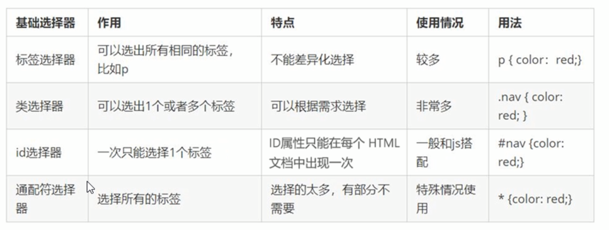

- 由单个选择器组成的
- 基础选择器又包括：**标签选择器、类选择器、id选择器和通配符选择器**

#### 标签选择器

```css
p {
  color: green;
}
```

使用html的标签名作为选择器。

##### 作用

把某一类标签全部选择出来，比如所有的`<div>`标签和所有的`<span>`标签。

##### 优点

能快速为页面中同类型的标签统一设置样式

##### 缺点

不能设计差异化样式，只能选择全部的当前标签。

#### 类选择器

```css
CSS部分
<style>
  .red {
    color: red;
  }
</style>

HTML部分
<ul>
  <li class="red">冰雨1</li>
  <li>冰雨2</li>
  <li>冰雨3</li>
  <li>冰雨4</li>
  <li>冰雨5</li>
</ul>
<div class="red">我也想变成红色</div>

```

类选择器口決：样式点定义     结构类(cLass) 调用     一个或多个    开发最常用

#### id 选择器

id选择器只能使用一次

##### id选择器和类选择器的区别

- 类选择器（class）好比人的名字，一个人可以有多个名字，同时一个名字也可以被多个人使用。

- id选择器好比人的身份证号码，全中国是唯一的，不得重复。

#### 通配符选择器

在CSS中，通配符选择器使用“*” 定义，它表示选取页面中所有元素（标签）。

### 复合选择器

- 复合选择器可以更准确、更高效的选择目标元素（标签）

- 复合选择器是由两个或多个基础选择器，，通过不同的方式组合而成的
- 常用的复合选择器包括：后代选择器、子选择器、并集选择器、伪类选择器等等

#### 后代选择器（重要）

**后代选择器**又称为*包含选择器*，可以选择父元素里面子元素。其写法就是把外层标签写在前面，内层标签写在后面，中间用空格分隔。当标签发生眼套时，内层标签就成为外层标签的后代。

##### 语法规范

元素1 元素2 { 样式声明 }

**最终改的只有元素2的样式**

##### 示例

CSS代码

```css
	<style>
		ol li {
			color: pink;
		}
	</style>
也可以这样写（与下面的运行结果无关）
.demo li a {
    XXX: XXX;
}
```

HTML代码

```html
<body>
	<ol>
		<li>我是ol的孩子</li>
		<li>我是ol的孩子</li>
		<li>我是ol的孩子</li>
	</ol>
	<ul>
		<li>我是ul的孩子</li>
		<li>我是ul的孩子</li>
		<li>我是ul的孩子</li>
	</ul>
</body>
```

结果：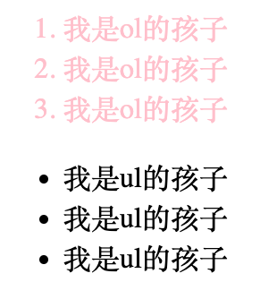


#### 子选择器（重要）

子元素选择器（子选择器）只能选择作为某元素的最近一级子元素。简单理解就是选亲**儿子**元素

##### 语法规范

元素1 > 元素2 { 样式声明 }

div > p { key: value; }

#### 并集选择器 （重要）

并集选择器可以选择**多组标签**同时为他们定义相同的样式。通常用于集体声明

井集选择器是各选择器**通过英文逗号（,）连接而成**，任何形式的选择器都可以作为并集选择器的一部分。

##### 语法规范

元素1, 元素2 { 样式声明 }

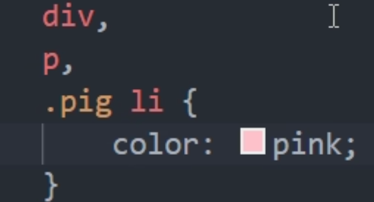

也可以并上**后代选择器**

#### 伪类选择器

伪类选择器用于向某些选择器添加特殊的效果 ，比如给链接添加特殊效果 ，或选择第1个，第八个元素。

伪类选择器书写最大的特点是用**冒号（:）**表示，比如：:hover、:first-child 。

因为伪类选择器很多，比如有链接伪类、结构伪类等，所以这里先给大家讲解常用的链接伪类选择器。

##### 链接伪类选择器

| 伪类选择器 | 描述                                 |
| ---------- | ------------------------------------ |
| a:link     | 选择所有未被访问的链接               |
| a:visited  | 选择所有已被访问的链接               |
| a:hover    | 选择鼠标指针位于其上的链接           |
| a:active   | 选择活动链接（鼠标按下未弹起的链接） |

为了确保生效，请按照LVHA 的循顺序声明：link - visited - hover -active。

开发中常用的写法

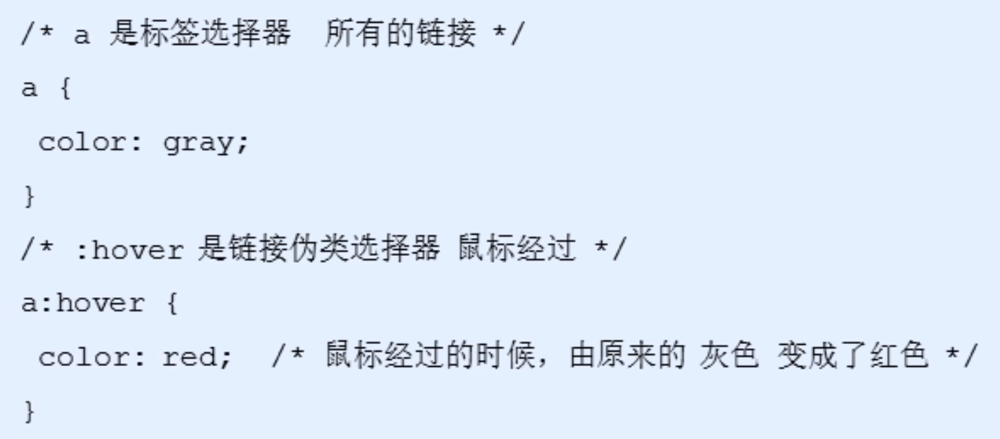

##### focus伪类选择器

```css
input:focus {
    background-color: pink;
}
```


## 常用的属性

### 字体 font

font-family：字体群组

font-size：字体大小（设置body的font-size，但是标题标签不会改变，需要另外进行设置）

font-weight：字体粗细。normal(400)  bold(700)

font-style ：设置文本的风格。 normal/italic

**字体复合属性：font（节约代码量）**  `font: font-style font-weight font-size/line-height font-family`
font-size 和 font-family不能省略

color：定义文本颜色 	十六进制/颜色名/RGB代码

text-align：用于设置元素内文本内容的水平对齐方式。

text-decoration ：规定添加到文本的修饰。可以给文本添加下划线、删除线、 上划线等。

text-indent：用来指定文本的第一行的缩进，通常是将段落的首行缩进。

> em 是一个相对单位，就是当前元素(font-size) 1个文字的大小，如果当前元素没有设置大小，则会按照父元素的1个文字大小。

line-height ：用于设置行间的距离（行高）。可以控制文字行与行之间的距离。

行间距 = 文本高度 + 上&下间距

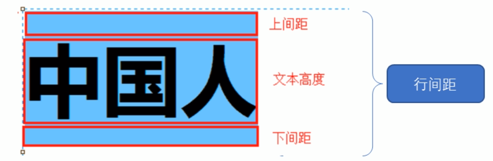

### 背景 background

- **背景颜色   background-color** 定义了元素的背景颜色   在背景的最底层，会被image压住

`backgound-color: 颜色值`一般情况下，默认值是**transparent**（透明）

- **背景图片   background-image** 描述了元素的背景图像。实际开发常见于logo。 或者一些装饰性的小图片或者是超大的背景图片，优点是非常便于控制位置（精灵图也是一种运用场景）

`background-image:none/url`

- **背景平铺    background-repeat**在HTML页面上对背景图像进行平铺

`background-repeat: repeat/no-repeat/repeat-x/repeat-y`

- **背景位置    background-position**可以改变图片在背景中的位置。

`background-position: x y;`可以使用方位名词（center/top/bottom/left/right）

- **背景图像固定（背景附着）    background-attachment**设置背景图像是否固定或者随着页面的其余部分滚动    后期可以做视差滚动

`background-attachment: scroll（随对象内容滚动）/fixed（固定）`

- **背景复合写法    background**

当使用简写属性时，没有特定的书亏顺序,一般习惯约定顺序为：

background:背景颜色、背景图片地址、背景平铺、背景图像滚动、背景图片位置;

- **背景颜色半透明 background: rgba(0, 0, 0, 0.3)**

## CSS 引入方式

### 内部样式表

内部样式表（内嵌样式表）是写到html页面内部．是将所有的CSS 代码抽取出来，单独放到一个＜style＞标签中。

```css
<style>
div {
		color: red;
    font-size: 12px;
}
</style>
```

- style标签理论上可以放在 HTML 文档的任何地方，但一般会放在文档的<head>标签中
- 通过此种方式，可以方便控制当前整个页面中的元素样式设置
- 代码结构清晰，但是并没有实现结构与样式完全分离
- 使用内部样式表设定CSS，通常也被称为**嵌入式引入**，这种方式是我们练习时常用的方式

### 行内样式表

行内样式表（内联样式表）是在元素标签内部的style 属性中设定CSS 样式。适合于修改简单样式.

```html
<div style="color: red; font-size: 12px;">哈哈哈哈哈</div>
```

### 外部样式表

实际开发都是外部样式表，适合于样式比较多的情况.核心是;样式单独写到CSS文件中，之后把CSS文件引入到HTML页面中使用。

```html
<link rel="stylesheet" href="css文件路径">
```

## CSS 的元素显示模式

作用：网页的标签非常多，在不同地方会用到不同类型的标签，了解他们的特点可以更好的布局我们的网页。

元素显示模式就是元素（标签）以什么方式进行品示 ，比如`<div>`自己占一行，比如一行可以放多个`<span>`。

HTML 元素一般分为**块元素和行内元素**两种类型。

### 块元素

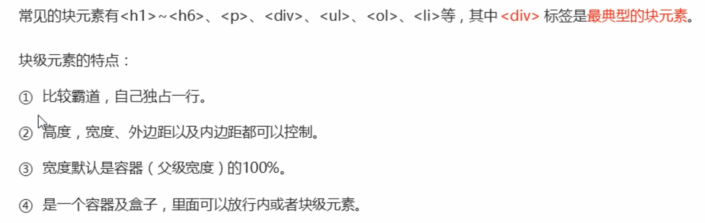

- 文字类的元素内不能使用块级元素
- `<p>`标签主要用于存放文字，因此p里面不能放块级元素，特别是不能放div
- 同理，h1~h6等都是文字类块级标签，里面也不能放其他块级元素

### 行元素

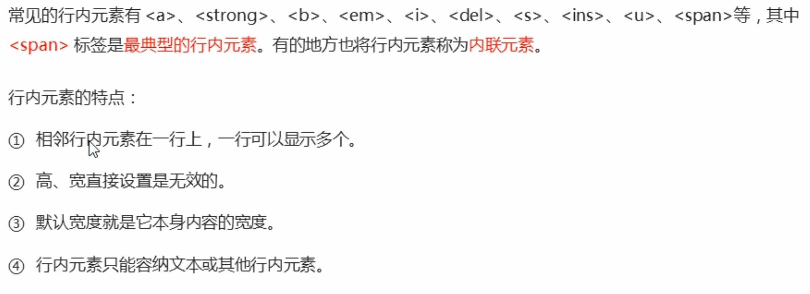

- 链接里面不能再放链接
- 特殊情况链接a里面可以放块级元素，但是给a转换一下块级模式最安全

### 行内块元素

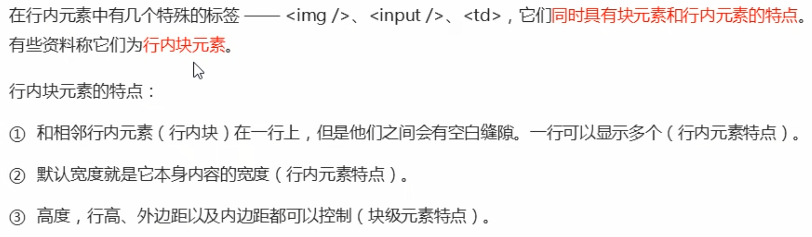

### 元素显示模式转换

特殊情况下，我们需要元素模式的转换，简单理解一个横式的元素需要另外一种模式的特性

比如想要增加链接＜a＞的触发范围。

- **转换为块元素：display:block**

- **转换为行元素：display:inline**
- **转换为行内块元素：display:inline-block**


## CSS三大特性

### 层叠性

相同选择器给设置相同的样式，此时一个样式就会覆盖（层叠）另一个冲突的样式。层叠性主要解决样式冲突的问题。

层叠性原则：

- 样式冲突，遵循的原则是**就近原则**，哪个样式离得近，就执行哪个样式
- 样式不冲突，不会层叠

### 继承性

现实中的继承：我们继承了父亲的姓

CSS中的继承：子标签会继承父标签的某些样式，如文本颜色和字号。简单的理解就是：子承父业。

#### 行高的继承性

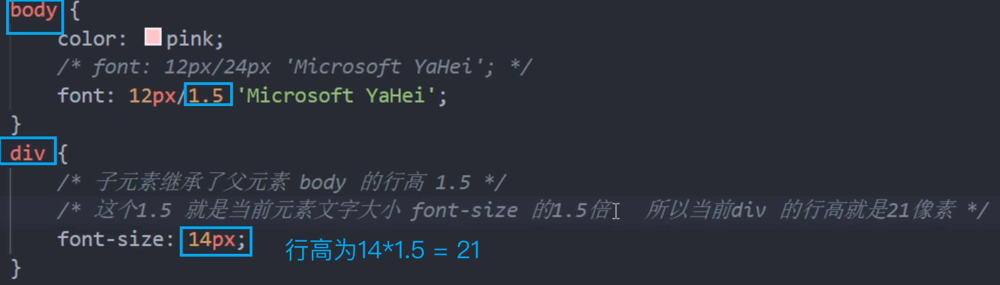

### 优先级

当同一个元素指定多个选择器，就会有优先级的产生。

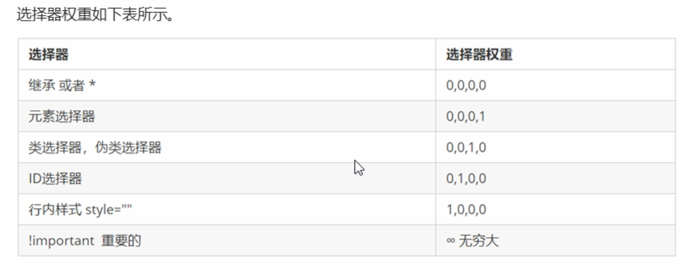

**继承的权重是0**

> `!important`的使用：
>
> ```css
> div {
>     color: blue!important;
> }
> ```

**权重叠加：**如果是复合选择器，则会有权重叠加，需要计算权重。

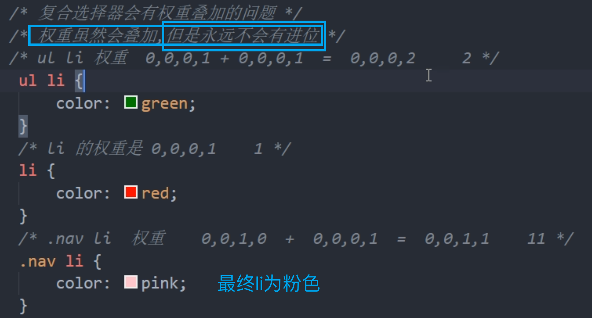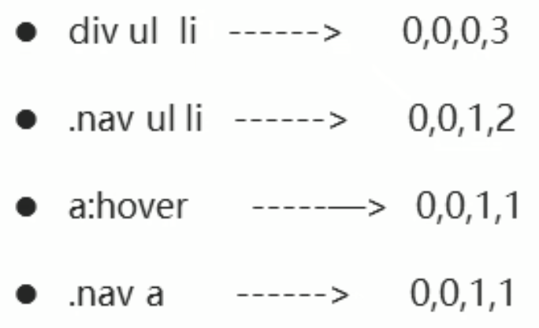


## 盒子模型

### 1.1网页布局的本质

#### 网页布局过程：

1. 先准备好相关的网页元素，网页元素基本都是盒子Box。
2. 利用CSS 设置好盒子样式，然后摆放到相应位置。
3. 往盒子里面装内容.

网页布局的核心本质：就是利用 CSS摆盒子。

### 1.2盒子模型的组成

所谓盒子模型：就是把HTML 页面中的布局元素看作是一个矩形的盒子，也就是一个盛装内容的容器。

CSS 盒子模型本质上是一个盒子，封装周国的HTML元素，它包括：边框、外边距、内边距、 和实际内容

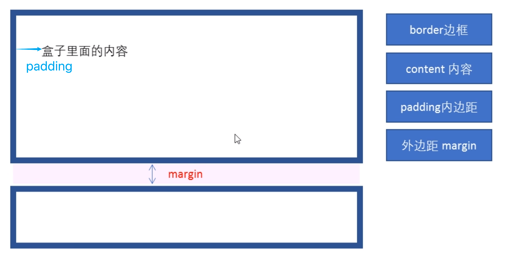

#### 边框border

border可以设置元素的边框。边框有三部分组成,边框完度(粗细)边框样式边框颜色

`border / border-width / border-style / border-color`

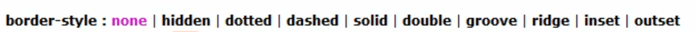

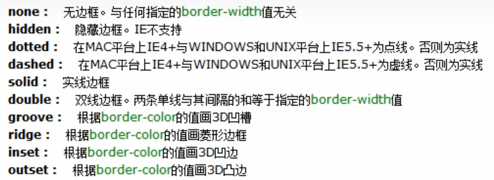

**border-collapse** 属性控制浏览器绘制表格边框的方式。它控制相邻单元格的边框。

边框会影响盒子实际大小

- 边框会额外增加盒子的实际大小。因此我们有两种方案解决：

1. 测量盒子大小的时候不量边框

2. 如果测量的时候包含了边框,则需要width/height 减去边框宽度

#### 内边距padding

padding / padding-left...  用于设置内边距，即边框与内容之问的距离。

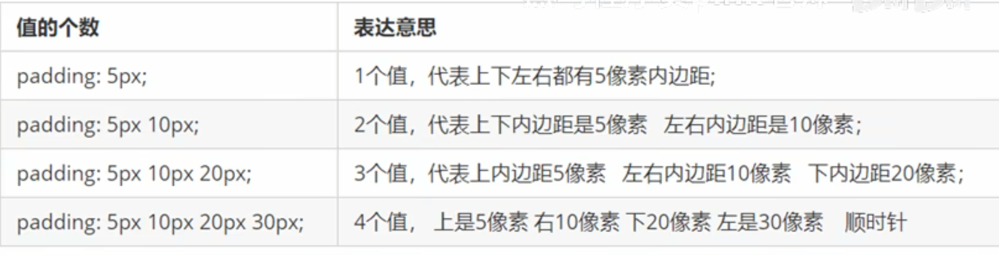

padding也会影响盒子的大小。在盒子原本的大小上，增加padding的大小。

#### 外边距margin

margin用法与padding一致

##### 外边距典型应用（水平居中）

外边距可以让**块级**盒子**水平居中**，但是必须满足两个条件

- 盒子必须指定了宽度（width）
- 盒子**左右的外边距**都设置为auto

```css
.header {
    width: 960px;
    height: 100px;
    background-color: pink;
    margin: 0 auto;
}
```

行内元素或者行内块元素水平居中给其父元素添加 text-align:center即可

##### 外边距合并

使用 margin定义块元素的垂直外边距时，可能会出现外边距的合井。

###### 嵌套块元素垂直外边距的塌陷

对于两个嵌套关系（父子关系）的块元素，父元素有上外边距同时子元素也有上外边距，此时父元素会塌陷较大的外边距值。

解决方案：

- 可以为父元素定义上边框。`border: 1px solid transparent;`
- 可以为父元素定义上内边距。`padding: 1px;`
- 可以为父元素添加 overflow:hidden。`overflow: hidden;`

#### 清除内外边距

在我们向html文件中写入内容时，发现文字或者列表等等内容都无法顶到浏览器的左上角。

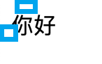

网页元素很多都带有默认的内外边距，而且不同浏览器默认的也不一致。因此我们在布局前，首先要清除下网页元素的内外边距。

```css
* {
    padding: 0;
    margin: 0;
}
```

**注意：行内元素为了照顾兼容性，尽量只设置左石内外边距，不要设置上下内外边距。但是转换为块级和行内块元素就可以了**

