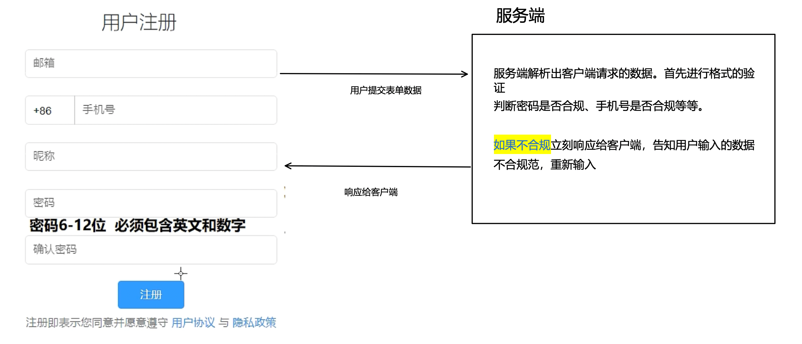
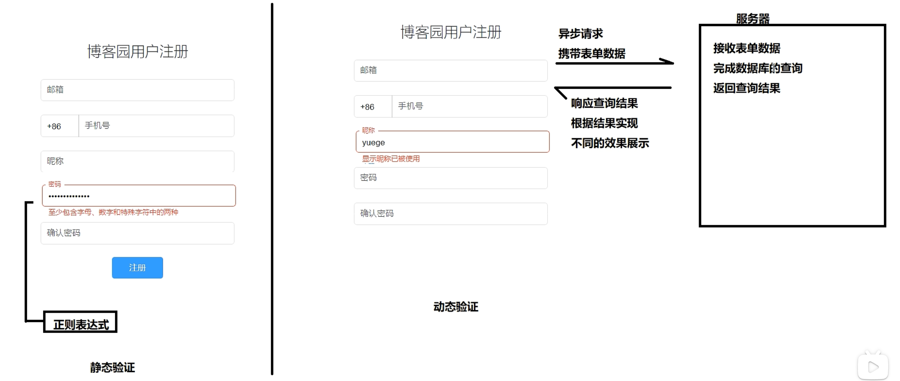
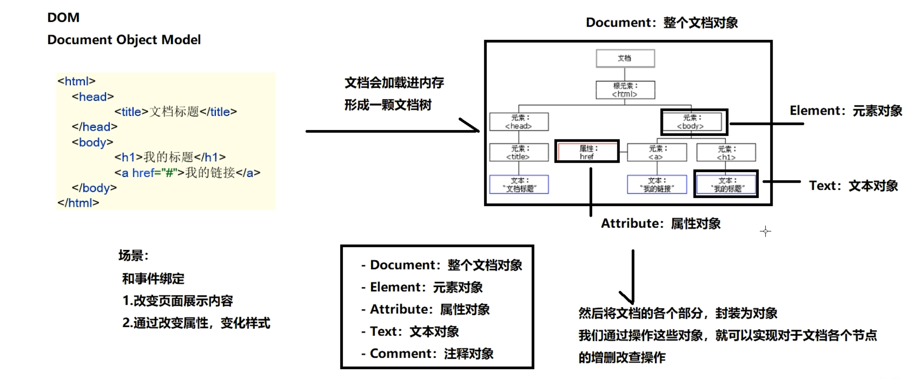

# 为什么会出现JavaScript？

> ##  在前端页面只有html css等非逻辑性的语言时
>
> 我们使用服务器判断用户提交的表单数据是否符合规范
>
> 
>
> 以前网速很慢，用户提交数据后，发送请求到服务端、服务端处理请求，进行合法判断、服务端响应给用户
>
> 这个过程会耗时很久，如果用户输入的数据不合规，那他需要等待更久的时间才能够注册成功。
>
> 前端急需要一个能够处理简单逻辑性问题的语言出现。来减少服务端的负担。

最初JS是用来解决表单的逻辑性问题的。慢慢的发展为处理前端的逻辑性问题



# JS代码编写的位置

## 在HTML代码中嵌入JS代码

```html
<!DOCTYPE html>
<html lang="en">
<head>
	<meta charset="UTF-8">
	<title>JS编写位置</title>
	<script>

	</script>
</head>
<body>
	<script>

	</script>
</body>
</html>
```

可以在 head 和 body 标签中嵌入JS代码。在这两个标签中嵌入代码是有区别的

## 引入外部JS文件

```html
	<script src="JS/index.js"></script>
```

通过`script`标签的**src**属性来引入外部文件

# 变量

变量的声明、赋值、命名与Java类似

使用**var**关键字声明任意类型的变量

使用**typeof**可以查看当前变量的数据类型

```html
<script>
    var int = 18;
    console.log(int);
    console.log(typeof int);
</script>
----------
浏览器控制台输出结果
18
number
```


## 变量的类型

### number类型

NaN是无值，但是变量的数据类型仍然为整形

```javascript
var haha = parseFloat("a111");
console.log(haha);
console.log(typeof haha);
```

Infinity是无穷大。1/0在其他编程语言中，会出现除0异常。在JS中表示为无穷大

```javascript
var haha01 = 1/0;
console.log(haha01);
console.log(typeof haha01);
```

### boolean类型

### undefined类型

只声明未赋值

### string类型

""和''都可以表是一个字符串

### null类型

## 强制类型转换

### `Number()`将括号中的数据类型强制转换为number类型。

```js
var num04 = Number("1aa");
console.log(num04);

var num05 = Number(typeof num01);
console.log(num05);
```

以上输出的值都会是NaN

### `Boolean()`将括号中的内容转换为boolean类型

只要括号中的值是**非空或者非0**，那么函数返回值就是true

### `String()`

### `parseInt()和parseFloat()`

功能更强的`Number()`

### 隐式转换

NaN、undefined、""、false、null在if语句中的判定结果都为false


# 函数

## 函数的arguments对象

```js
function fun (a, b, c) {
    console.log(arguments);
    console.log(a);
    console.log(b);
    console.log(c);

    console.log(arguments[0]);
    console.log(arguments[1]);
    console.log(arguments[2]);
    console.log(arguments[3]);
}
fun(1, 2, 3, 4);
```

js的语法很松散，函数的实参和形参可以不对等。

我们可以使用arguments对象以数组的方式输出函数接收到的实参值


# 内置对象

## string对象

常用方法：`length`、`charAt()`、`indexOf()`

```js
var str1 = "helloworld";
console.log(str1.length);

console.log(str1.charAt(0));
console.log(str1.charAt(9));
console.log(str1.charAt(10));
console.log(str1.indexOf("h"));
console.log(str1.indexOf("a"));
```

## Array对象

```js
var arr1 = [];

//创建数组，并带有指定元素
var arr2 = ["11","22","33","44"];

//可以在数组中指定不同类型的元素
var arr3 = [11, "22", undefined, true, null];

var arr4 = new Array();

//创建一个指定长度的数组
var arr5 = new Array(10);

//创建一个数组，在创建时指定元素
var arr6 = new Array(10, 20, 30, 40);
```

### length属性

```js
/*
     length属性  长度
     1.获取数组元素的个数
     2.操作数组元素，改变数组的长度

     var arr = [1,2,3,4,5,6];
*/

var arr = [1, 2, 3, 4, 5, 6];
console.log(arr.length);

// arr.length = 3;
// console.log(arr.length);
// console.log(arr);

arr.length = 10;
console.log(arr.length);
console.log(arr);
```

### 常用方法

在头部插入unshift

在尾部插入push

在头部删除shift

在尾部删除pop

## Math对象

```js
//常见属性
console.log(Math.PI);

//常见方法

//round
console.log(Math.round(1.4));
console.log(Math.round(1.5));

//floor向下取整
console.log(Math.floor(1.8));
console.log(Math.floor(-1.8));

//ceil向上取整
console.log(Math.ceil(-1.2));

//abs取绝对值
console.log(Math.abs(5));
console.log(Math.abs(-5));

//min 最小值
console.log(Math.min(20, 30));

//max 最大值
console.log(Math.max(20, 30));

//pow 次方
console.log(Math.pow(2, 4));

//random 随机数  0-1之间
console.log(Math.random());
```

## Date对象

new Date();

## 正则对象

\编写正则\

new RegExp("编写正则")


# DOM




