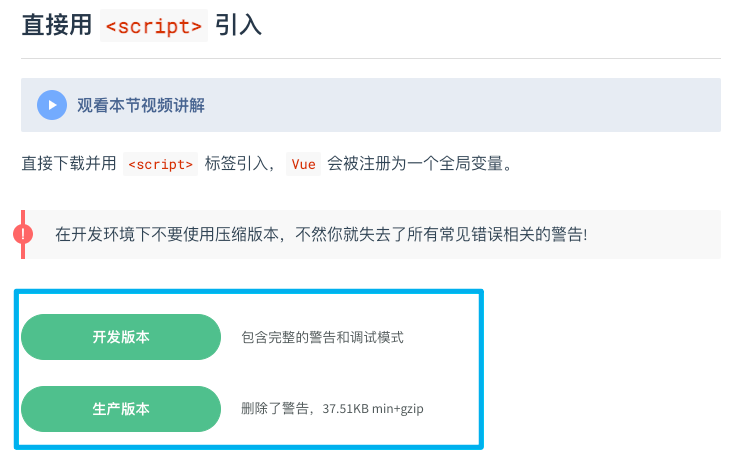
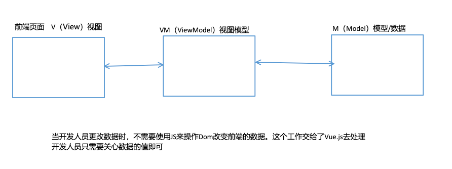
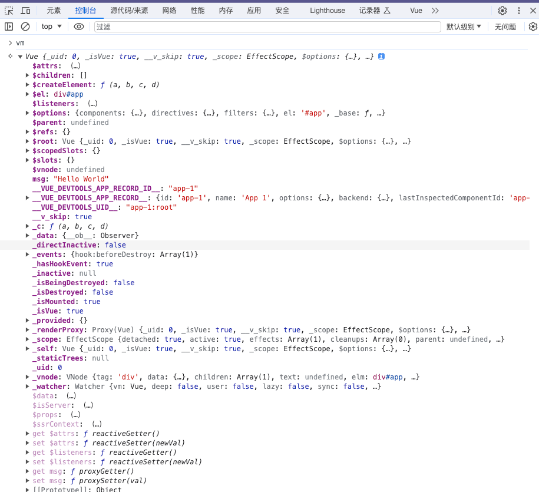
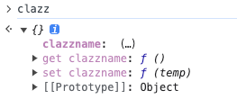
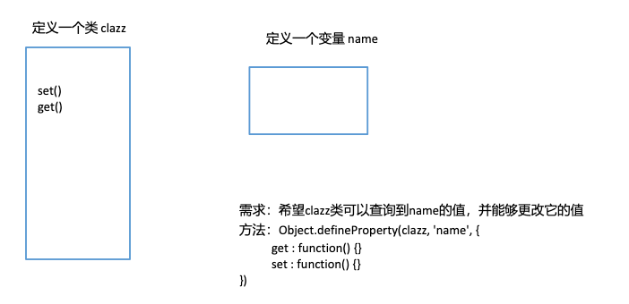

> 本篇前期以Vue2.X学习为主。
>
> 对于语法细节的研究可以查看Vue2.X的api官网
>
> https://v2.cn.vuejs.org/v2/api/
>
> 通过搜索以查看详细的举例说明

## Vue的引入

Vue (读音 /vjuː/，类似于 **view**) 是一套用于构建用户界面的**渐进式框架**。

### Vue2的安装

在学习前期阶段，我们使用Vue2。

[Vue2下载链接](https://v2.cn.vuejs.org/v2/guide/installation.html)



### 引入Vue2

```html
<script src="../js/vue.js"></script>
// ../js/vue.js为vue所在的路径
```

### 最简单的Vue程序

```html
<div id="app"></div>
<script>
    // 第一步
	const myVue = new Vue({
		template : '<h1>Hello Vue!!!</h1>'
	})
    // 第二步
	myVue.$mount('#app')
</script>
```

#### 第一步 创建Vue实例

1. 为什么不直接调用Vue()函数？
    - 不行，因为直接调用Vue()函数，不创建实例的话，会出现以下错误：
    - `Vue is a constructor and should be called with the new keyword`
2. Vue(options)构造函数中，options参数是什么
    - option翻译为选项  options翻译为多个选项
    - Vue框架要求这个options参数必须是一个纯粹的JS对象：{}
    - 在{}对象中可以编写大量的key:value对。
    - 一个key:value对就是一个配置项。
    - 主要是通过options这个参数来给Vue实例指定多个配置项。
3. 关于template配置项
    - template翻译为：模板。
    - template配置项用来指定什么？用来指定模板语句，模板语句是一个字符串形式的。
    - 什么是模板语句？
        - Vue框架自己制定了一些具有特殊含义的特殊符号。
        - Vue的模板语句是Vue框架自己搞的一套语法规则。
        - 我们写Vue模板语句的时候，不能乱写，要遵守Vue框架的模板语法规则。
        - 模板语句可以是一个纯粹的HTML代码，也可以是Vue中的特殊规则。也可以是HTML代码 + Vue的特殊规则。
        - template后面的模板语句会被Vue框架的编译器进行编译，转换成浏览器能够识别的HTML代码。

#### 第二步 将Vue实例挂载到id='app'的元素位置。

1. Vue实例都有一个$mount()方法，这个方法的作用是什么？
    - 将Vue实例挂载到指定位置。
2. #app 显然是ID选择器。这个语法借鉴了CSS。

### 模板语句template的数据来源

#### 谁可以给模板语句提供数据支持呢

data选项。

data配置项的专业叫法：Vue 实例的数据对象.（data实际上是给整个Vue实例提供数据来源的。）

##### 项的类型是什么？

Object | Function （对象或者函数）

a是对象的话，对象必须是纯粹的对象 (含有零个或多个的 key/value 对)

##### data数据如何插入到模板语句当中？

{{}} 这是Vue框架自己搞的一套语法，别的框架看不懂的，浏览器也是不能够识别的。
Vue框架自己是能够看懂的。这种语法在Vue框架中被称为：模板语法中的插值语法。（有的人把他叫做胡子语法。）

```vue
{{data的key}}
```


### 模板语句的配置项

1. template后面指定的是模板语句，但是模板语句中只能有一个根节点。

2. 只要data中的数据发生变化，模板语句一定会重新编译。（只要data变，template就会重新编译，重新渲染）

3. 如果使用template配置项的话，指定挂载位置的元素会被替换。

    - ```html
        原本的<div id="app"></div>会被替代
        ```

4. 好消息：目前我们可以不使用template来编写模板语句。这些模板语句可以直接写到html标签中。Vue框架能够找到并编译，然后渲染。如果直接将模板语句编写到HTML标签中，指定的挂载位置就不会被替换了。

5. 关于$mount('#app')

    1. 也可以不使用$mount('#app')的方式进行挂载
    2. 在Vue中有一个配置项：el
    3. el配置项和$mount()可以达到同样的效果。

6. el配置项的作用？

    1. 告诉Vue实例去接管哪个容器。
    2. el : '#app'，表示让Vue实例去接管id='app'的容器。
    3. el其实是element的缩写。被翻译为元素。


### 解决浏览器控制台的错误信息

1. 我们使用开发版本的vue.js时，控制台会出现白色字体的警告。可以用以下方法关掉警告

- 在每次写代码时，在script标签内写入`Vue.config.productionTip=false`，但是这样有些时候会不起作用
    - 可能是vue的版本问题，也可能是浏览器的内核问题
- 更换生产版本的vue
- 更改开发版本vue的源码：找到`productionTip`这个全局变量，将它的值设置为`false`

2. 安装vue.jsp devtools，关闭另一个白色字体的警告
3. 在vscode中，使用LiveServer运行html文件时，会将html放到一个服务器上运行。有些时候服务器会找不到一些原本的资源文件。我们只需要找到对应的资源文件，将其放到相应的位置即可。（这是废话）

### Vue实例与容器的关系

实例就是new出来的一个Vue对象

容器就是Vue对象接管的html标签

**一个Vue实例只能接管一个容器**

**一个容器也只能被一个Vue实例接管**

## Vue核心语法

### 模版语法-插值

`{{}}`

#### 主要研究：{{这里可以写什么}}

1. 在data中声明的变量、函数等都可以。
2. 常量都可以。    
3. 只要是合法的javascript表达式，都可以。
4. 模板表达式都被放在沙盒中，只能访问全局变量的一个白名单，如 Math 和 Date 等。
    'Infinity,undefined,NaN,isFinite,isNaN,' 'parseFloat,parseInt,decodeURI,decodeURIComponent,encodeURI,encodeURIComponent,' 
    'Math,Number,Date,Array,Object,Boolean,String,RegExp,Map,Set,JSON,Intl,' 
    'require'

```html
    <div id="app">
        <!-- 在data中声明的 -->
        <!-- 这里就可以看做在使用msg变量。 -->
        <h1>{{msg}}</h1>
        <h1>{{sayHello()}}</h1>
        <!-- <h1>{{i}}</h1> -->
        <!-- <h1>{{sum()}}</h1> -->

        <!-- 常量 -->
        <h1>{{100}}</h1>
        <h1>{{'hello vue!'}}</h1>
        <h1>{{3.14}}</h1>

        <!-- javascript表达式 -->
        <h1>{{1 + 1}}</h1>
        <h1>{{'hello' + 'vue'}}</h1>
        <h1>{{msg + 1}}</h1>
        <h1>{{'msg' + 1}}</h1>
        <h1>{{gender ? '男' : '女'}}</h1>
        <h1>{{number + 1}}</h1>
        <h1>{{'number' + 1}}</h1>
        <h1>{{msg.split('').reverse().join('')}}</h1>

        <!-- 错误的：不是表达式，这是语句。 -->
        <!-- <h1>{{var i = 100}}</h1> -->

        <!-- 在白名单里面的 -->
        <h1>{{Date}}</h1>
        <h1>{{Date.now()}}</h1>
        <h1>{{Math}}</h1>
        <h1>{{Math.ceil(3.14)}}</h1>

    </div>

    <!-- vue程序 -->
    <script>

        // 用户自定义的一个全局变量
        var i = 100
        // 用户自定义的一个全局函数
        function sum(){
            console.log('sum.....');
        }

        new Vue({
            el : '#app',
            data : {
                number : 1,
                gender : true,
                msg : 'abcdef',  // 为了方便沟通，以后我们把msg叫做变量。（这行代码就可以看做是变量的声明。）
                sayHello : function(){
                    console.log('hello vue!');
                }
            }
        })
    </script>
```

### 模版语法-指令

1. 什么是指令？有什么作用？

    - 指令的职责是，当表达式的值改变时，将其产生的连带影响，响应式地作用于 DOM

2. Vue框架中的所有指令的名字都以“v-”开始。

3. 插值是写在标签体当中的，那么指令写在哪里呢？

    - Vue框架中所有的指令都是以HTML标签的属性形式存在的，例如：

    ```html
    <span 指令是写在这里的>{{这里是插值语法的位置}}</span>
    ```

    - **注意：**虽然指令是写在标签的属性位置上，但是这个指令浏览器是无法直接看懂的。是需要先让Vue框架进行编译的，编译之后的内容浏览器是可以看懂的。

4. 指令的语法规则

    - 指令的一个完整的语法格式：

    `<HTML标签 v-指令名:参数="javascript表达式"></HTML标签>`

    - 表达式：
        - 之前在插值语法中{{这里可以写什么}}，那么指令中的表达式就可以写什么。实际上是一样的。但是需要注意的是：在指令中的表达式位置不能外层再添加一个{{}}

    - 不是所有的指令都有参数和表达式：
        - 有的指令，不需要参数，也不需要表达式，例如：**v-once**
        -  有的指令，不需要参数，但是需要表达式，例如：**v-if="表达式"**
        -  有的指令，既需要参数，又需要表达式，例如：**v-bind:参数="表达式"**

#### v-once 指令

- 作用：只渲染元素一次。随后的重新渲染，元素及其所有的子节点将被视为静态内容并跳过。这可以用于优化更新性能。

```html
<div id="app">
    <h1>{{msg}}</h1>
    <h1 v-once>{{msg}}</h1>
</div>
```

#### v-if="表达式" 指令

- 作用：表达式的执行结果需要是一个布尔类型的数据：true或者false
    - true：这个指令所在的标签，会被渲染到浏览器当中。
    - false：这个指令所在的标签，不会被渲染到浏览器当中。

```html
<div id="app">
    <h1 v-if="a > b">v-if测试：{{msg}}</h1>
</div>
```

#### v-bind指令

1. 这个指令是干啥的？
            - 它可以让HTML标签的某个属性的值产生动态的效果。

2. v-bind指令的语法格式：

    ```html
    <HTML标签 v-bind:参数="表达式"></HTML标签>
    ```

3. v-bind指令的编译原理？

    - 编译前：

    ```html
    <HTML标签 v-bind:参数="表达式"></HTML标签>
    ```

    - 编译后

    ```html
    <HTML标签 参数="表达式的值"></HTML标签>
    ```

    - 注意两项：
        - 在编译的时候v-bind后面的“参数名”会被编译为HTML标签的“属性名”
        - 表达式会关联data，当data发生改变之后，表达式的执行结果就会发生变化。
    - 所以v-bind才会有动态效果

4. v-bind因为很常用，所以Vue框架对该指令提供了一种简写方式：

    - 只是针对v-bind提供了以下简写方式：``保留`:`，去掉`v-bind`

5. 什么时候使用插值语法？什么时候使用指令？

    - 凡是标签体当中的内容要想动态，需要使用插值语法。
    - 只要向让HTML标签的属性动态，需要使用指令语法。

```html
<!-- 准备一个容器 -->
<div id="app">
    <!-- 注意：以下代码中 msg 是变量名。 -->
    <!-- 注意：原则上v-bind指令后面的这个参数名可以随便写。 -->
    <!-- 虽然可以随便写，但大部分情况下，这个参数名还是需要写成该HTML标签支持的属性名。这样才会有意义。 -->
    <span v-bind:xyz="msg"></span>

    <!-- 这个表达式带有单引号，这个'msg'就不是变量了，是常量。 -->
    <span v-bind:xyz="'msg'"></span>

    <!-- v-bind实战 -->
     <br>
     <br>

    <!-- v-bind简写形式 -->
     <br>

    <!-- 这是一个普通的文本框 -->
    <input type="text" name="username" value="zhangsan"> <br>
    <!-- 以下文本框可以让value这个数据变成动态的：这个就是典型的动态数据绑定。 -->
    <input type="text" name="username" :value="username"> <br>

    <!-- 使用v-bind也可以让超链接的地址动态 -->
    <a href="https://www.baidu.com">走起</a> <br>
    <a :href="url">走起2</a> <br>

    <!-- 不能采用以下写法吗？ -->
    <!-- <a href="{{url}}">走起3</a>  -->
    <!--
        不能这样，报错了，信息如下：
        Interpolation inside attributes has been removed.
        Use v-bind or the colon shorthand instead. For example,
        instead of <div id="{{ val }}">, use <div :id="val">

        属性内部插值这种语法已经被移除了。（可能Vue在以前的版本中是支持这种写法的，但是现在不允许了。）
        请使用v-bind或冒号速记来代替。
        请使用 <div :id="val"> 来代替 <div id="{{ val }}">
     --> 
</div>

<script>
    new Vue({
        el : '#app',
        data : {
            msg : 'Hello Vue!',
            imgPath : '../img/1.jpg',
            username : 'jackson',
            url : 'https://www.baidu.com'
        }
    })
</script>
```

#### v-model指令

v-bind和v-model的区别和联系

- v-bind和v-model这两个指令都可以完成数据绑定。
    - v-bind是单向数据绑定。
        - data ===> 视图
    - v-model是双向数据绑定。
        - data <===> 视图
- v-bind可以使用在任何HTML标签当中。v-model只能使用在表单类元素上
    - input标签、select标签、textarea标签
        - 举例参见：https://v2.cn.vuejs.org/v2/api/#v-model
    - 为什么v-model的使用会有这个限制呢？
        - 因为表单类的元素才能给用户提供交互输入的界面。
    - v-model指令通常也是用在value属性上面的。
- v-model简写方式：
    - v-model:value="表达式"  简写为      v-model="表达式"

#### v-on指令

绑定事件监听器

缩写为@

```js
<button v-on:click="sayHello()">hello</button>
<!-- v-on指令的简写形式 -->
<button @click="sayHi()">hi button</button>
<button @click="sayHi($event, 'jack')">hi button2</button>
<!-- 绑定的回调函数，如果不需要传任何参数，小括号() 可以省略 -->
<button @click="sayWhat">what button</button>
```

### MVVM

- **M：**model（模型/数据）
- **V：**view（视图）
- **VM：**ViewModel（视图模型）：VM是MVVM中的核心部分。（它起到一个核心的非常重要的作用。）
- 

MVVM是目前前端开发领域当中非常流行的开发思想。(一种架构模式。)
目前前端的大部分主流框架都实现了这个MVVM思想，例如Vue，React等。

1. Vue框架遵循MVVM吗？
    - 虽然没有完全遵循 MVVM 模型，但是 Vue 的设计也受到了它的启发。
    - Vue框架基本上也是符合MVVM思想的。
2. MVVM模型当中倡导了Model和View进行了分离，为什么要分离？
    - 假如Model和View不分离，使用最原始的原生的javascript代码写项目：
    - 如果数据发生任意的改动，接下来我们需要编写大篇幅的操作DOM元素的JS代码。

将Model和View分离之后，出现了一个VM核心，这个VM把所有的脏活累活给做了，也就是说，当Model发生改变之后，VM自动去更新View。当View发生改动之后，VM自动去更新Model。我们再也不需要编写操作DOM的JS代码了。开发效率提高了很多。

```vue
<!-- View V-->
<div id="app">
姓名：<input type="text" v-model="name">
</div>

<!-- vue程序 -->
<script>
// ViewModel  VM
const vm = new Vue({
    el : '#app',
    // Model  M
    data : {
        name : 'zhangsan'
    }
})
</script>
```

### VM

```html
<div id="app">
    {{msg}}
</div>

<script>
    const vm = new Vue({
        el : '#app',
        data : {
            msg : 'Hello World'
        }
    })
</script>
```

现在有以上代码，在浏览器的控制台中，输出vm的变量可以发现有

其中有以`$`和`_`开头的，还有正常的。

以`$`开头的可以看做是公开的属性，这些属性是供程序员使用的。

以`_`开头可以看做是私有的属性，这些属性是Vue框架底层使用的。一般我们程序员很少使用。


### Object的数据代理机制

```js
let clazz = {}

let name = "哈哈就看见"

Object.defineProperty(clazz, "clazzname", {
    // value : "nihao",
    // writable : false,
    get : function() {
        console.log("get方法执行了")
        return name
    },

    set : function(temp) {
        console.log("set方法执行了");
        name = temp
        // return tempName
    }
})
```





通过浏览器控制台查询，发现clazz中的name属性需要点击一下，才能看到，并且会调用get方法

说明clazz代理name变量成功

### 自制一个与Vue框架类似的数据代理机制


```js
class Vue{
	constructor(options) {
        // 获取到data对象的数据
        Object.keys(options.data).forEach((propertyName, index) => {
            // console.log(propertyName, index, firstChar);
            // 判断propertyName的开头字母是否为$ _
            let firstChar = propertyName.charAt(0);
            if (firstChar != '_' && firstChar != '$') {
                Object.defineProperty(this, propertyName, {
                    get : function() {
                        return options.data[propertyName]
                    },
                    set : function(val) {
                        options.data[propertyName] = val
                    }
                })
            }
        })
    }
}
```

### 解读Vue.js中实现数据代理机制的源码

Vue框架源代码中关键性代码：

1. var data = vm.$options.data;

    1. 注意：这是获取data。程序执行到这里的时候vm上还没有 _data 属性。

2. data = vm._data = isFunction(data) ? getData(data, vm) : data || {};

    1. 程序执行完这个代码之后，vm对象上多了一个_data这样的属性。通过以上源码解读，可以得知data不一定是一个{}，也可以是一个函数。

    2. 代码含义：

        1. 如果data是函数，则调用getData(data, vm)来获取data。
        2. 如果data不是函数，则直接将data返回，给data变量。并且同时将data赋值给vm._data属性了。

    3. 有一个疑问？程序执行到这里，为什么要给vm扩展一个_data属性呢？

        1. _data属性，以"_"开始，足以说明，这个属性是人家Vue框架底层需要访问的。

        2. Vue框架底层它使用vm._data这个属性干啥呢？

        3. vm._data是啥？

            ```js
            vm._data 是：
            {
            	name : 'jackson',
                age : 35
            }
            ```

        4. vm._data 这个属性直接指向了底层真实的data对象。通过_data访问的name和age是不会走数据代理机制的。通过vm._data方式获取name和age的时候，是不会走getter和setter方法的。
        5. 注意：对于Vue实例vm来说，不仅有_data这个属性，还有一个$data这个属性。
            1. _data 是框架内部使用的，可以看做私有的。
            2. $data 这是Vue框架对外公开的一个属性，是给我们程序员使用。

3. 重点函数：

    ```js
    function isReserved(str) {
        var c = (str + '').charCodeAt(0);
        return c === 0x24 || c === 0x5f;
    }
    ```

    1. 这个函数是用来判断字符串是否以 _ 和 $ 开始的。
        1. true表示以_或$开始的。
        2. false表示不是以_或$开始的。

    ```js
    proxy(vm, "_data", key);
    ```

    2. 通过这行代码直接进入代理机制（数据代理）。

    ```js
    function proxy(target, sourceKey, key) { // target是vm，sourceKey是"_data"，key是"age"
        sharedPropertyDefinition.get = function proxyGetter() {
            return this["_data"]["age"];
        };
        sharedPropertyDefinition.set = function proxySetter(val) {
            this["_data"]["age"] = val;
        };
        Object.defineProperty(vm, 'age', sharedPropertyDefinition);
    }
    ```

    #### data也可以是一个函数

    ```js
    // data : {
    //     msg : 'Hello Vue!'
    // }
    // data functions should return an object：data函数应该返回一个对象。
    
    // data 也可以是一个函数。
    // 如果是函数的话，必须使用return语句返回{}对象。
    // data可以是直接的对象，也可以是一个函数，什么时候使用直接的对象？什么时候使用函数呢？（等你学到组件的时候自然就明白了。）
    // data : function(){
    //     return {
    //         msg : 'Hello Vue!'
    //     }
    // }
    
    // 在对象当中，函数的 :function 可以省略
    data(){
        return {
            msg : 'Hello Zhangsan!'
        }
    }
    ```

    
